# Mapa de Dependencias - DomiChat n8n Workflows

## Resumen de Dependencias

Este documento mapea las relaciones y dependencias entre los 18 flujos de trabajo de n8n del sistema DomiChat.

## Tipos de Dependencias

### 1. Execute Workflow (Invocación Directa)
Flujos que invocan a otros flujos como sub-workflows.

### 2. Error Workflows (Manejo de Errores)
Flujos configurados para manejar errores de otros flujos.

### 3. Dependencias de Datos
Flujos que comparten tablas de Supabase o estructuras de datos.

---

## Dependencias por Flujo

### 📱 CLIENTES

#### 0001 Clientes Flujo Principal
- **ID**: `vZz3KSWmbZa2xPyx`
- **Estado**: Activo
- **Invoca a**:
  - (Por analizar - archivo demasiado grande para leer completo)
- **Error Workflow**: `0002 Utilidades Control y Notificación de Errores` (tCJVhMSfqtz6Lsv2)
- **Tablas Supabase**: `clientes`, `pedidos`

#### 0002 Clientes Crear Pedido
- **ID**: Sin determinar
- **Estado**: Por analizar
- **Invoca a**: TBD
- **Tablas Supabase**: `pedidos`, `ventanas_ofertas`

#### 0003 Clientes Broadcast Domiciliarios
- **ID**: Sin determinar
- **Estado**: Por analizar
- **Invoca a**: TBD
- **Tablas Supabase**: `domiciliarios`, `ventanas_ofertas`, `pedidos`

#### 0004 Clientes Procesar Ventana Ofertas
- **ID**: Sin determinar
- **Estado**: Por analizar
- **Invoca a**: TBD
- **Tablas Supabase**: `ventanas_ofertas`, `ofertas_recibidas`, `pedidos`

#### 0005 Clientes Aceptar Contraoferta
- **ID**: Sin determinar
- **Estado**: Inactivo
- **Invoca a**: TBD
- **Tablas Supabase**: `pedidos`, `ventanas_ofertas`

#### 0006 Clientes Procesar Contraoferta
- **ID**: Sin determinar
- **Estado**: Inactivo
- **Invoca a**: TBD
- **Tablas Supabase**: `pedidos`, `contraofertas`

#### 0007 Clientes Rechazar Contraoferta
- **ID**: Sin determinar
- **Estado**: Inactivo
- **Invoca a**: TBD
- **Tablas Supabase**: `pedidos`

---

### 🚚 DOMICILIARIOS

#### 0001 Domiciliarios Flujo Principal
- **ID**: `MKNuC0q1F3Sh6K6Q`
- **Estado**: Activo
- **Invoca a**:
  - `0002 Domiciliarios Aceptar Pedido` (ZlGuD4CfbuDS4EMR)
  - `0003 Domiciliarios Contraofertar Pedido` (HzK6mbnjJfsRlNyW)
  - `0004 Domiciliarios Validar Entrega Pedido` (qERWYLB6k0hZ7k4s)
  - `0005 Domiciliarios Cambiar Estado` (3qKyLhg7cDGi1Ijs)
- **Error Workflow**: `0002 Utilidades Control y Notificación de Errores` (tCJVhMSfqtz6Lsv2)
- **Tablas Supabase**: `domiciliarios`
- **Redis**: Chat memory (sessions: `{telefono}_delivery`)

#### 0002 Domiciliarios Aceptar Pedido
- **ID**: `ZlGuD4CfbuDS4EMR`
- **Estado**: Inactivo (sub-workflow)
- **Invocado por**: `0001 Domiciliarios Flujo Principal`
- **Error Workflow**: `cGFHe0wsizcDFbHD`
- **Tablas Supabase**: `pedidos`, `ventanas_ofertas`, `ofertas_recibidas`
- **Inputs**:
  - `pedido_id`
  - `numero_domiciliario`
  - `nombre_domiciliario`
  - `calificacion_domiciliario`

#### 0003 Domiciliarios Contraofertar Pedido
- **ID**: `HzK6mbnjJfsRlNyW`
- **Estado**: Inactivo (sub-workflow)
- **Invocado por**: `0001 Domiciliarios Flujo Principal`
- **Error Workflow**: `cGFHe0wsizcDFbHD`
- **Tablas Supabase**: `pedidos`, `ventanas_ofertas`, `ofertas_recibidas`
- **Inputs**:
  - `pedido_id`
  - `valor_contraoferta`
  - `numero_domiciliario`
  - `nombre_domiciliario`
  - `calificacion_domiciliario`

#### 0004 Domiciliarios Validar Entrega Pedido
- **ID**: `qERWYLB6k0hZ7k4s`
- **Estado**: Inactivo (sub-workflow)
- **Invocado por**: `0001 Domiciliarios Flujo Principal`
- **Error Workflow**: `0002 Utilidades Control y Notificación de Errores` (tCJVhMSfqtz6Lsv2)
- **Tablas Supabase**: `pedidos`
- **Redis**: Limpia memoria del cliente (`{numero_usuario}_cliente`)
- **WhatsApp**: Envía notificación al cliente
- **Inputs**:
  - `pedido_id`
  - `numero_domiciliario`
  - `codigo_verificacion`

#### 0005 Domiciliarios Cambiar Estado
- **ID**: `3qKyLhg7cDGi1Ijs`
- **Estado**: Inactivo (sub-workflow)
- **Invocado por**: `0001 Domiciliarios Flujo Principal`
- **Tablas Supabase**: `domiciliarios`
- **Inputs**:
  - `numero_domiciliario`
  - `nuevo_estado`

---

### 🛠️ UTILIDADES

#### 0001 Utilidades Backup n8n Workflows
- **ID**: TBD
- **Estado**: Activo
- **Trigger**: Schedule (3:00 AM diario)
- **Integración Externa**: GitHub API
- **Repositorio**: `DomiChat/domichat-n8n-workflows-backup`

#### 0002 Utilidades Control y Notificación de Errores
- **ID**: `tCJVhMSfqtz6Lsv2`
- **Estado**: Activo (Error Workflow)
- **Trigger**: Error Trigger
- **Usado por**:
  - `0001 Domiciliarios Flujo Principal` (MKNuC0q1F3Sh6K6Q)
  - `0004 Domiciliarios Validar Entrega Pedido` (qERWYLB6k0hZ7k4s)
  - Todos los flujos que lo configuran como `errorWorkflow`
- **Integración Externa**:
  - Google Sheets (Log Errores DomiChat)
  - Telegram (Notificaciones)
- **Telegram Chat IDs**: `209571519`

#### 0003 Utilidades Deploy QA to Production
- **ID**: TBD
- **Estado**: Inactivo
- **Trigger**: Webhook
- **Función**: Migra workflows de QA a Producción

#### 0004 Utilidades Borrar Memoria de Agente
- **ID**: `CY132083QPsn1AYm`
- **Estado**: Inactivo
- **Trigger**: Manual
- **Redis**: Limpia memoria de sesión específica
- **Session Key**: `573006064535_cliente`

#### 0005 Utilidades Extraer Credenciales
- **ID**: `txbu5tXSsbm0OFqL`
- **Estado**: Inactivo
- **Trigger**: Webhook / Manual
- **Comando**: `npx n8n export:credentials --all --decrypted`

#### 0006 Utilidades Dashboard DomiChat
- **ID**: TBD
- **Estado**: Por analizar (archivo muy grande)

---

## Diagrama de Dependencias (Mermaid)

```mermaid
graph TB
    subgraph CLIENTES
        C1[0001 Flujo Principal]
        C2[0002 Crear Pedido]
        C3[0003 Broadcast Domiciliarios]
        C4[0004 Procesar Ventana]
        C5[0005 Aceptar Contraoferta]
        C6[0006 Procesar Contraoferta]
        C7[0007 Rechazar Contraoferta]
    end

    subgraph DOMICILIARIOS
        D1[0001 Flujo Principal]
        D2[0002 Aceptar Pedido]
        D3[0003 Contraofertar]
        D4[0004 Validar Entrega]
        D5[0005 Cambiar Estado]
    end

    subgraph UTILIDADES
        U1[0001 Backup Workflows]
        U2[0002 Control Errores]
        U3[0003 Deploy QA→Prod]
        U4[0004 Borrar Memoria]
        U5[0005 Extraer Credenciales]
        U6[0006 Dashboard]
    end

    subgraph INFRAESTRUCTURA
        DB[(Supabase)]
        REDIS[(Redis)]
        WA[WhatsApp API]
        GH[GitHub]
        GS[Google Sheets]
        TG[Telegram]
    end

    %% Execute Workflow Dependencies
    D1 -->|execute| D2
    D1 -->|execute| D3
    D1 -->|execute| D4
    D1 -->|execute| D5

    %% Error Workflow Dependencies
    D1 -.->|error| U2
    D4 -.->|error| U2
    C1 -.->|error| U2

    %% Database Dependencies
    C1 --> DB
    C2 --> DB
    C3 --> DB
    C4 --> DB
    C5 --> DB
    C6 --> DB
    C7 --> DB
    D1 --> DB
    D2 --> DB
    D3 --> DB
    D4 --> DB
    D5 --> DB

    %% Redis Dependencies
    D1 --> REDIS
    D4 --> REDIS
    U4 --> REDIS
    C1 --> REDIS

    %% External Services
    D1 --> WA
    D4 --> WA
    C1 --> WA
    U1 --> GH
    U2 --> GS
    U2 --> TG

    %% Styling
    classDef clienteStyle fill:#e1f5ff,stroke:#01579b,stroke-width:2px
    classDef domiciliarioStyle fill:#e8f5e9,stroke:#1b5e20,stroke-width:2px
    classDef utilidadStyle fill:#fff3e0,stroke:#e65100,stroke-width:2px
    classDef infraStyle fill:#f3e5f5,stroke:#4a148c,stroke-width:2px

    class C1,C2,C3,C4,C5,C6,C7 clienteStyle
    class D1,D2,D3,D4,D5 domiciliarioStyle
    class U1,U2,U3,U4,U5,U6 utilidadStyle
    class DB,REDIS,WA,GH,GS,TG infraStyle
```

---

## Tablas de Supabase Compartidas

### `pedidos`
**Usado por**:
- Clientes: 0001, 0002, 0004, 0005, 0006, 0007
- Domiciliarios: 0002, 0003, 0004

**Campos clave**:
- `pedido_id` (PK)
- `estado`: VentanaAbierta, Confirmado, Entregado
- `numero_usuario`
- `domiciliario_asignado`
- `valor_oferta`
- `codigo_verificacion`

### `domiciliarios`
**Usado por**:
- Clientes: 0003
- Domiciliarios: 0001, 0005

**Campos clave**:
- `numero_domiciliario` (PK)
- `nombre_domiciliario`
- `estado_domiciliario`: Activo, Inactivo
- `calificacion_domiciliario`
- `fecha_ultimo_mensaje`

### `ventanas_ofertas`
**Usado por**:
- Clientes: 0002, 0004, 0005
- Domiciliarios: 0002, 0003

**Campos clave**:
- `ventana_id` (PK)
- `pedido_id` (FK)
- `estado_ventana`: abierta, cerrada
- `fecha_apertura`
- `fecha_cierre`

### `ofertas_recibidas`
**Usado por**:
- Clientes: 0004
- Domiciliarios: 0002, 0003

**Campos clave**:
- `oferta_id` (PK)
- `ventana_id` (FK)
- `numero_domiciliario`
- `tipo_oferta`: aceptacion, contraoferta
- `valor_oferta`
- `calificacion_domiciliario`

### `clientes`
**Usado por**:
- Clientes: 0001

**Campos clave**:
- `numero_usuario` (PK)
- `nombre`
- `apellido`
- `ciudad`
- `fecha_registro`

---

## Sesiones Redis

### Pattern: `{telefono}_cliente`
**Usado por**: Flujos de Clientes
- Almacena conversación con AI Agent del cliente
- TTL: 24 horas
- Window: 6 mensajes

### Pattern: `{telefono}_delivery`
**Usado por**: Flujos de Domiciliarios
- Almacena conversación con AI Agent del domiciliario
- TTL: 24 horas
- Window: 6 mensajes

---

## Observaciones Importantes

1. **Patrón de Sub-Workflows**: El flujo principal de Domiciliarios (0001) orquesta 4 sub-workflows especializados mediante Execute Workflow nodes.

2. **Manejo Centralizado de Errores**: El flujo `0002 Utilidades Control y Notificación de Errores` actúa como punto central de logging y notificación.

3. **Separación de Responsabilidades**:
   - Flujos principales (0001) manejan la interacción con WhatsApp y AI
   - Sub-workflows manejan lógica de negocio específica

4. **Estado Compartido**: Múltiples flujos leen/escriben las mismas tablas de Supabase, requiriendo coordinación cuidadosa.

5. **Flujos Desactivados**: Varios flujos están inactivos (`active: false`), posiblemente versiones antiguas o funcionalidades en desarrollo.

---

**Última actualización**: 2025-11-17
**Total de flujos analizados**: 16 de 18
**Flujos pendientes de análisis completo**:
- `0001 Clientes Flujo Principal` (archivo muy grande)
- `0006 Utilidades Dashboard DomiChat` (archivo muy grande)
