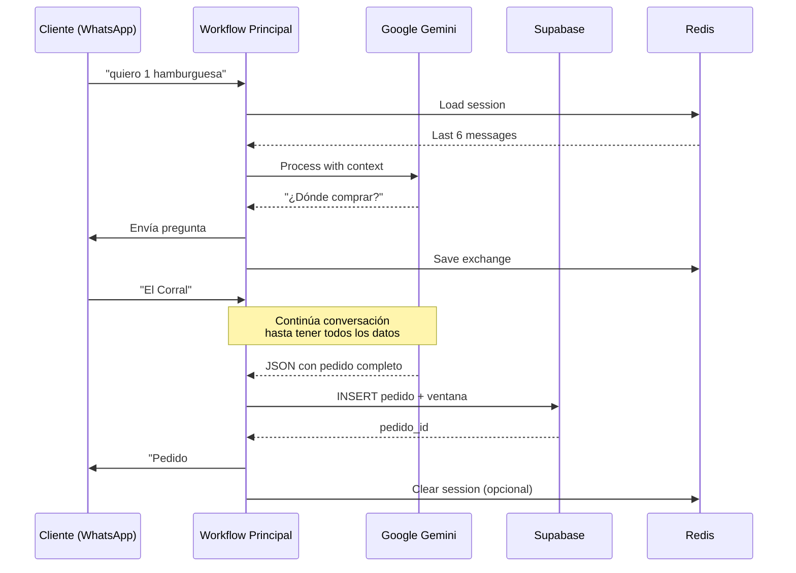
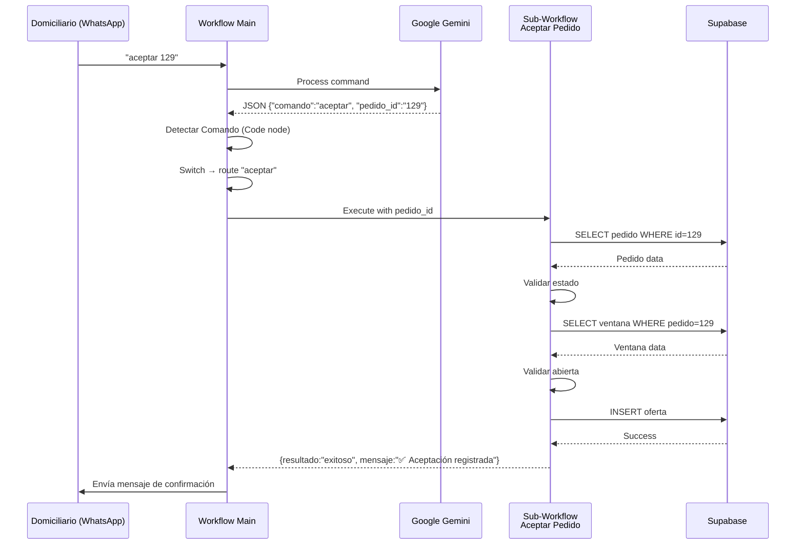
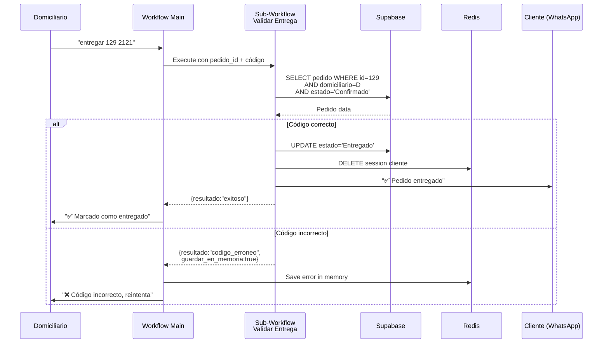

# DomiChat - Resumen Técnico Consolidado

## Introducción

Este documento proporciona un análisis técnico consolidado del sistema DomiChat, basado en el análisis de 16 de 18 workflows de n8n (2 archivos fueron demasiado grandes para análisis completo).

**Fecha de Análisis**: 2025-11-17
**Workflows Analizados**: 16/18 (88.9%)
**Total de Nodos**: ~300+ (estimado)
**Líneas de Configuración**: ~15,000+ (JSON)

---

## Arquitectura General

### Modelo de Operación

DomiChat opera como un **marketplace bilateral de delivery** conectando:
- **Clientes** → Necesitan productos entregados
- **Domiciliarios** → Disponibles para entregar

**Canal Único**: WhatsApp Business API

### Patrón Arquitectónico Principal

```
Main Workflow (Orquestador)
  ├─ AI Agent (Google Gemini)
  │    └─ Redis Memory (TTL 24h, ventana 6 mensajes)
  ├─ Sub-Workflows (Execute Workflow)
  │    ├─ Validaciones
  │    ├─ Operaciones BD
  │    └─ Notificaciones
  └─ Error Handler (Global)
```

**Ventajas del Patrón**:
- Separación de responsabilidades
- Reutilización de lógica
- Testing independiente
- Escalabilidad

---

## Stack Tecnológico Detallado

### Capa de Datos

| Componente | Tecnología | Uso | Configuración |
|------------|------------|-----|---------------|
| **Base de Datos** | Supabase (PostgreSQL) | Almacenamiento persistente | Ambiente QA |
| **Cache/Sesiones** | Redis | Memoria conversacional AI | TTL 24h, ventana 6 msgs |
| **Logging** | Google Sheets | Registro de errores | Sheet "Errores QA" |

**Tablas Principales**:
- `clientes` (7 campos)
- `domiciliarios` (10 campos)
- `pedidos` (12 campos)
- `ventanas_ofertas` (6 campos)
- `ofertas_recibidas` (8 campos)

### Capa de Inteligencia Artificial

| Componente | Tecnología | Uso | Configuración |
|------------|------------|-----|---------------|
| **LLM** | Google Gemini (Vertex AI) | Agentes conversacionales | Modelo: gemini-pro |
| **Framework** | LangChain (n8n integration) | Orquestación de agentes | Agent type: Tools |
| **Memoria** | Redis Chat Memory | Contexto conversacional | Window: 6, TTL: 24h |

**Prompts**:
- Cliente: ~3,000 líneas (recopilación de pedido)
- Domiciliario: ~3,000 líneas (comandos de negocio)

### Capa de Comunicación

| Componente | Tecnología | Uso | Configuración |
|------------|------------|-----|---------------|
| **Mensajería Principal** | WhatsApp Business API | Canal principal usuario-sistema | API v21.0 |
| **Alertas Internas** | Telegram Bot API | Notificaciones a equipo | Chat ID: 209571519 |

**Tipos de Mensajes WhatsApp**:
- Text (texto simple)
- Interactive (botones)
- Flow (formularios nativos)
- Typing Indicator (UX)

### Capa de Orquestación

| Componente | Tecnología | Versión | Uso |
|------------|------------|---------|-----|
| **Motor de Workflows** | n8n | Latest (self-hosted) | Orquestación principal |
| **Versionado** | GitHub | - | Backup automático diario |
| **Deployment** | Docker (inferido) | - | QA environment |

---

## Patrones de Diseño Identificados

### 1. Orquestador + Sub-Workflows

**Implementación**: `0001 Domiciliarios Flujo Principal`

```javascript
Main Workflow (WhatsApp → AI Agent)
  ├─ Execute: Aceptar Pedido
  ├─ Execute: Contraofertar Pedido
  ├─ Execute: Validar Entrega
  └─ Execute: Cambiar Estado
```

**Ventajas**:
- Código modular
- Reutilización
- Testing aislado
- Menor complejidad individual

### 2. Conversational AI con Detección de Comandos

**Implementación**: Agentes de Clientes y Domiciliarios

```
User Input (Natural Language)
  ↓
AI Agent (Google Gemini)
  ↓
Response with Embedded JSON
  ↓
Code Node (Regex extraction)
  ↓
Switch Node (Command routing)
  ↓
Execute appropriate sub-workflow
```

**JSON Embedding Pattern**:
```
Mensaje amigable para usuario

```json
{
  "comando": "aceptar",
  "pedido_id": "129"
}
```
```

**Procesamiento**:
1. Regex extrae bloque JSON
2. JSON parseado y validado
3. Mensaje limpiado (sin JSON)
4. Usuario ve solo texto amigable
5. Sistema usa JSON internamente

### 3. Validación en Cascada

**Implementación**: Sub-workflows (ej: `0002 Aceptar Pedido`)

```
Validación 1: ¿Pedido existe?
  ├─ NO → Return error específico
  └─ SÍ → Continuar
      ↓
Validación 2: ¿Ventana abierta?
  ├─ NO → Return error específico
  └─ SÍ → Continuar
      ↓
Operación: Registrar oferta
  ↓
Return exitoso
```

**Ventajas**:
- Early return
- Mensajes específicos
- Eficiencia (menos queries)

### 4. Error Workflow Global

**Implementación**: `0002 Utilidades Control de Errores`

```
Any Workflow Error
  ↓
Error Trigger (automático)
  ├─ Log to Google Sheets
  └─ Notify via Telegram
```

**Configuración en workflows**:
```json
{
  "settings": {
    "errorWorkflow": "tCJVhMSfqtz6Lsv2"
  }
}
```

### 5. Memoria Conversacional con Ventana Deslizante

**Implementación**: Redis Chat Memory

```
Window: [msg1, msg2, msg3, msg4, msg5, msg6]
         user   ai    user   ai    user   ai

New message arrives → msg7 (user)
  ↓
Window shifts → [msg2, msg3, msg4, msg5, msg6, msg7]
  ↓
msg1 discarded (fuera de ventana)
```

**TTL**: 24 horas (limpieza automática)

---

## Flujos de Datos Críticos

### Flujo 1: Creación de Pedido (Cliente)



### Flujo 2: Aceptación de Pedido (Domiciliario)



### Flujo 3: Validación de Entrega



---

## Análisis de Seguridad

### Autenticación y Autorización

| Nivel | Mecanismo | Implementación |
|-------|-----------|----------------|
| **Usuario** | WhatsApp Phone Verification | Inherente a WhatsApp Business |
| **Workflow Execution** | Caller Policy | `workflowsFromSameOwner` |
| **API Calls** | Bearer Tokens | Variables de entorno |
| **Database** | Row Level Security (RLS) | Supabase (no verificado en workflows) |

### Validación de Datos

**Cliente**:
- Cantidades de productos (requeridas)
- Dirección (urbana: flexible, rural: estricta)
- Valor ofrecido (≥ mínimo por zona, múltiplo de 50)

**Domiciliario**:
- pedido_id (existe y disponible)
- valor_contraoferta (> valor original, múltiplo de 50)
- codigo_verificacion (exacto de 4 dígitos)

### Código de Verificación

**Generación**: Por sistema al confirmar pedido
**Formato**: 4 dígitos numéricos (ej: "2121")
**Almacenamiento**: Campo `codigo_verificacion` en tabla `pedidos`
**Validación**: Exacta, permite reintentos
**Propósito**: Prevenir entregas fraudulentas

### Manejo de Credenciales

**Variables de Entorno**:
```bash
WHATSAPP_CLIENT_SENDER_ACCESS_TOKEN=***
WHATSAPP_DELIVERY_SENDER_ACCESS_TOKEN=***
```

**Credenciales n8n**:
- Supabase QA
- Redis QA
- Google AI Studio QA
- Telegram Notificaciones DomiChat

**⚠️ Observación**: Existe flujo `0005 Utilidades Extraer Credenciales` que exporta credenciales desencriptadas. **Usar solo en desarrollo**.

---

## Análisis de Performance

### Latencias Estimadas

| Operación | Latencia | Componentes |
|-----------|----------|-------------|
| **Mensaje WhatsApp → Respuesta AI** | 2-5s | WhatsApp API + Gemini + Redis |
| **Comando → Sub-workflow** | 0.5-1s | Execute Workflow + Supabase |
| **Validación de entrega** | 0.3-0.5s | 2 queries Supabase + UPDATE |
| **Notificación error** | 1-2s | Google Sheets + Telegram API |

### Optimizaciones Implementadas

**1. Typing Indicator**:
```
Usuario envía mensaje
  ↓ (instantáneo)
Marca como "leído" + muestra "escribiendo..."
  ↓ (mejora percepción)
Usuario sabe que fue recibido
  ↓ (2-5s procesamiento real)
Respuesta del agente
```

**2. Always Output Data**:
- Queries vacías no detienen flujo
- Permite manejo de errores específico
- Evita ejecuciones incompletas

**3. Memoria Redis Ventana Corta**:
- Solo 6 mensajes en contexto
- Reduce payload a LLM
- Menor latencia
- Menor costo

**4. Retry Strategies**:
```javascript
// WhatsApp API calls
retryOnFail: true
maxTries: 3

// Notificaciones no críticas
maxTries: 2
```

### Cuellos de Botella Potenciales

**1. LLM Call (Google Gemini)**:
- Latencia variable (2-10s)
- Dependiente de carga de Google
- **Mitigación**: Prompt optimizado, contexto reducido

**2. Supabase Queries**:
- Múltiples queries en cascada
- **Mitigación**: Índices en campos filtrados (pedido_id, estado)

**3. WhatsApp API Rate Limits**:
- Límites por número de teléfono
- **Mitigación**: Desconocida (no implementada)

---

## Análisis de Escalabilidad

### Límites Actuales (Estimados)

| Métrica | Límite | Observación |
|---------|--------|-------------|
| **Mensajes/seg** | ~10 | Rate limit WhatsApp |
| **Sesiones Redis** | ~10,000 | Con TTL 24h |
| **Conexiones Supabase** | 100 | Plan Free |
| **Llamadas Gemini** | Variable | Depende de quotas Google |

### Estrategias de Escalamiento

**Horizontal**:
- n8n soporta múltiples workers
- Redis puede usar clustering
- Supabase puede escalar plan

**Vertical**:
- Optimizar prompts (reducir tokens)
- Cachear respuestas comunes
- Batch operations en BD

**Geografía**:
- Actualmente: La Vega, Villeta (Colombia)
- Escalamiento: Una instancia por ciudad
- Aislamiento de datos por región

---

## Monitoreo y Observabilidad

### Métricas Capturadas

**Errores**:
- Google Sheets: "Log Errores DomiChat"
- Campos: Fecha, Hora, Workflow, Error Message, Estado, URL
- Notificación: Telegram en tiempo real

**Actividad de Usuarios**:
- `fecha_ultimo_mensaje` en tablas `clientes` y `domiciliarios`
- Permite identificar usuarios inactivos

### Métricas NO Capturadas (Sugeridas)

- Tiempo de respuesta promedio
- Tasa de éxito de pedidos
- Tasa de aceptación de contraofertas
- Calificación promedio de domiciliarios
- Revenue por pedido

### Alertas Configuradas

**Telegram** (Chat ID: 209571519):
- Errores en workflows críticos
- Formato: Workflow name + Error message + URL

**⚠️ Limitación**: No hay alertas de métricas de negocio (ej: pedidos sin aceptar)

---

## Análisis de Confiabilidad

### Estrategias de Resiliencia

**1. Error Workflow Global**:
```
Workflow falla
  ↓
Error Trigger (automático)
  ├─ Log a Google Sheets (onError: continue)
  └─ Notify Telegram
```

**2. Retry en HTTP Calls**:
- WhatsApp API: 3 intentos
- Notificaciones: 2 intentos

**3. Always Output Data**:
- Supabase queries retornan `{}` en vez de fallar
- Permite validación explícita

**4. Graceful Degradation**:
- Google Sheets falla → Telegram aún funciona
- Ambos fallan → n8n internal error log

### Puntos Únicos de Falla

| Componente | Impacto si Falla | Mitigación Actual |
|------------|------------------|-------------------|
| **WhatsApp API** | Sistema completo inoperante | Retry, ninguna alternativa |
| **Supabase** | No se guardan datos | Retry, ningún backup en tiempo real |
| **Google Gemini** | Agentes AI no funcionan | Ninguna (crítico) |
| **Redis** | Se pierde contexto conversacional | TTL 24h, reconstrucción desde cero |
| **n8n** | Sistema completo inoperante | Backup diario a GitHub (recovery manual) |

**⚠️ Recomendación**: Implementar failover para servicios críticos

---

## Recomendaciones Técnicas

### Corto Plazo (1-2 sprints)

1. **Implementar Métricas de Negocio**:
   ```sql
   CREATE TABLE metricas_diarias (
     fecha DATE PRIMARY KEY,
     pedidos_creados INTEGER,
     pedidos_confirmados INTEGER,
     pedidos_entregados INTEGER,
     tasa_confirmacion DECIMAL,
     revenue_total DECIMAL
   );
   ```

2. **Rate Limiting**:
   ```javascript
   // Prevenir spam de comandos
   if (ultimo_mensaje < 2 segundos) {
     return "Por favor espera antes de enviar otro comando";
   }
   ```

3. **Consolidar Error Workflows**:
   - Identificar por qué `cGFHe0wsizcDFbHD` es diferente de `tCJVhMSfqtz6Lsv2`
   - Unificar en un solo error handler

4. **Índices de Base de Datos**:
   ```sql
   CREATE INDEX idx_pedidos_estado ON pedidos(estado);
   CREATE INDEX idx_ventanas_estado ON ventanas_ofertas(estado_ventana);
   CREATE INDEX idx_ofertas_ventana ON ofertas_recibidas(ventana_id);
   ```

### Mediano Plazo (3-6 meses)

1. **Multi-región**:
   - Separar infraestructura por ciudad
   - Reducir latencias
   - Mejorar aislamiento de datos

2. **Dashboard de Métricas**:
   - Looker Studio conectado a Supabase
   - KPIs en tiempo real
   - Alertas automáticas

3. **Testing Automatizado**:
   - Tests unitarios de sub-workflows
   - Tests de integración end-to-end
   - CI/CD pipeline

4. **Gestión de Ambiente Producción**:
   - Separar completamente QA y Prod
   - Blue-green deployment
   - Rollback automatizado

### Largo Plazo (6-12 meses)

1. **Migrar a Microservicios**:
   - Separar lógica crítica de n8n
   - APIs REST/GraphQL propias
   - Mejor control y testing

2. **Machine Learning**:
   - Predicción de mejor domiciliario
   - Optimización de precios dinámicos
   - Detección de fraude

3. **Multi-canal**:
   - Telegram como alternativa a WhatsApp
   - App móvil nativa
   - Web app

---

## Costos Estimados

### Infraestructura (Mensual)

| Servicio | Plan Actual | Costo Estimado | Notas |
|----------|-------------|----------------|-------|
| **n8n** | Self-hosted | $0-50 | VPS/Cloud hosting |
| **Supabase** | Free/Pro | $0-25 | Depende de uso |
| **Redis** | Cloud (inferido) | $10-30 | Redis Cloud/Upstash |
| **Google Gemini** | Pay-as-you-go | $50-200 | Variable por llamadas |
| **WhatsApp Business** | Conversaciones | $20-100 | $0.005-0.01 por mensaje |
| **Google Sheets** | Free | $0 | Parte de Google Workspace |
| **Telegram** | Free | $0 | Uso de Bot API |
| **GitHub** | Free | $0 | Repositorio público |

**Total Estimado**: $80-405/mes

**Variables Principales**:
- Número de pedidos/día
- Longitud de conversaciones (tokens LLM)
- Número de usuarios activos

---

## Conclusiones

### Fortalezas del Sistema

1. **Arquitectura Modular**: Separación clara entre flujos principales y sub-workflows
2. **AI Conversational**: Experiencia natural para usuarios via WhatsApp
3. **Automatización Completa**: Desde pedido hasta entrega validada
4. **Monitoreo de Errores**: Sistema robusto con Google Sheets + Telegram
5. **Versionado Automático**: Backup diario a GitHub

### Áreas de Mejora

1. **Falta de Métricas de Negocio**: No hay dashboard de KPIs
2. **Sin Failover**: Puntos únicos de falla no mitigados
3. **Testing Manual**: No hay tests automatizados
4. **Documentación Incompleta**: 2 workflows no analizados (archivos grandes)
5. **Escalabilidad Limitada**: Sin estrategia clara para múltiples regiones

### Riesgo Técnico Global

**Nivel**: MEDIO-ALTO

**Factores**:
- ✅ Código modular y bien estructurado
- ✅ Error handling implementado
- ⚠️ Dependencia fuerte en servicios terceros (WhatsApp, Gemini)
- ⚠️ Sin redundancia en componentes críticos
- ❌ Sin métricas de SLA/uptime
- ❌ Sin disaster recovery plan

---

**Documento Generado por**: Claude (Anthropic)
**Fecha**: 2025-11-17
**Basado en**: Análisis de 16/18 workflows n8n de DomiChat
**Versión**: 1.0
