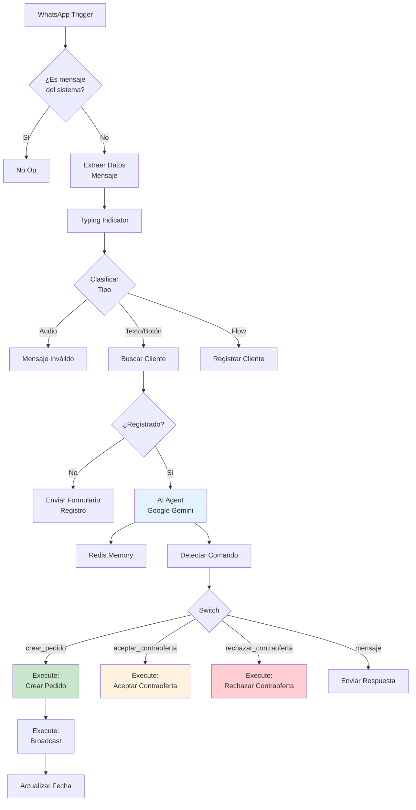

# 0001 Clientes Flujo Principal

## INFORMACIÓN GENERAL

| Campo | Valor |
|-------|-------|
| **Nombre** | 0001 Clientes Flujo Principal |
| **ID** | vZz3KSWmbZa2xPyx |
| **Estado** | ✅ Activo |
| **Total de Nodos** | 49 (estimado) |
| **Trigger** | WhatsApp Trigger |
| **Análisis** | Parcial (archivo muy grande - 48,375 tokens) |

---

## PROPÓSITO

Flujo principal para la **interacción conversacional con clientes** vía WhatsApp.

### Responsabilidades
1. Recibir mensajes WhatsApp de clientes
2. Motor conversacional AI (Google Gemini)
3. Recopilar datos del pedido mediante conversación natural
4. Orquestar sub-workflows para operaciones específicas
5. Gestionar sesiones con memoria en Redis

---

## ARQUITECTURA GENERAL



---

## FLUJO DE CONVERSACIÓN

### 1. Recepción de Mensaje
- WhatsApp Trigger recibe evento
- Filtro: Ignora mensajes del sistema
- Extrae: tipo, teléfono, ID, contenido

### 2. Clasificación
**Tipos soportados**:
- ✅ Texto
- ✅ Botón interactivo
- ✅ Flow (formulario)
- ❌ Audio (no soportado)

### 3. Registro de Cliente
**Si no está registrado**:
- Envía WhatsApp Flow interactivo
- Campos: nombres, apellidos, ciudad, email
- Guarda en tabla `clientes`
- Mensaje de bienvenida

---

## AI AGENT

### Google Gemini Chat Model
**Configuración**:
- Model: gemini-pro
- Prompt: ~3,000 líneas
- Credenciales: Google AI Studio QA

### Redis Chat Memory
**Session Key**: `{numero_usuario}_cliente`

**Ejemplo**: `573219876543_cliente`

**Config**:
- TTL: 24 horas
- Window: 6 mensajes
- Credenciales: Redis QA

---

## PROMPT DEL AGENTE

### Identidad
```
Eres DomiChat Cliente, asistente especializado en crear pedidos de delivery.
```

### Responsabilidades
1. Recopilar información del pedido mediante conversación natural
2. Validar datos requeridos
3. Generar JSON cuando datos completos
4. Procesar contraófertas de domiciliarios

### Variables de Sesión
```javascript
{
  lista_compras_guardada: string,
  direccion_guardada: string,
  ciudad_guardada: string,
  valor_oferta_guardado: number,
  zona_domicilio_guardada: string,
  pedido_id_guardado: string
}
```

---

## COMANDOS DETECTADOS

### Comando: crear_pedido

**Trigger**: Cuando todos los datos están completos

**Datos requeridos**:
- `lista_compras`: "1 pizza hawaiana, 2 gaseosas"
- `direccion`: "Calle 5 # 12-34, Barrio Centro"
- `ciudad`: "La Vega" | "Villeta"
- `valor_oferta`: 8000 (múltiplo de 50)
- `zona_domicilio`: "Urbana" | "Rural"

**JSON generado**:
```json
{
  "comando": "crear_pedido",
  "phone_number": "573219876543",
  "client_name": "María González",
  "lista_compras": "1 pizza hawaiana",
  "direccion": "Calle 5 # 12-34",
  "ciudad": "La Vega",
  "valor_oferta": "8000",
  "zona_domicilio": "Urbana"
}
```

**Ejecuta**:
1. `0002 Crear Pedido`
2. `0003 Broadcast Domiciliarios`
3. `0004 Procesar Ventana Ofertas` (timer)

---

### Comando: aceptar_contraoferta

**Trigger**: Cliente dice "sí" a contraoferta

**JSON**:
```json
{
  "comando": "aceptar_contraoferta",
  "pedido_id": "155"
}
```

**Ejecuta**: `0005 Aceptar Contraoferta`

---

### Comando: rechazar_contraoferta

**Trigger**: Cliente dice "no" a contraoferta

**JSON**:
```json
{
  "comando": "rechazar_contraoferta",
  "pedido_id": "155"
}
```

**Ejecuta**: `0007 Rechazar Contraoferta`

---

## VALIDACIONES

### Dirección
**Urbana**: Flexible
```
"Calle 5 # 12-34"
"Carrera 10 con 15"
```

**Rural**: Detallada requerida
```
"Vereda San Miguel, finca Los Rosales,
bajando por el río, casa azul después del puente"
```

### Valor Ofrecido
**Validaciones**:
- Múltiplo de 50
- Mínimo según zona:
  - Urbana: $5,000
  - Rural: $8,000

**Ejemplos válidos**:
- 5000 ✅
- 8700 ✅
- 12800 ✅

**Inválidos**:
- 5025 ❌ (no múltiplo de 50)
- 4000 ❌ (menor al mínimo)

### Ciudad
**Solo admite**:
- La Vega
- Villeta

---

## CASOS DE USO

### Caso 1: Pedido Urbano Completo
```
Cliente: "Hola"
Bot: "👋 ¡Hola! ¿Qué necesitas?"

Cliente: "Quiero una pizza"
Bot: "📝 ¿Qué pizza deseas?"

Cliente: "Una hawaiana grande"
Bot: "📍 ¿Cuál es tu dirección?"

Cliente: "Calle 5 # 12-34"
Bot: "🏙️ ¿En qué ciudad?"

Cliente: "La Vega"
Bot: "💰 ¿Cuánto ofreces por el domicilio?"

Cliente: "5000"
Bot: "✅ Pedido creado #155
     ⏰ Domiciliarios tienen 3 minutos para ofertar"

[Sistema ejecuta sub-workflows]
```

---

### Caso 2: Pedido Rural con Validaciones
```
Cliente: "Necesito 1 kilo de arroz"
Bot: "📝 ¿Algo más?"

Cliente: "No, solo eso"
Bot: "📍 ¿Tu dirección?"

Cliente: "Vereda La Palma"
Bot: "⚠️ Para zonas rurales necesito dirección detallada.
     Ejemplo: Vereda, finca, puntos de referencia..."

Cliente: "Vereda La Palma, finca Los Pinos,
         después del puente colgante, portón verde"
Bot: "🏙️ ¿Ciudad?"

Cliente: "Villeta"
Bot: "💰 ¿Cuánto ofreces? (rural mínimo $8,000)"

Cliente: "10000"
Bot: "✅ Pedido creado #156"
```

---

## SUB-WORKFLOWS INVOCADOS

| Workflow | Cuándo | Función |
|----------|--------|---------|
| 0002 Crear Pedido | Datos completos | Crea pedido y ventana |
| 0003 Broadcast | Después de crear | Notifica domiciliarios |
| 0004 Procesar Ventana | Timer 3-5 min | Selecciona mejor oferta |
| 0005 Aceptar Contraoferta | Cliente acepta | Confirma pedido |
| 0006 Procesar Contraoferta | Timer 2 min | Espera decisión cliente |
| 0007 Rechazar Contraoferta | Cliente rechaza | Cancela pedido |

---

## TABLAS SUPABASE

### `clientes`
```sql
CREATE TABLE clientes (
  numero_usuario VARCHAR PRIMARY KEY,
  nombre VARCHAR,
  apellido VARCHAR,
  ciudad VARCHAR,
  email VARCHAR,
  fecha_registro TIMESTAMPTZ,
  fecha_ultimo_mensaje TIMESTAMPTZ
);
```

### `pedidos`
Interactuado por sub-workflows

---

## CONFIGURACIÓN

### Variables de Entorno
```bash
WHATSAPP_API_VERSION=v21.0
WHATSAPP_CLIENT_PHONE_NUMBER_ID=xxxxx
WHATSAPP_CLIENT_SENDER_ACCESS_TOKEN=xxxxx
WHATSAPP_CLIENT_FLOW_ID_REGISTRO=xxxxx
TZ=America/Bogota
```

### Error Workflow
**ID**: tCJVhMSfqtz6Lsv2 (Control y Notificación de Errores)

---

## CONSIDERACIONES

### 1. Conversación Natural
- No formulario rígido
- Pregunta por pregunta
- Acepta respuestas en cualquier orden
- Tolerante a errores de escritura

### 2. Memoria Contextual
- Recuerda respuestas previas
- No pide información ya proporcionada
- Mantiene contexto durante 24h

### 3. Validación Progresiva
- Valida cada dato al recibirlo
- Pide corrección inmediatamente
- No espera a tener todo para validar

---

## MEJORAS POTENCIALES

1. **Geolocalización**:
   - Botón "Compartir ubicación"
   - Auto-detectar dirección

2. **Sugerencias de Valor**:
   ```
   "Pedidos similares cuestan $8,000-$12,000"
   ```

3. **Historial de Pedidos**:
   ```
   "¿Repetir tu último pedido?"
   [Sí] [No] [Ver historial]
   ```

4. **Tracking en Tiempo Real**:
   - Estado del pedido
   - Ubicación del domiciliario

---

**Documentado por**: Claude (Anthropic)
**Fecha**: 2025-11-17
**Análisis**: Parcial (archivo muy grande - 48,375 tokens)
**Nota**: Análisis completo requiere lectura fragmentada
**Parte de**: Sistema DomiChat (18 workflows totales)
