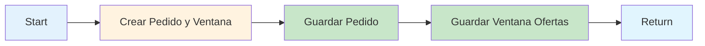

# 0002 Clientes Crear Pedido

## INFORMACIÓN GENERAL

| Campo | Valor |
|-------|-------|
| **Nombre** | 0002 Clientes Crear Pedido |
| **ID** | Mdl3DHroFQwCDQKf |
| **Estado** | ⚪ Inactivo (Sub-workflow) |
| **Fecha Creación** | 2025-09-10T02:34:20.224Z |
| **Última Actualización** | 2025-09-25T05:02:35.000Z |
| **Total de Nodos** | 5 |
| **Trigger** | Execute Workflow Trigger |

---

## PROPÓSITO DEL FLUJO

Sub-workflow que **crea un nuevo pedido** en el sistema y **abre la ventana de ofertas** para que los domiciliarios puedan proponer.

### Responsabilidades
1. Generar código de verificación de 4 dígitos
2. Validar datos requeridos del pedido
3. Crear registro en tabla `pedidos`
4. Crear ventana de ofertas en tabla `ventanas_ofertas`
5. Retornar IDs generados

### Invocado Por
- `0001 Clientes Flujo Principal` (cuando el agente AI completa recopilación de datos)

---

## FLUJO DE DATOS



---

## NODOS DETALLADOS

### 1. Start (Execute Workflow Trigger)

**Input esperado**:
```typescript
{
  phone_number: string;          // Número WhatsApp del cliente
  client_name: string;           // Nombre del cliente
  lista_compras: string;         // Descripción de los productos
  direccion: string;             // Dirección de entrega completa
  ciudad: string;                // La Vega | Villeta
  valor_oferta: string | number; // Valor ofrecido por el cliente
  zona_domicilio: "Urbana" | "Rural";
}
```

**Ejemplo**:
```json
{
  "phone_number": "573006064535",
  "client_name": "Manuel Torres",
  "lista_compras": "1 kilo arroz, 2 libras carne, 1 sixpack cerveza",
  "direccion": "Vereda San Miguel, finca Los Rosales, bajando por el río, casa azul después del puente",
  "ciudad": "Villeta",
  "valor_oferta": "10000",
  "zona_domicilio": "Rural"
}
```

---

### 2. Crear Pedido y Ventana (Code Node)

**Función**: Procesa y estructura los datos del pedido

**Operaciones**:

#### Generar Código de Verificación
```javascript
function generarCodigoVerificacion() {
  return Math.floor(1000 + Math.random() * 9000).toString();
}
// Resultado: "2121", "8347", "1906", etc.
```

#### Obtener Timestamp Bogotá
```javascript
function obtenerFechaBogotaISO() {
  const ahora = new Date();
  const opciones = { timeZone: 'America/Bogota' };
  const bogotaTimestamp = new Date(
    ahora.toLocaleString('en-US', opciones)
  ).toISOString();
  return bogotaTimestamp;
}
```

#### Validaciones
```javascript
if (
  !datosPedido.phone_number ||
  !datosPedido.client_name ||
  !datosPedido.lista_compras ||
  !datosPedido.direccion ||
  !datosPedido.valor_oferta ||
  !datosPedido.zona_domicilio
) {
  throw new Error(
    'Faltan datos requeridos en el pedido desde la tool crear_pedido.'
  );
}
```

#### Estructurar Output
```javascript
{
  codigo_verificacion: "2121",
  fecha_pedido: "2025-11-17T10:30:00.000Z",
  estado_pedido: "VentanaAbierta",
  numero_usuario: "573006064535",
  nombre_usuario: "Manuel Torres",
  ciudad: "Villeta",
  zona_domicilio: "Rural",
  lista_compras: "1 kilo arroz, 2 libras carne, 1 sixpack cerveza",
  direccion: "Vereda San Miguel, finca Los Rosales...",
  valor_oferta: 10000,
  tiempo_inicio: "2025-11-17T10:30:00.000Z",
  tiempo_fin: "2025-11-17T10:33:00.000Z",  // +3 minutos
  estado_ventana: "abierta"
}
```

---

### 3. Guardar Pedido (Supabase INSERT)

**Operación**: INSERT en tabla `pedidos`

**Campos**:
```javascript
{
  estado: "VentanaAbierta",
  numero_usuario: "573006064535",
  nombre_usuario: "Manuel Torres",
  lista_compras: "...",
  direccion: "...",
  zona_domicilio: "Rural",
  valor_oferta: 10000,
  fecha_pedido: "2025-11-17T10:30:00.000Z",
  codigo_verificacion: "2121",
  ciudad: "Villeta"
}
```

**Retorna**:
```javascript
{
  pedido_id: "155",  // Auto-generado por Supabase
  ...otros campos
}
```

---

### 4. Guardar Ventana Ofertas (Supabase INSERT)

**Operación**: INSERT en tabla `ventanas_ofertas`

**Campos**:
```javascript
{
  pedido_id: "155",  // Del nodo anterior
  tiempo_inicio: "2025-11-17T10:30:00.000Z",
  tiempo_fin: "2025-11-17T10:33:00.000Z",
  estado_ventana: "abierta"
}
```

**Retorna**:
```javascript
{
  ventana_id: "87",  // Auto-generado
  ...otros campos
}
```

---

### 5. Return (Set)

**Output final**:
```javascript
{
  pedido_id: "155",
  ventana_id: "87",
  message: "Pedido creado exitosamente",
  success: true
}
```

Este output se retorna al flujo principal para continuar el proceso.

---

## TABLAS SUPABASE

### `pedidos`
```sql
CREATE TABLE pedidos (
  pedido_id SERIAL PRIMARY KEY,
  estado VARCHAR NOT NULL,              -- 'VentanaAbierta'
  numero_usuario VARCHAR NOT NULL,
  nombre_usuario VARCHAR NOT NULL,
  lista_compras TEXT NOT NULL,
  direccion TEXT NOT NULL,
  zona_domicilio VARCHAR NOT NULL,      -- 'Urbana' | 'Rural'
  valor_oferta NUMERIC NOT NULL,
  fecha_pedido TIMESTAMPTZ NOT NULL,
  codigo_verificacion VARCHAR(4) NOT NULL,
  ciudad VARCHAR NOT NULL,
  domiciliario_asignado VARCHAR,
  fecha_entrega TIMESTAMPTZ
);
```

### `ventanas_ofertas`
```sql
CREATE TABLE ventanas_ofertas (
  ventana_id SERIAL PRIMARY KEY,
  pedido_id INTEGER REFERENCES pedidos(pedido_id),
  tiempo_inicio TIMESTAMPTZ NOT NULL,
  tiempo_fin TIMESTAMPTZ NOT NULL,
  estado_ventana VARCHAR NOT NULL       -- 'abierta' | 'cerrada'
);
```

---

## CASOS DE USO

### Caso 1: Pedido Urbano
```javascript
Input:
{
  "phone_number": "573006064535",
  "client_name": "María González",
  "lista_compras": "1 pizza grande hawaiana",
  "direccion": "Calle 5 # 12-34, Barrio Centro",
  "ciudad": "La Vega",
  "valor_oferta": "5000",
  "zona_domicilio": "Urbana"
}

Proceso:
1. Genera código: "8342"
2. Calcula ventana: 3 minutos
3. INSERT en pedidos → pedido_id: 156
4. INSERT en ventanas_ofertas → ventana_id: 88

Output:
{
  "pedido_id": "156",
  "ventana_id": "88",
  "message": "Pedido creado exitosamente",
  "success": true
}
```

---

### Caso 2: Pedido Rural
```javascript
Input:
{
  "phone_number": "573219876543",
  "client_name": "Carlos Rodríguez",
  "lista_compras": "1 kilo arroz, 2 libras carne, aceite",
  "direccion": "Vereda La Palma, finca Los Pinos, después del puente colgante",
  "ciudad": "Villeta",
  "valor_oferta": "15000",
  "zona_domicilio": "Rural"
}

Output:
{
  "pedido_id": "157",
  "ventana_id": "89",
  "message": "Pedido creado exitosamente",
  "success": true
}
```

**Diferencias**:
- Valor oferta mayor (zona rural requiere más)
- Dirección más descriptiva
- Misma duración de ventana (3 minutos)

---

### Caso 3: Error - Datos Faltantes
```javascript
Input:
{
  "phone_number": "573006064535",
  "client_name": "Juan Pérez",
  "lista_compras": "1 hamburguesa"
  // Falta: direccion, ciudad, valor_oferta, zona_domicilio
}

Proceso:
1. Nodo "Crear Pedido y Ventana" valida datos
2. throw new Error('Faltan datos requeridos...')
3. Workflow falla
4. Error capturado por flujo principal

Resultado:
- Pedido NO creado
- Cliente debe completar datos faltantes
```

---

## CONFIGURACIÓN TEMPORAL

### Ventana de Ofertas
**Duración**: 3 minutos fijos

```javascript
tiempo_inicio = fechaPedido;
tiempo_fin = new Date(
  new Date(fechaPedido).getTime() + 3 * 60 * 1000
).toISOString();
```

**Ejemplos**:
- Inicio: 10:30:00 → Fin: 10:33:00
- Inicio: 14:15:30 → Fin: 14:18:30

---

## CÓDIGO DE VERIFICACIÓN

### Formato
- **Longitud**: 4 dígitos
- **Rango**: 1000-9999
- **Generación**: Random

### Uso Posterior
1. Cliente recibe código al confirmar pedido
2. Domiciliario solicita código al entregar
3. Sistema valida coincidencia exacta
4. Solo una oportunidad de verificación

### Seguridad
- No secuencial (previene adivinación)
- Único por pedido
- Válido solo para ese pedido específico

---

## CONSIDERACIONES TÉCNICAS

### 1. Timezone Bogotá
- Todas las fechas en timezone `America/Bogota`
- Formato ISO 8601 con 'Z'
- Importante para cálculo correcto de ventana

### 2. Orden de Inserciones
```
1. Pedido primero (genera pedido_id)
2. Ventana después (usa pedido_id como FK)
```

No se puede invertir por dependencia de foreign key.

### 3. Transaccionalidad
⚠️ **No hay transacción explícita**
- Si `Guardar Pedido` falla → Workflow falla
- Si `Guardar Ventana` falla → Pedido queda huérfano

**Mejora sugerida**: Implementar rollback o transacción Supabase

### 4. Valor Duplicado
**Nota**: Campo `valor_oferta` se inserta dos veces en el mismo nodo
```javascript
{
  fieldId: "valor_oferta",
  fieldValue: "={{ $json.valor_oferta }}"
},
{
  fieldId: "valor_oferta",  // Duplicado
  fieldValue: "={{ $json.valor_oferta }}"
}
```

Esto probablemente es un error de configuración (no causa problemas, solo es redundante).

---

## DEPENDENCIAS

### Workflows
- **Invocado por**: 0001 Clientes Flujo Principal
- **Invoca a**: Ninguno
- **Siguiente en cadena**: 0003 Broadcast Domiciliarios (fuera de este workflow)

### Servicios Externos
- **Supabase QA**: Tablas `pedidos` y `ventanas_ofertas`

---

## PINDATA (Testing)

```json
{
  "When Executed by Another Workflow": [{
    "json": {
      "phone_number": "573006064535",
      "client_name": "Manuel Torres",
      "lista_compras": "1 kilo arroz, 2 libras carne, 1 sixpack cerveza",
      "direccion": "Vereda San Miguel, finca Los Rosales, bajando por el río, casa azul después del puente",
      "ciudad": "Villeta",
      "valor_oferta": "10000",
      "zona_domicilio": "Rural"
    }
  }]
}
```

---

## MEJORAS POTENCIALES

1. **Transacciones**:
   ```javascript
   BEGIN TRANSACTION;
   INSERT INTO pedidos...;
   INSERT INTO ventanas_ofertas...;
   COMMIT;
   ```

2. **Validación de Ciudad**:
   ```javascript
   if (!['La Vega', 'Villeta'].includes(ciudad)) {
     throw new Error('Ciudad no soportada');
   }
   ```

3. **Validación de Valor**:
   ```javascript
   const valorMinimo = zona === 'Rural' ? 8000 : 5000;
   if (valor_oferta < valorMinimo) {
     throw new Error(`Valor mínimo: $${valorMinimo}`);
   }
   ```

4. **Ventana Dinámica**:
   ```javascript
   const duracion = zona === 'Rural' ? 5 : 3; // minutos
   ```

---

**Documentado por**: Claude (Anthropic)
**Fecha**: 2025-11-17
**Parte de**: Sistema DomiChat (18 workflows totales)
