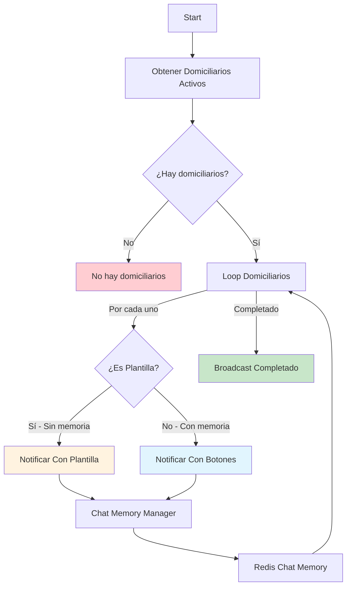

# 0003 Clientes Broadcast Domiciliarios

## INFORMACIÓN GENERAL

| Campo | Valor |
|-------|-------|
| **Nombre** | 0003 Clientes Broadcast Domiciliarios |
| **ID** | Qt35dLh0xdcGB6jT |
| **Estado** | ⚪ Inactivo (Sub-workflow) |
| **Fecha Creación** | 2025-09-10T02:35:27.874Z |
| **Última Actualización** | 2025-11-06T16:48:15.000Z |
| **Total de Nodos** | 10 |
| **Trigger** | Execute Workflow Trigger |

---

## PROPÓSITO DEL FLUJO

Sub-workflow que **notifica a todos los domiciliarios activos** de una ciudad sobre un nuevo pedido disponible.

### Responsabilidades
1. Consultar domiciliarios activos de la ciudad del pedido
2. Determinar tipo de mensaje (plantilla vs botones)
3. Enviar notificación WhatsApp a cada domiciliario
4. Guardar notificación en memoria Redis de cada domiciliario
5. Retornar resultado del broadcast

### Invocado Por
- `0001 Clientes Flujo Principal` (después de crear pedido y ventana)

---

## FLUJO DE DATOS



---

## NODOS DETALLADOS

### 1. Start (Execute Workflow Trigger)

**Input esperado**:
```typescript
{
  lista_compras: string;    // Productos a comprar
  valor_oferta: number;     // Valor ofrecido
  zona_domicilio: string;   // "Urbana" | "Rural"
  pedido_id: string;        // ID del pedido
  direccion: string;        // Dirección completa
  ciudad: string;           // "La Vega" | "Villeta"
}
```

**Ejemplo**:
```json
{
  "lista_compras": "una bolsa de leche y unas zanahorias",
  "valor_oferta": "15000",
  "zona_domicilio": "Rural",
  "pedido_id": "155",
  "direccion": "Vereda la huerta, bajas al puente...",
  "ciudad": "La Vega"
}
```

---

### 2. Obtener Domiciliarios Activos (Supabase GET ALL)

**Query**:
```sql
SELECT *
FROM domiciliarios
WHERE estado_domiciliario = 'Activo'
  AND ciudad_domiciliario = :ciudad
```

**Filtros**:
- `estado_domiciliario` = "Activo"
- `ciudad_domiciliario` = ciudad del pedido

**Configuración**:
- `alwaysOutputData`: true (retorna array vacío si no hay resultados)

**Output esperado**:
```javascript
[
  {
    numero_domiciliario: "573006064535",
    nombre_domiciliario: "Juan",
    apellido_domiciliario: "Pérez",
    ciudad_domiciliario: "La Vega",
    estado_domiciliario: "Activo",
    calificacion_domiciliario: 4.5,
    fecha_ultimo_mensaje: "2025-11-16T10:30:00.000Z"
  },
  // ... más domiciliarios
]
```

---

### 3. ¿Hay domiciliarios activos? (IF)

**Condición**:
```javascript
Object.keys($json).length > 0
```

**Salidas**:
- **TRUE**: Hay domiciliarios → Continuar con broadcast
- **FALSE**: No hay domiciliarios → Retornar sin notificaciones

---

### 4. Loop Domiciliarios (Split In Batches)

**Función**: Itera sobre cada domiciliario uno por uno

**Configuración**:
- `batchSize`: 1 (procesa uno a la vez)
- Permite enviar mensajes individualizados
- Continúa hasta procesar todos

---

### 5. ¿Es Plantilla? (IF)

**Condición**: Determina si usar mensaje plantilla o botones interactivos

```javascript
!$json["fecha_ultimo_mensaje"] ||
(Date.now() - new Date($json["fecha_ultimo_mensaje"]).getTime()) > (86400000 - 120000)
```

**Lógica**:
- Si NO tiene `fecha_ultimo_mensaje` → TRUE (domiciliario nuevo, usar plantilla)
- Si último mensaje > 23h58m (casi 24h) → TRUE (memoria Redis próxima a expirar, usar plantilla)
- Si último mensaje < 23h58m → FALSE (usar botones interactivos)

**Razón**:
- **Plantillas**: Pueden enviarse sin ventana de 24h de conversación activa
- **Botones**: Requieren ventana de conversación activa (memory en Redis válida)

---

### 6. Notificar Domiciliario Con Plantilla (HTTP Request)

**Método**: POST a WhatsApp API

**Endpoint**:
```
https://graph.facebook.com/{{WHATSAPP_API_VERSION}}/{{WHATSAPP_DELIVERY_PHONE_NUMBER_ID}}/messages
```

**Body**:
```json
{
  "messaging_product": "whatsapp",
  "to": "{{ numero_domiciliario }}",
  "type": "template",
  "template": {
    "name": "notificar_pedido",
    "language": {
      "code": "es"
    },
    "components": [
      {
        "type": "body",
        "parameters": [
          { "type": "text", "text": "155" },                    // pedido_id
          { "type": "text", "text": "1 kilo arroz, ..." },      // lista_compras
          { "type": "text", "text": "Vereda la huerta..." },    // direccion
          { "type": "text", "text": "Rural" },                  // zona_domicilio
          { "type": "text", "text": "15000" }                   // valor_oferta
        ]
      }
    ]
  }
}
```

**Headers**:
```json
{
  "Authorization": "Bearer {{WHATSAPP_DELIVERY_SENDER_ACCESS_TOKEN}}",
  "Content-Type": "application/json"
}
```

**Retry**: 2 intentos

---

### 7. Notificar Domiciliario Con Botones (HTTP Request)

**Método**: POST a WhatsApp API

**Body**:
```json
{
  "messaging_product": "whatsapp",
  "recipient_type": "individual",
  "to": "{{ numero_domiciliario }}",
  "type": "interactive",
  "interactive": {
    "type": "button",
    "header": {
      "type": "text",
      "text": "🚚 Pedido disponible"
    },
    "body": {
      "text": "📋 No. 155\n📦 1 kilo arroz...\n📍 Vereda la huerta... (Rural)\n💰 Valor: $15000\n\n⏰ Responder en 3 minutos"
    },
    "action": {
      "buttons": [
        {
          "type": "reply",
          "reply": {
            "id": "ACEPTAR-155",
            "title": "Aceptar"
          }
        },
        {
          "type": "reply",
          "reply": {
            "id": "CONTRAOFERTAR-155",
            "title": "Contraofertar"
          }
        }
      ]
    }
  }
}
```

**Retry**: 2 intentos

---

### 8. Chat Memory Manager (Memory Manager)

**Modo**: insert

**Mensaje**:
```javascript
{
  type: "ai",
  message: `
    🚚 Pedido disponible

    📋 No. {{ pedido_id }}
    📦 {{ lista_compras }}
    📍 {{ direccion }} ({{ zona_domicilio }})
    💵 Valor: ${{ valor_oferta }}

    ⏰ Responder en 3 minutos
  `
}
```

**Función**: Guarda la notificación en el historial de Redis del domiciliario

**Por qué**:
- Domiciliario ve el mensaje en WhatsApp
- Sistema lo guarda en memoria conversacional
- Cuando domiciliario responde, AI agent tiene contexto del pedido

---

### 9. Redis Chat Memory (Memory)

**Session Key**:
```javascript
{{ numero_domiciliario }}_delivery
```

**Ejemplo**: `573006064535_delivery`

**Configuración**:
- TTL: 86400000 ms (24 horas)
- Context Window: 6 mensajes
- Credenciales: Redis QA

---

### 10. Broadcast Completado (Set)

**Output exitoso**:
```javascript
{
  resultado_broadcast: "Exitoso",
  domiciliarios_notificados: "573006064535,573219876543,573123456789"
}
```

**Output sin domiciliarios**:
```javascript
{
  resultado_broadcast: "Sin domiciliarios"
}
```

---

## CASOS DE USO

### Caso 1: Broadcast Exitoso - 3 Domiciliarios Activos

**Input**:
```json
{
  "pedido_id": "155",
  "lista_compras": "1 pizza hawaiana",
  "direccion": "Calle 5 # 12-34",
  "zona_domicilio": "Urbana",
  "valor_oferta": "8000",
  "ciudad": "La Vega"
}
```

**Proceso**:
1. Query Supabase → 3 domiciliarios activos en La Vega
2. Loop:
   - Dom 1: Último mensaje hace 1 hora → Botones interactivos
   - Dom 2: Último mensaje hace 23h59m → Plantilla
   - Dom 3: Sin mensajes previos → Plantilla
3. Cada uno recibe notificación y se guarda en su memoria Redis

**Output**:
```json
{
  "resultado_broadcast": "Exitoso",
  "domiciliarios_notificados": "573001111111,573002222222,573003333333"
}
```

---

### Caso 2: Sin Domiciliarios Activos

**Input**:
```json
{
  "pedido_id": "156",
  "ciudad": "Villeta",
  ...
}
```

**Proceso**:
1. Query Supabase → 0 domiciliarios activos en Villeta
2. IF: No hay domiciliarios → Saltar broadcast
3. Retornar resultado sin notificaciones

**Output**:
```json
{
  "resultado_broadcast": "Sin domiciliarios"
}
```

**Consecuencia**:
- Cliente debe esperar o cancelar pedido
- No se pueden procesar pedidos sin domiciliarios disponibles

---

### Caso 3: Domiciliarios en Diferentes Ciudades

**Escenario**: Pedido en La Vega, pero hay domiciliarios activos en Villeta

```sql
-- Pedido en La Vega
ciudad = 'La Vega'

-- Domiciliarios:
- Juan (Activo, La Vega) ✅ Notificado
- María (Activo, Villeta) ❌ No notificado
- Carlos (Activo, La Vega) ✅ Notificado
```

**Resultado**: Solo Juan y Carlos reciben notificación

---

## PLANTILLA vs BOTONES

### Cuándo Usar Plantilla

**Condiciones**:
1. Domiciliario nuevo (nunca ha recibido mensaje)
2. Último mensaje hace casi 24 horas

**Ventajas**:
- Puede enviarse fuera de ventana de 24h
- Aprobada previamente por Meta
- No requiere memoria Redis activa

**Desventajas**:
- Menos interactiva
- Sin botones de acción rápida
- Requiere aprobación previa en Meta Business

### Cuándo Usar Botones

**Condiciones**:
- Conversación activa (< 24h desde último mensaje)

**Ventajas**:
- Botones "Aceptar" y "Contraofertar"
- Respuesta más rápida
- Mejor UX

**Desventajas**:
- Solo válido dentro de ventana de 24h
- Si ventana expiró, falla el envío

---

## MEMORIA REDIS

### Por qué Guardar Notificación

**Escenario sin memoria**:
```
Sistema: [envía pedido 155]
Domiciliario: "aceptar"
AI Agent: ¿Cuál pedido quieres aceptar?  ❌
```

**Escenario con memoria**:
```
Sistema: [envía y guarda en Redis: "Pedido 155 disponible..."]
Domiciliario: "aceptar"
AI Agent: [lee memoria, ve pedido 155]
AI Agent: {comando: "aceptar", pedido_id: "155"}  ✅
```

### Estructura en Redis

```javascript
Key: "573006064535_delivery"
Value: {
  messages: [
    {
      role: "ai",
      content: "🚚 Pedido disponible\n\n📋 No. 155\n..."
    }
  ],
  ttl: 86400000
}
```

---

## TABLAS SUPABASE

### `domiciliarios`

**Query de consulta**:
```sql
SELECT numero_domiciliario, fecha_ultimo_mensaje, ...
FROM domiciliarios
WHERE estado_domiciliario = 'Activo'
  AND ciudad_domiciliario = :ciudad;
```

**Campos relevantes**:
- `numero_domiciliario`: Para enviar WhatsApp
- `estado_domiciliario`: Filtro "Activo"
- `ciudad_domiciliario`: Filtro por ciudad
- `fecha_ultimo_mensaje`: Decisión plantilla vs botones

---

## CONFIGURACIÓN TÉCNICA

### Variables de Entorno

```bash
WHATSAPP_API_VERSION=v21.0
WHATSAPP_DELIVERY_PHONE_NUMBER_ID=xxxxx
WHATSAPP_DELIVERY_SENDER_ACCESS_TOKEN=xxxxx
```

### Credenciales
- **Supabase QA** (4bpjJPK2fqZkspgx)
- **Redis QA** (v1sP8v4ffq4fES1C)

### Settings
```json
{
  "executionOrder": "v1"
}
```

---

## CONSIDERACIONES IMPORTANTES

### 1. Ventana de Conversación WhatsApp

WhatsApp Business tiene **política de 24 horas**:
- Dentro de 24h desde último mensaje del usuario → Cualquier mensaje
- Fuera de 24h → Solo plantillas aprobadas

Este workflow maneja ambos casos inteligentemente.

### 2. Seguridad en Loop

- `maxTries: 2` en HTTP requests
- Si un envío falla, continúa con siguiente domiciliario
- No detiene todo el broadcast por un fallo individual

### 3. Performance

**Optimización**: Split in Batches procesa uno a la vez
- ✅ Evita rate limiting de WhatsApp
- ✅ Cada domiciliario recibe mensaje personalizado
- ⚠️ Puede ser lento con muchos domiciliarios (>20)

**Mejora potencial**: Batch de 3-5 en paralelo

### 4. Tiempo de Respuesta

**Cálculo estimado**:
```
Domiciliarios * (HTTP Request + Redis Write) + Query inicial
= N * (500ms + 100ms) + 200ms
= N * 600ms + 200ms

Ejemplos:
- 5 domiciliarios: ~3.2 segundos
- 10 domiciliarios: ~6.2 segundos
- 20 domiciliarios: ~12.2 segundos
```

---

## DEPENDENCIAS

### Workflows
- **Invocado por**: 0001 Clientes Flujo Principal
- **Invoca a**: Ninguno
- **Siguiente en cadena**: 0004 Procesar Ventana Ofertas (ejecutado por timer, no por este workflow)

### Servicios Externos
- **WhatsApp Business API**: Envío de mensajes
- **Supabase QA**: Tabla `domiciliarios`
- **Redis QA**: Memoria conversacional

---

## PINDATA (Testing)

```json
{
  "Start": [{
    "json": {
      "lista_compras": "una bolsa de leche y unas zanahorias de donde el negro",
      "valor_oferta": "15000",
      "zona_domicilio": "Rural",
      "pedido_id": "155",
      "direccion": "Vereda la huerta, bajas al puente y luego subes...",
      "ciudad": "La Vega"
    }
  }]
}
```

---

## MEJORAS POTENCIALES

1. **Filtro por Rating**:
   ```sql
   AND calificacion_domiciliario >= 3.5
   ORDER BY calificacion_domiciliario DESC
   ```

2. **Límite de Notificaciones**:
   ```sql
   LIMIT 10  -- Solo los 10 mejores
   ```

3. **Batch Paralelo**:
   ```javascript
   batchSize: 5  // Procesar 5 a la vez
   ```

4. **Logging de Notificaciones**:
   ```sql
   INSERT INTO notificaciones_enviadas (
     pedido_id,
     numero_domiciliario,
     tipo_mensaje,
     fecha_envio
   ) VALUES (...);
   ```

---

**Documentado por**: Claude (Anthropic)
**Fecha**: 2025-11-17
**Parte de**: Sistema DomiChat (18 workflows totales)
