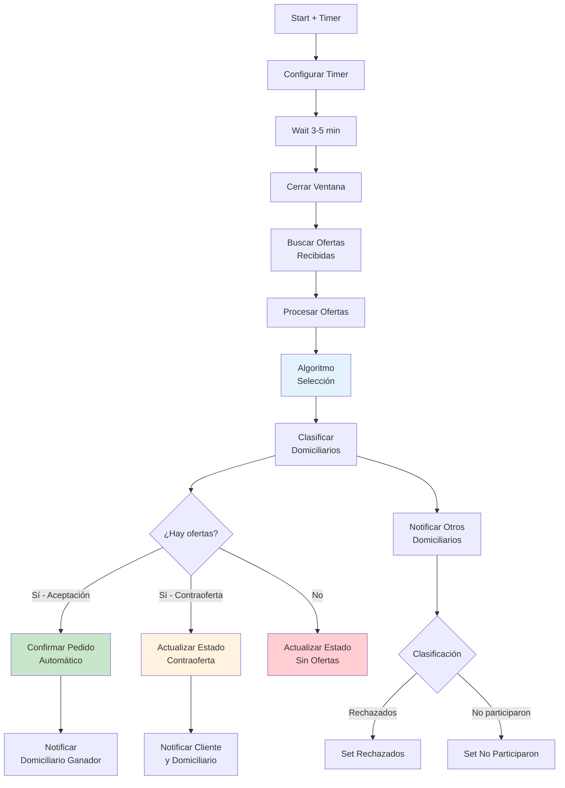

# 0004 Clientes Procesar Ventana Ofertas

## INFORMACIÓN GENERAL

| Campo | Valor |
|-------|-------|
| **Nombre** | 0004 Clientes Procesar Ventana Ofertas |
| **ID** | J7IDbKTkclpin309 (estimado) |
| **Estado** | ⚪ Inactivo (Sub-workflow con timer) |
| **Trigger** | Execute Workflow Trigger (con timer) |
| **Análisis** | Parcial |

---

## PROPÓSITO

Sub-workflow que **procesa la ventana de ofertas** después de que expira el tiempo para que domiciliarios propongan.

### Responsabilidades
1. Esperar cierre de ventana (timer de 3-5 minutos)
2. Obtener todas las ofertas recibidas
3. Aplicar algoritmo de selección
4. Seleccionar mejor domiciliario
5. Notificar resultado a todos los participantes

---

## ARQUITECTURA



---

## COMPONENTES PRINCIPALES

### 1. Timer (Configurar + Wait)
**Duración**: 3-5 minutos desde creación del pedido

**Variables de entorno**:
```bash
DOMICHAT_TIEMPO_VENTANA_OFERTAS=180  # 3 minutos
# o
DOMICHAT_TIEMPO_VENTANA_OFERTAS=300  # 5 minutos
```

---

### 2. Cerrar Ventana Ofertas (Supabase UPDATE)
```sql
UPDATE ventanas_ofertas
SET estado_ventana = 'cerrada'
WHERE pedido_id = :pedido_id
  AND estado_ventana = 'abierta';
```

---

### 3. Buscar Ofertas Recibidas (Supabase GET ALL)
```sql
SELECT *
FROM ofertas_recibidas
WHERE ventana_id = :ventana_id
ORDER BY calificacion_domiciliario DESC,
         valor_oferta ASC,
         fecha_oferta ASC;
```

**Output esperado**:
```javascript
[
  {
    oferta_id: "OFE-123",
    numero_domiciliario: "573001111111",
    nombre_domiciliario: "Juan Pérez",
    tipo_oferta: "aceptacion",
    valor_oferta: 8000,
    calificacion_domiciliario: 4.8,
    fecha_oferta: "2025-11-17T10:31:00Z"
  },
  {
    tipo_oferta: "contraoferta",
    valor_oferta: 12000,
    calificacion_domiciliario: 4.2,
    ...
  },
  // ... más ofertas
]
```

---

## ALGORITMO DE SELECCIÓN

### Criterios de Ranking

**1. Calificación del Domiciliario** (peso mayor)
```javascript
calificacion_domiciliario DESC
```

**2. Valor de la Oferta** (peso medio)
```javascript
valor_oferta ASC  // Menor valor = mejor
```

**3. Tiempo de Respuesta** (desempate)
```javascript
fecha_oferta ASC  // Primero en responder
```

### Ejemplo de Ranking

```
Pedido valor original: $8000

Ofertas recibidas:
1. Juan - Aceptación $8000 - Rating 4.8 - 10:31:15 ← GANADOR
2. María - Aceptación $8000 - Rating 4.5 - 10:31:10
3. Carlos - Contraoferta $12000 - Rating 4.9 - 10:32:00

Ganador: Juan (mejor rating entre aceptaciones)
```

---

### Prioridad: Aceptaciones vs Contraofertas

**Escenario 1: Hay aceptaciones**
```
Resultado: Selecciona mejor aceptación
Razón: Mismo valor que ofreció cliente
```

**Escenario 2: Solo contraofertas**
```
Resultado: Selecciona mejor contraoferta
Acción: Notifica cliente para aprobación
```

**Escenario 3: Sin ofertas**
```
Resultado: Pedido sin ofertas
Estado: "SinOfertas"
Notifica: Cliente debe reintentar o modificar pedido
```

---

## CASOS DE USO

### Caso 1: Aceptación Directa
```
Pedido #155: $8000

Ofertas:
- Dom1: Acepta $8000, Rating 4.5
- Dom2: Acepta $8000, Rating 4.8
- Dom3: Contraoferta $10000, Rating 5.0

Proceso:
1. Timer 3 minutos completa
2. Cerrar ventana
3. Obtener 3 ofertas
4. Algoritmo: Dom2 (mejor rating entre aceptaciones)
5. Confirmar pedido automáticamente
6. Notificar:
   - Dom2: "✅ Pedido asignado"
   - Dom1, Dom3: "❌ No fuiste seleccionado"
   - Cliente: "✅ Domiciliario asignado"
```

---

### Caso 2: Solo Contraofertas
```
Pedido #156: $8000

Ofertas:
- Dom1: Contraoferta $12000, Rating 4.8
- Dom2: Contraoferta $11000, Rating 4.2

Proceso:
1. Timer completa
2. Obtener 2 contraofertas
3. Algoritmo: Dom1 (mejor rating)
4. Estado pedido: "EsperandoConfirmacion"
5. Notificar:
   - Cliente: "Contraoferta de $12000. ¿Aceptas?"
   - Dom1: "Tu contraoferta fue la mejor. Esperando cliente."
   - Dom2: "No fuiste seleccionado"
6. Ejecutar timer de 2 minutos (0006 Procesar Contraoferta)
```

---

### Caso 3: Sin Ofertas
```
Pedido #157: $5000 (valor bajo para zona rural)

Ofertas: []

Proceso:
1. Timer completa
2. Obtener ofertas → vacío
3. Estado: "SinOfertas"
4. Notificar cliente:
   "❌ No hubo domiciliarios disponibles.
    💡 Sugerencias:
    - Aumentar el valor ofrecido
    - Intentar más tarde
    - Cambiar zona de entrega"
```

---

## NOTIFICACIONES

### Al Domiciliario Ganador (Aceptación)
```
✅ ¡PEDIDO ASIGNADO!

🆔 Pedido No: 155
💰 Valor: $8,000
📍 Dirección: Calle 5 # 12-34
🛒 Productos: 1 pizza hawaiana
📱 Cliente: María González
📞 Teléfono: 3219876543

🚚 Puedes comenzar el domicilio
⏰ Recuerda contactar al cliente

⚠️ Al entregar: Pide código
[Botón: Entregar]
```

---

### Al Domiciliario Ganador (Contraoferta)
```
🎯 TU CONTRAOFERTA FUE LA MEJOR

🆔 Pedido: 156
💰 Tu propuesta: $12,000

⏰ Esperando confirmación del cliente
📲 Te notificaremos su decisión
```

---

### A Domiciliarios No Seleccionados
```
😔 No fuiste seleccionado para el pedido #155

🚀 Nuevos pedidos vienen en camino
💡 Mejora tus oportunidades:
   - Responde rápido
   - Mantén buena calificación
   - Acepta el valor propuesto
```

---

### Al Cliente (Contraoferta)
```
💰 CONTRAOFERTA RECIBIDA

Domiciliario: Juan Pérez (⭐ 4.8)
Valor propuesto: $12,000
Valor original: $8,000
Diferencia: +$4,000

¿Aceptas esta contraoferta?
[Sí] [No]

⏰ Tienes 2 minutos para decidir
```

---

## TABLAS SUPABASE

### `ofertas_recibidas`
```sql
SELECT * FROM ofertas_recibidas
WHERE ventana_id = :ventana_id;
```

### `pedidos`
```sql
-- Si hay aceptación
UPDATE pedidos
SET estado = 'Confirmado',
    domiciliario_asignado = :numero_domiciliario,
    valor_final = :valor_oferta,
    fecha_confirmacion = NOW()
WHERE pedido_id = :pedido_id;

-- Si solo contraofertas
UPDATE pedidos
SET estado = 'EsperandoConfirmacion',
    domiciliario_asignado = :numero_domiciliario,
    valor_final = :valor_contraoferta
WHERE pedido_id = :pedido_id;

-- Sin ofertas
UPDATE pedidos
SET estado = 'SinOfertas'
WHERE pedido_id = :pedido_id;
```

### `ventanas_ofertas`
```sql
UPDATE ventanas_ofertas
SET estado_ventana = 'cerrada'
WHERE pedido_id = :pedido_id;
```

---

## DEPENDENCIAS

**Invocado por**: 0003 Broadcast Domiciliarios (después de notificar)

**Invoca a**:
- `0006 Procesar Contraoferta` (si hay contraoferta seleccionada)

---

## MEJORAS POTENCIALES

1. **Machine Learning**:
   ```javascript
   Predecir mejor domiciliario basado en:
   - Historial
   - Ubicación
   - Horario
   - Tipo de pedido
   ```

2. **Negociación Automática**:
   ```
   Si contraoferta muy alta:
   "¿Aceptarías $10,000 en vez de $12,000?"
   ```

3. **Re-Broadcast**:
   ```
   Si no hay ofertas → Esperar 5 min → Re-notificar
   ```

4. **Scoring Dinámico**:
   ```javascript
   score = (rating * 0.5) + (1/valor * 0.3) + (1/tiempo * 0.2)
   ```

---

**Documentado por**: Claude (Anthropic)
**Fecha**: 2025-11-17
**Análisis**: Parcial (archivo grande)
**Parte de**: Sistema DomiChat (18 workflows totales)
