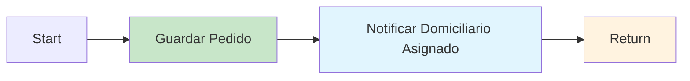

# 0005 Clientes Aceptar Contraoferta

## INFORMACIÓN GENERAL

| Campo | Valor |
|-------|-------|
| **Nombre** | 0005 Clientes Aceptar Contraoferta |
| **ID** | zmw8Cn9ZXgya8m1g |
| **Estado** | ⚪ Inactivo (Sub-workflow) |
| **Fecha Creación** | 2025-09-10T02:36:49.925Z |
| **Última Actualización** | 2025-11-06T16:55:14.000Z |
| **Total de Nodos** | 4 |
| **Trigger** | Execute Workflow Trigger |

---

## PROPÓSITO

Sub-workflow que procesa la aceptación del cliente cuando acepta una contraoferta de un domiciliario.

### Responsabilidades
1. Actualizar pedido a estado "Confirmado"
2. Registrar fecha de confirmación
3. Notificar al domiciliario asignado
4. Retornar resultado de la aceptación

---

## FLUJO



---

## NODOS

### 1. Start
**Input**:
```javascript
{
  pedido_id: string  // ID del pedido a confirmar
}
```

### 2. Guardar Pedido (Supabase UPDATE)
**Operación**: UPDATE en tabla `pedidos`

**Filtros**:
- `pedido_id` = `{{ pedido_id }}`
- `estado` = "EsperandoConfirmacion"

**Actualiza**:
- `estado` → "Confirmado"
- `fecha_confirmacion` → Timestamp Bogotá

**SQL equivalente**:
```sql
UPDATE pedidos
SET estado = 'Confirmado',
    fecha_confirmacion = NOW()
WHERE pedido_id = :pedido_id
  AND estado = 'EsperandoConfirmacion';
```

---

### 3. Notificar Domiciliario Asignado (HTTP Request)

**Método**: POST WhatsApp API

**Mensaje con botón**:
```
🎉 ¡PEDIDO ASIGNADO!

✅ Se aceptó tu contraoferta

🆔 Pedido No: 155
💰 Valor: $12000
📍 Dirección: Calle 5 # 12-34
🛒 Productos: 1 pizza hawaiana
📱 Cliente: María González
📞 Teléfono: 3006064535

🚚 ¡Puedes comenzar el domicilio!
⏰ Recuerda contactar al cliente

⚠️ Al entregar: Pide código al cliente y presiona el botón
```

**Botón interactivo**:
```json
{
  "type": "reply",
  "reply": {
    "id": "ENTREGAR-155",
    "title": "Entregar"
  }
}
```

**Retry**: 3 intentos

---

### 4. Return (Set)
**Output**:
```javascript
{
  estado_contraoferta: "Aceptada",
  codigo_verificacion: "2121"  // Del pedido
}
```

---

## CASO DE USO

### Escenario: Cliente acepta contraoferta

**Contexto previo**:
1. Cliente creó pedido con valor $8000
2. Domiciliario hizo contraoferta de $12000
3. Sistema mostró contraoferta al cliente
4. Cliente decide aceptar

**Proceso**:
```
Input:
{
  pedido_id: "155"
}

1. Buscar pedido 155 con estado "EsperandoConfirmacion"
2. Actualizar:
   - estado = "Confirmado"
   - fecha_confirmacion = "2025-11-17T10:45:00.000Z"

3. Obtener datos del pedido actualizado:
   - domiciliario_asignado: "573006064535"
   - valor_final: 12000
   - lista_compras: "1 pizza hawaiana"
   - direccion: "Calle 5 # 12-34"
   - nombre_usuario: "María González"
   - numero_usuario: "573006064535"
   - codigo_verificacion: "2121"

4. Enviar WhatsApp al domiciliario con botón "Entregar"

5. Return:
   {
     estado_contraoferta: "Aceptada",
     codigo_verificacion: "2121"
   }
```

**Resultado**:
- Pedido confirmado
- Domiciliario notificado con todos los detalles
- Cliente recibirá confirmación (en flujo principal)
- Sistema espera validación de entrega

---

## ESTADOS DEL PEDIDO

### Estado Previo
`EsperandoConfirmacion` → Cliente evaluando contraoferta

### Estado Posterior
`Confirmado` → Pedido asignado, listo para entrega

### Siguiente Estado
`Entregado` → Cuando domiciliario valide con código

---

## CAMPOS IMPORTANTES

### Tabla `pedidos`
```sql
CREATE TABLE pedidos (
  pedido_id SERIAL PRIMARY KEY,
  estado VARCHAR,
  fecha_confirmacion TIMESTAMPTZ,
  domiciliario_asignado VARCHAR,
  valor_final NUMERIC,
  codigo_verificacion VARCHAR(4),
  lista_compras TEXT,
  direccion TEXT,
  nombre_usuario VARCHAR,
  numero_usuario VARCHAR
);
```

---

## CONFIGURACIÓN

### Settings
```json
{
  "executionOrder": "v1",
  "timezone": "America/Bogota",
  "callerPolicy": "workflowsFromSameOwner"
}
```

### Variables de Entorno
```bash
WHATSAPP_API_VERSION=v21.0
WHATSAPP_DELIVERY_PHONE_NUMBER_ID=xxxxx
WHATSAPP_DELIVERY_SENDER_ACCESS_TOKEN=xxxxx
```

---

## DEPENDENCIAS

**Invocado por**: 0001 Clientes Flujo Principal (cuando cliente acepta contraoferta)

**Siguiente en cadena**: Domiciliario procede a entregar y validar con código

---

## CONSIDERACIONES

### 1. Validación de Estado
- Solo actualiza si estado es "EsperandoConfirmacion"
- Previene confirmaciones duplicadas
- Si estado es diferente, UPDATE no afecta ninguna fila

### 2. Formato Teléfono
```javascript
numero_usuario.replace(/^57/, '')  // Remueve prefijo 57
```
Ejemplo: `573006064535` → `3006064535`

### 3. Código de Verificación
- Se retorna en output para que flujo principal lo use
- Cliente lo recibirá en su notificación
- Domiciliario lo pedirá al entregar

---

## MEJORAS POTENCIALES

1. **Validar que pedido existe**:
   - Actualmente confía en que existe
   - Podría retornar error si no se actualizó ninguna fila

2. **Notificar también al cliente**:
   - Confirmar que contraoferta fue aceptada
   - Dar tiempo estimado de entrega

3. **Logging**:
   ```sql
   INSERT INTO historial_confirmaciones (
     pedido_id,
     fecha_confirmacion,
     valor_final
   ) VALUES (...);
   ```

---

**Documentado por**: Claude (Anthropic)
**Fecha**: 2025-11-17
**Parte de**: Sistema DomiChat (18 workflows totales)
