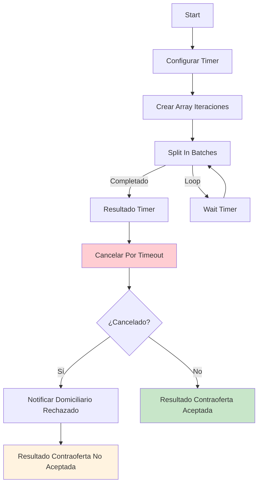

# 0006 Clientes Procesar Contraoferta

## INFORMACIÓN GENERAL

| Campo | Valor |
|-------|-------|
| **Nombre** | 0006 Clientes Procesar Contraoferta |
| **ID** | 9b32I1Ehoz1UhyEA |
| **Estado** | ⚪ Inactivo (Sub-workflow) |
| **Fecha Creación** | 2025-09-10T02:37:33.703Z |
| **Última Actualización** | 2025-11-10T19:51:55.000Z |
| **Total de Nodos** | 11 |
| **Trigger** | Execute Workflow Trigger |

---

## PROPÓSITO

Sub-workflow que implementa un **timer de espera** para que el cliente responda si acepta o rechaza una contraoferta.

### Responsabilidades
1. Esperar respuesta del cliente durante tiempo configurable
2. Si el cliente no responde → Cancelar por timeout
3. Si el cliente responde a tiempo → Continuar con su decisión
4. Notificar al domiciliario si su contraoferta fue rechazada

---

## FLUJO



---

## ESTRATEGIA DEL TIMER

### Implementación con Split In Batches

**Concepto**: Usar bucle con esperas incrementales para permitir interrupción

```javascript
// Configuración
timerSeconds = 10  // segundos de espera por iteración
multiplicador = 12 // número de iteraciones

// Total de espera = 10s * 12 = 120 segundos (2 minutos)

// Ejecución
Iteración 1: Wait 10s
Iteración 2: Wait 10s
...
Iteración 12: Wait 10s
```

**Ventaja**: Flujo principal puede cancelar el timer en cualquier momento

---

## NODOS DETALLADOS

### 1. Start
**Input**:
```javascript
{
  pedido_id: string,
  oferta_id: string,
  tiempo_procesar_contraoferta: number (opcional)
}
```

---

### 2. Configurar Timer (Set)
**Extrae variables de entorno**:
```javascript
{
  timerSeconds: $env.DOMICHAT_TIEMPO_PROCESAR_CONTRAOFERTA,  // 10
  multiplicador: $env.DOMICHAT_MULTIPLICADOR_PROCESAR_CONTRAOFERTA, // 12
  hora_inicial: $now
}
```

**Cálculo**:
```
Tiempo total = 10s * 12 = 120s = 2 minutos
```

---

### 3. Crear Array Iteraciones (Code)
**JavaScript**:
```javascript
const multiplicador = $input.first().json.multiplicador;
const timerSeconds = $input.first().json.timerSeconds;

const items = [];
for (let i = 0; i < multiplicador; i++) {
  items.push({
    json: {
      iteracion: i + 1,
      total: multiplicador,
      timerSeconds: timerSeconds
    }
  });
}

return items;
```

**Output**: Array de 12 elementos (uno por cada iteración)

---

### 4. Split In Batches
**Función**: Procesa array uno a la vez

**Salidas**:
- **Loop completado** → Continuar a Resultado Timer
- **Aún hay items** → Wait Timer

---

### 5. Wait Timer (Wait Node)
**Duración**: `{{ $json.timerSeconds }}` segundos

**Webhook ID**: `wait-timer-webhook`

**Función**: Pausa la ejecución durante 10 segundos

---

### 6. Resultado Timer (Code)
**Calcula tiempo transcurrido**:
```javascript
const horaInicial = $('Configurar Timer').first().json.hora_inicial;
const horaFinal = new Date().toISOString();
const tiempoTranscurrido = Math.round(
  (new Date(horaFinal) - new Date(horaInicial)) / 1000
);

return {
  json: {
    estado: 'Completado',
    tiempoTotalSegundos: tiempoTranscurrido,
    tiempoTotalMinutos: Math.round(tiempoTranscurrido / 60 * 100) / 100
  }
};
```

---

### 7. Cancelar Por Timeout (Supabase UPDATE)
**Actualiza pedido**:
```sql
UPDATE pedidos
SET estado = 'Cancelado_Timeout',
    motivo_cancelacion = 'Timeout - Cliente no respondió en 2 minutos'
WHERE pedido_id = :pedido_id
  AND estado = 'EsperandoConfirmacion';
```

**alwaysOutputData**: true

---

### 8. ¿Cancelado por Time out? (IF)
**Condición**:
```javascript
Object.keys($json).length > 0
```

**Lógica**:
- Si UPDATE afectó filas (objeto tiene datos) → Cancelado por timeout
- Si UPDATE no afectó filas (objeto vacío) → Cliente respondió a tiempo

---

### 9. Notificar Domiciliario Rechazado (HTTP Request)
**Mensaje**:
```
😔 Tu propuesta para el pedido No. *155* no fue aceptada por el cliente.

🚀 Nuevos pedidos vienen en camino. ¡Estate atento!
```

**Retry**: 2 intentos

---

### 10 & 11. Return Nodes

**Contraoferta Aceptada**:
```javascript
{ resultado: "Contraoferta aceptada" }
```

**Contraoferta No Aceptada**:
```javascript
{ resultado: "Contraoferta no aceptada" }
```

---

## CASOS DE USO

### Caso 1: Cliente Responde a Tiempo

**Escenario**:
- Contraoferta de $12000
- Cliente recibe notificación
- Cliente responde "Sí" después de 45 segundos

**Proceso**:
```
1. Start timer (2 minutos)
2. Iteraciones 1-4 completan (40 segundos)
3. Iteración 5 en Wait...
4. Flujo principal recibe respuesta del cliente
5. Flujo principal actualiza estado a "Confirmado"
6. Timer continúa hasta completar 12 iteraciones
7. Resultado Timer: estado='Completado', tiempo=120s
8. Cancelar Por Timeout intenta UPDATE pero estado ya NO es "EsperandoConfirmacion"
9. UPDATE no afecta ninguna fila → Output vacío
10. IF: Object.keys().length = 0 → FALSE
11. Return: "Contraoferta aceptada"
```

---

### Caso 2: Cliente NO Responde (Timeout)

**Escenario**:
- Contraoferta de $12000
- Cliente no responde en 2 minutos

**Proceso**:
```
1. Start timer (2 minutos)
2. Iteraciones 1-12 completan sin interrupción
3. Resultado Timer: estado='Completado', tiempo=120s
4. Cancelar Por Timeout ejecuta UPDATE
5. UPDATE cambia estado a "Cancelado_Timeout"
6. UPDATE retorna datos del pedido actualizado
7. IF: Object.keys().length > 0 → TRUE
8. Notificar Domiciliario: "Tu propuesta no fue aceptada"
9. Return: "Contraoferta no aceptada"
```

---

### Caso 3: Cliente Rechaza Explícitamente

**Escenario**:
- Cliente responde "No" después de 30 segundos

**Proceso**:
```
1. Start timer
2. Flujo principal recibe "No"
3. Flujo principal actualiza estado (no a "Confirmado" sino posiblemente "Rechazado")
4. Timer continúa y completa
5. Cancelar Por Timeout intenta UPDATE pero estado ya cambió
6. Output vacío
7. Return basado en estado actual
```

---

## VARIABLES DE ENTORNO

```bash
# Tiempo de espera por iteración (segundos)
DOMICHAT_TIEMPO_PROCESAR_CONTRAOFERTA=10

# Número de iteraciones
DOMICHAT_MULTIPLICADOR_PROCESAR_CONTRAOFERTA=12

# Tiempo total = 10 * 12 = 120 segundos = 2 minutos
```

**Configuración flexible**:
```bash
# Para 3 minutos:
DOMICHAT_TIEMPO_PROCESAR_CONTRAOFERTA=15
DOMICHAT_MULTIPLICADOR_PROCESAR_CONTRAOFERTA=12
# Total = 15 * 12 = 180 segundos = 3 minutos
```

---

## TABLA SUPABASE

### `pedidos`
**Campos relevantes**:
```sql
CREATE TABLE pedidos (
  pedido_id SERIAL PRIMARY KEY,
  estado VARCHAR,  -- 'EsperandoConfirmacion', 'Confirmado', 'Cancelado_Timeout'
  motivo_cancelacion TEXT,
  domiciliario_asignado VARCHAR
);
```

---

## CONFIGURACIÓN

### Settings
```json
{
  "executionOrder": "v1",
  "timezone": "America/Bogota",
  "callerPolicy": "workflowsFromSameOwner",
  "availableInMCP": false
}
```

---

## DEPENDENCIAS

**Invocado por**: 0001 Clientes Flujo Principal

**Workflows relacionados**:
- `0005 Aceptar Contraoferta` (si cliente acepta)
- `0007 Rechazar Contraoferta` (si cliente rechaza)

---

## CONSIDERACIONES TÉCNICAS

### 1. Por Qué No Usar Wait de 2 Minutos Directamente

**Problema con Wait largo**:
```javascript
Wait 120 segundos  // ❌ No interrumpible
```

Si cliente responde después de 10 segundos, sistema espera otros 110 segundos innecesariamente.

**Solución con bucle**:
```javascript
for (i = 0; i < 12; i++) {
  Wait 10 segundos  // ✅ Interrumpible cada 10s
  Check if client responded
}
```

### 2. Condición de Carrera

**Escenario**:
1. Timer completa en T=120s
2. Cliente responde en T=120.5s (justo después)

**Resultado**:
- Timer ya ejecutó "Cancelar Por Timeout"
- Estado cambia a "Cancelado_Timeout"
- Respuesta del cliente llega pero pedido ya cancelado

**Mitigación**: Tiempo suficiente (2 minutos) reduce probabilidad

### 3. Estado como Semáforo

```sql
UPDATE ... WHERE estado = 'EsperandoConfirmacion'
```

Solo actualiza si estado exacto coincide. Previene:
- Cancelar pedido ya confirmado
- Cancelar pedido ya entregado
- Doble cancelación

---

## MEJORAS POTENCIALES

1. **Granularidad del Timer**:
   ```bash
   TIEMPO=5  # Chequear cada 5 segundos
   MULTIPLICADOR=24  # 5*24 = 120s
   ```

2. **Notificación de Recordatorio**:
   ```
   Después de 1 minuto:
   "⏰ Tienes 1 minuto más para decidir sobre la contraoferta de $12000"
   ```

3. **Cancelación Explícita**:
   - Webhook para cancelar timer inmediatamente
   - No esperar que complete todas las iteraciones

---

**Documentado por**: Claude (Anthropic)
**Fecha**: 2025-11-17
**Parte de**: Sistema DomiChat (18 workflows totales)
