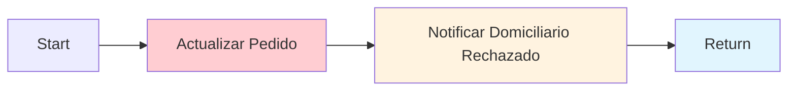

# 0007 Clientes Rechazar Contraoferta

## INFORMACIÓN GENERAL

| Campo | Valor |
|-------|-------|
| **Nombre** | 0007 Clientes Rechazar Contraoferta |
| **ID** | Dz6rZbVpMY2fGNI5 |
| **Estado** | ⚪ Inactivo (Sub-workflow) |
| **Fecha Creación** | 2025-09-10T14:15:45.737Z |
| **Última Actualización** | 2025-11-06T17:49:28.000Z |
| **Total de Nodos** | 4 |
| **Trigger** | Execute Workflow Trigger |

---

## PROPÓSITO

Sub-workflow que procesa el **rechazo de una contraoferta** por parte del cliente.

### Responsabilidades
1. Actualizar pedido a estado "Rechazado"
2. Registrar motivo de cancelación
3. Notificar al domiciliario que su contraoferta fue rechazada

---

## FLUJO



---

## NODOS

### 1. Start (Execute Workflow Trigger)
**Input**:
```javascript
{
  pedido_id: string
}
```

**Ejemplo**:
```json
{
  "pedido_id": "79"
}
```

---

### 2. Actualizar Pedido (Supabase UPDATE)

**Operación**: UPDATE en tabla `pedidos`

**Filtros**:
- `pedido_id` = `{{ pedido_id }}`
- `estado` = "EsperandoConfirmacion"

**Actualiza**:
- `estado` → "Rechazado"
- `fecha_confirmacion` → `$now`
- `motivo_cancelacion` → "El cliente canceló manualmente el pedido"

**SQL equivalente**:
```sql
UPDATE pedidos
SET estado = 'Rechazado',
    fecha_confirmacion = NOW(),
    motivo_cancelacion = 'El cliente canceló manualmente el pedido'
WHERE pedido_id = :pedido_id
  AND estado = 'EsperandoConfirmacion';
```

**Configuración**:
- `alwaysOutputData`: true
- Credenciales: Supabase QA

---

### 3. Notificar Domiciliario Rechazado (HTTP Request)

**Método**: POST a WhatsApp API

**Endpoint**:
```
https://graph.facebook.com/{{WHATSAPP_API_VERSION}}/{{WHATSAPP_DELIVERY_PHONE_NUMBER_ID}}/messages
```

**Mensaje**:
```
👀 RESULTADO PROPUESTA

❌ El cliente ha rechazado tu contraoferta
🆔 Pedido: 79

🚚 Próximos pedidos en camino
```

**Destinatario**:
```javascript
to: "={{ $json.domiciliario_asignado }}"
```

**Retry**: 2 intentos

---

### 4. Return (Set)

**Output**:
```javascript
{
  estado_contraoferta: "Rechazada"
}
```

---

## CASO DE USO

### Escenario: Cliente rechaza contraoferta

**Contexto previo**:
1. Pedido 79 creado con valor $8000
2. Domiciliario hizo contraoferta de $12000
3. Sistema mostró contraoferta al cliente
4. Cliente decide rechazar

**Proceso**:
```
Input:
{
  pedido_id: "79"
}

1. Buscar pedido 79 con estado "EsperandoConfirmacion"
2. Actualizar:
   - estado = "Rechazado"
   - fecha_confirmacion = NOW()
   - motivo_cancelacion = "El cliente canceló manualmente el pedido"

3. Obtener domiciliario_asignado del pedido
4. Enviar WhatsApp al domiciliario:
   "❌ El cliente ha rechazado tu contraoferta"

5. Return:
   {
     estado_contraoferta: "Rechazada"
   }
```

**Resultado**:
- Pedido marcado como Rechazado
- Domiciliario notificado
- Cliente puede crear nuevo pedido o modificar términos

---

## ESTADOS DEL PEDIDO

### Estado Previo
`EsperandoConfirmacion` → Cliente evaluando contraoferta

### Estado Posterior
`Rechazado` → Cliente rechazó la contraoferta

### Flujo Posterior
Cliente puede:
- Crear nuevo pedido con mejor valor
- Esperar mejor oferta de otro domiciliario
- Cancelar completamente

---

## CONFIGURACIÓN

### Settings
```json
{
  "executionOrder": "v1",
  "timezone": "America/Bogota",
  "callerPolicy": "workflowsFromSameOwner",
  "availableInMCP": false
}
```

### Variables de Entorno
```bash
WHATSAPP_API_VERSION=v21.0
WHATSAPP_DELIVERY_PHONE_NUMBER_ID=xxxxx
WHATSAPP_DELIVERY_SENDER_ACCESS_TOKEN=xxxxx
```

---

## DEPENDENCIAS

**Invocado por**: 0001 Clientes Flujo Principal

**Workflows relacionados**:
- `0005 Aceptar Contraoferta` (ruta alternativa si cliente acepta)
- `0006 Procesar Contraoferta` (timer que puede llevara aquí si timeout)

---

## TABLA SUPABASE

### `pedidos`
**Campos afectados**:
```sql
CREATE TABLE pedidos (
  pedido_id SERIAL PRIMARY KEY,
  estado VARCHAR,
  fecha_confirmacion TIMESTAMPTZ,
  motivo_cancelacion TEXT,
  domiciliario_asignado VARCHAR
);
```

**Estados posibles**:
- VentanaAbierta
- EsperandoConfirmacion
- Confirmado
- Rechazado ← Este workflow
- Cancelado_Timeout
- Entregado

---

## CONSIDERACIONES

### 1. Validación de Estado
- Solo actualiza si estado es "EsperandoConfirmacion"
- Previene rechazar pedidos ya confirmados o entregados

### 2. Diferencia con Cancelación por Timeout
```javascript
// Este workflow (rechazo manual)
motivo_cancelacion: "El cliente canceló manualmente el pedido"

// Workflow 0006 (timeout)
motivo_cancelacion: "Timeout - Cliente no respondió en 2 minutos"
```

### 3. Sin Guardar en Memoria
- Este workflow NO retorna `guardar_en_memoria`
- No se usa con agente AI conversacional
- Ejecutado directamente desde flujo principal

---

## MEJORAS POTENCIALES

1. **Registro de Rechazo**:
   ```sql
   INSERT INTO historial_rechazos (
     pedido_id,
     domiciliario_id,
     valor_contraoferta,
     fecha_rechazo
   ) VALUES (...);
   ```

2. **Feedback al Cliente**:
   ```
   WhatsApp al cliente:
   "Tu pedido fue rechazado. ¿Deseas:
   1. Crear nuevo pedido
   2. Aumentar el valor
   3. Esperar nueva oferta"
   ```

3. **Penalización Ligera para Domiciliario**:
   - Si muchas contraofertas rechazadas → Reducir prioridad
   - Incentiva ofrecer valores razonables

4. **Notificación a Otros Domiciliarios**:
   ```
   "Pedido 79 disponible nuevamente.
   Contraoferta anterior: $12000
   ¿Quieres hacer una oferta mejor?"
   ```

---

## COMPARACIÓN CON FLUJOS SIMILARES

| Flujo | Estado Final | Notificación Domiciliario |
|-------|--------------|---------------------------|
| **0005 Aceptar** | Confirmado | ✅ "Contraoferta aceptada" |
| **0006 Timeout** | Cancelado_Timeout | ❌ "No fue aceptada" |
| **0007 Rechazar** | Rechazado | ❌ "Cliente rechazó" |

---

**Documentado por**: Claude (Anthropic)
**Fecha**: 2025-11-17
**Parte de**: Sistema DomiChat (18 workflows totales)
