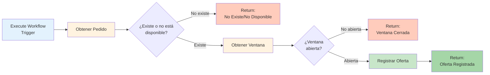
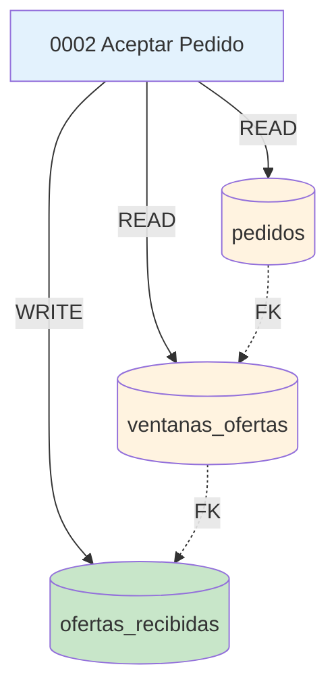

# 0002 Domiciliarios Aceptar Pedido

## INFORMACIÓN GENERAL

| Campo | Valor |
|-------|-------|
| **Nombre** | 0002 Domiciliarios Aceptar Pedido |
| **ID** | ZlGuD4CfbuDS4EMR |
| **Estado** | ⚪ Inactivo (`active: false`) - Sub-workflow |
| **Fecha Creación** | 2025-09-10T19:36:40.218Z |
| **Última Actualización** | 2025-10-22T18:16:41.000Z |
| **Versión** | dfc4a83a-b93b-46c8-a107-ee899c9e586e |
| **Propietario** | Proyecto: 0IzhKVOc0T9TvoCy |
| **Tags** | Ninguno |
| **Descripción** | Sub-workflow que procesa la aceptación de un pedido por parte de un domiciliario. Valida disponibilidad del pedido, estado de ventana de ofertas, y registra la oferta de aceptación en la base de datos. |

---

## PROPÓSITO DEL FLUJO

Este flujo es un **sub-workflow especializado** invocado desde `0001 Domiciliarios Flujo Principal` cuando un domiciliario acepta un pedido al valor original (sin contraofertar).

### Responsabilidades

1. Validar que el pedido existe y está disponible
2. Validar que la ventana de ofertas está abierta
3. Registrar la oferta de "aceptación" en `ofertas_recibidas`
4. Retornar resultado estructurado al flujo principal

### Casos de Uso

- Domiciliario acepta pedido: `"aceptar 129"`
- Sistema valida elegibilidad
- Registra oferta para posterior evaluación
- Cliente recibirá notificación si este domiciliario es seleccionado

---

## ARQUITECTURA DEL FLUJO

### Diagrama de Flujo



### Estructura Lineal

El flujo sigue un patrón de **validación en cascada**:

1. **Validación de Pedido** → ¿Existe y está en VentanaAbierta?
2. **Validación de Ventana** → ¿Está abierta para ofertas?
3. **Registro de Oferta** → Insertar en BD
4. **Return** → Mensaje estructurado al flujo padre

---

## NODOS UTILIZADOS

### Trigger

#### Start (Execute Workflow Trigger)
- **Tipo**: `n8n-nodes-base.executeWorkflowTrigger` v1.1
- **Posición**: (-1248, 176)
- **Inputs**:
  ```javascript
  {
    pedido_id: string,              // ID del pedido a aceptar
    numero_domiciliario: string,    // WhatsApp ID del domiciliario
    nombre_domiciliario: string,    // Nombre completo
    calificacion_domiciliario: number  // Rating 1-5 (usado para ranking)
  }
  ```
- **Pinned Data** (Testing):
  ```json
  {
    "pedido_id": "1",
    "numero_domiciliario": "573006064535",
    "nombre_domiciliario": "Manuel",
    "calificacion_domiciliario": 4
  }
  ```

---

### Validación de Pedido

#### Obtener Pedido
- **Tipo**: `n8n-nodes-base.supabase` v1
- **Posición**: (-1008, 176)
- **Operación**: GET
- **Tabla**: `pedidos`
- **Filtros**:
  ```sql
  pedido_id = {{ $json.pedido_id }}
  AND estado = 'VentanaAbierta'
  ```
- **Always Output Data**: true
- **Credenciales**: Supabase QA (4bpjJPK2fqZkspgx)
- **Función**: Verifica que el pedido existe y está en estado correcto para recibir ofertas

#### ¿Existe o no está disponible?
- **Tipo**: `n8n-nodes-base.if` v2.2
- **Posición**: (-784, 176)
- **Condición**:
  ```javascript
  Object.keys($json).length > 0
  ```
- **Lógica**: Si Supabase retorna objeto vacío `{}`, el pedido no existe o no está disponible
- **Outputs**:
  - **True** → Continuar validación de ventana
  - **False** → Retornar error "no_existe_no_disponible"

#### Return No Existe/No Disponible
- **Tipo**: `n8n-nodes-base.set` v3.4
- **Posición**: (-560, 304)
- **Assignments**:
  ```javascript
  {
    resultado: "no_existe_no_disponible",
    mensaje_respuesta: "⚠️ El pedido {{pedido_id}} no existe o no está disponible.\n\nVerifica el No. del pedido.",
    guardar_en_memoria: false
  }
  ```
- **Función**: Estructura respuesta de error para enviar al domiciliario

---

### Validación de Ventana

#### Obtener Ventana
- **Tipo**: `n8n-nodes-base.supabase` v1
- **Posición**: (-560, 80)
- **Operación**: GET
- **Tabla**: `ventanas_ofertas`
- **Filtros**:
  ```sql
  pedido_id = {{ $('Start').first().json.pedido_id }}
  AND estado_ventana = 'abierta'
  ```
- **Always Output Data**: true
- **Credenciales**: Supabase QA
- **Función**: Verifica que la ventana de tiempo para recibir ofertas no ha cerrado

#### ¿Ventana abierta?
- **Tipo**: `n8n-nodes-base.if` v2.2
- **Posición**: (-336, 80)
- **Condición**:
  ```javascript
  Object.keys($json).length > 0
  ```
- **Lógica**: Ventana existe y está abierta
- **Outputs**:
  - **True** → Registrar oferta
  - **False** → Retornar error "ventana_cerrada"

#### Return Ventana Cerrada
- **Tipo**: `n8n-nodes-base.set` v3.4
- **Posición**: (-64, 176)
- **Assignments**:
  ```javascript
  {
    resultado: "ventana_cerrada",
    mensaje_respuesta: "⏰ La ventana del pedido {{pedido_id}} ya cerró.\n\nYa no acepta más propuestas.",
    guardar_en_memoria: false
  }
  ```
- **Función**: Informa que la ventana de ofertas expiró (típicamente 3-5 minutos después de creación)

---

### Registro de Oferta

#### Registrar Oferta
- **Tipo**: `n8n-nodes-base.supabase` v1
- **Posición**: (-64, -16)
- **Operación**: INSERT
- **Tabla**: `ofertas_recibidas`
- **Campos**:
  ```javascript
  {
    ventana_id: ventana_id,                     // Del nodo "Obtener Ventana"
    numero_domiciliario: numero_domiciliario,   // Del input
    nombre_domiciliario: nombre_domiciliario,   // Del input
    tipo_oferta: "aceptacion",                  // Constante
    valor_oferta: valor_oferta,                 // Del pedido (valor original)
    calificacion_domiciliario: calificacion     // Del input (para ranking)
  }
  ```
- **Credenciales**: Supabase QA
- **Función**: Crea registro de la oferta para evaluación posterior

---

### Return

#### Return Oferta Registrada
- **Tipo**: `n8n-nodes-base.set` v3.4
- **Posición**: (208, -16)
- **Assignments**:
  ```javascript
  {
    resultado: "exitoso",
    mensaje_respuesta: "✅ Aceptación registrada para pedido {{pedido_id}}.\n\n⏰ Te notificaremos si eres seleccionado.",
    guardar_en_memoria: false
  }
  ```
- **Función**: Confirma registro exitoso, indica que domiciliario debe esperar notificación

---

## MAPA DE CONEXIONES

### Flujo de Datos

```
Start (Execute Workflow Trigger)
  ↓
  pedido_id: string
  numero_domiciliario: string
  nombre_domiciliario: string
  calificacion_domiciliario: number
  ↓
Obtener Pedido (Supabase)
  → SELECT * FROM pedidos WHERE pedido_id = X AND estado = 'VentanaAbierta'
  ↓
¿Existe o no está disponible? (If)
  ├─ (No existe) → Return No Existe/No Disponible → [END]
  │                {
  │                  resultado: "no_existe_no_disponible",
  │                  mensaje_respuesta: "⚠️ El pedido X no existe...",
  │                  guardar_en_memoria: false
  │                }
  │
  └─ (Existe) → Obtener Ventana (Supabase)
                  → SELECT * FROM ventanas_ofertas
                    WHERE pedido_id = X AND estado_ventana = 'abierta'
                  ↓
                ¿Ventana abierta? (If)
                  ├─ (Cerrada) → Return Ventana Cerrada → [END]
                  │              {
                  │                resultado: "ventana_cerrada",
                  │                mensaje_respuesta: "⏰ La ventana del pedido X ya cerró...",
                  │                guardar_en_memoria: false
                  │              }
                  │
                  └─ (Abierta) → Registrar Oferta (Supabase)
                                  → INSERT INTO ofertas_recibidas (...)
                                  ↓
                                Return Oferta Registrada → [END]
                                  {
                                    resultado: "exitoso",
                                    mensaje_respuesta: "✅ Aceptación registrada...",
                                    guardar_en_memoria: false
                                  }
```

### Dependencias de Tablas



---

## FUNCIONALIDAD DETALLADA

### 1. Recepción de Parámetros

**Entrada desde Flujo Principal**:

El flujo padre (`0001 Domiciliarios Flujo Principal`) ejecuta este workflow cuando detecta comando "aceptar":

```javascript
// En nodo "Detectar Comando" del flujo principal
{
  "comando": "aceptar",
  "pedido_id": "129"
}

// Execute Workflow Node
workflowId: "ZlGuD4CfbuDS4EMR"
inputs: {
  pedido_id: command_data.pedido_id,                              // "129"
  numero_domiciliario: $('Buscar Numero Domiciliario').json.numero_domiciliario,   // "573006064535"
  nombre_domiciliario: $('Buscar Numero Domiciliario').json.nombre_domiciliario,   // "Manuel Torres"
  calificacion_domiciliario: $('Buscar Numero Domiciliario').json.calificacion_domiciliario  // 4
}
```

**Validaciones de Input**:
- `pedido_id`: Debe ser string no vacío (validado por agente AI antes de invocar)
- `calificacion_domiciliario`: Número entre 1-5 (validado al registrar domiciliario)

---

### 2. Validación del Pedido

**Query a Supabase**:
```sql
SELECT *
FROM pedidos
WHERE pedido_id = '129'
  AND estado = 'VentanaAbierta'
LIMIT 1;
```

**Resultado Esperado**:
```json
{
  "pedido_id": "129",
  "numero_usuario": "573123456789",
  "estado": "VentanaAbierta",
  "valor_oferta": 8000,
  "lista_compras": "1 hamburguesa de El Corral",
  "direccion": "Barrio Centro, Calle 10",
  "zona_domicilio": "Urbana",
  "fecha_creacion": "2025-11-17T15:30:00Z",
  ...
}
```

**Casos de Respuesta**:

1. **Pedido Existe y Está Disponible** (`Object.keys($json).length > 0`):
   - Continúa a validación de ventana
   - `valor_oferta` será usado para registrar la oferta

2. **Pedido No Existe o No Disponible** (`Object.keys($json).length === 0`):
   - Posibles razones:
     - `pedido_id` incorrecto
     - Pedido ya fue confirmado (`estado = 'Confirmado'`)
     - Pedido ya fue entregado (`estado = 'Entregado'`)
     - Pedido fue cancelado
   - Retorna mensaje de error

**Always Output Data = true**:
- Incluso si no hay resultados, el nodo emite `{}`
- Permite que el flujo continúe a la validación IF

---

### 3. Validación de la Ventana de Ofertas

**Query a Supabase**:
```sql
SELECT *
FROM ventanas_ofertas
WHERE pedido_id = '129'
  AND estado_ventana = 'abierta'
LIMIT 1;
```

**Resultado Esperado**:
```json
{
  "ventana_id": "vent_129_abc",
  "pedido_id": "129",
  "estado_ventana": "abierta",
  "fecha_apertura": "2025-11-17T15:30:00Z",
  "fecha_cierre": "2025-11-17T15:35:00Z",  // 5 minutos después
  "numero_ofertas_recibidas": 3
}
```

**Casos de Respuesta**:

1. **Ventana Abierta**:
   - `estado_ventana = 'abierta'`
   - Fecha actual < `fecha_cierre`
   - Continúa a registro de oferta

2. **Ventana Cerrada**:
   - Posibles razones:
     - Tiempo expiró (típicamente 3-5 minutos)
     - Cliente ya seleccionó domiciliario
     - Ventana cerrada manualmente
   - Retorna mensaje "ventana_cerrada"

**Ventana de Tiempo Típica**:
```
15:30:00 → Pedido creado, ventana abierta
15:30:05 → Primer domiciliario acepta
15:30:12 → Segundo domiciliario contraofertar
15:30:45 → Tercer domiciliario acepta
15:35:00 → Ventana se cierra automáticamente
15:35:05 → Domiciliario intenta aceptar → ERROR "ventana_cerrada"
```

---

### 4. Registro de la Oferta

**Insert a Supabase**:
```sql
INSERT INTO ofertas_recibidas (
  ventana_id,
  numero_domiciliario,
  nombre_domiciliario,
  tipo_oferta,
  valor_oferta,
  calificacion_domiciliario
) VALUES (
  'vent_129_abc',
  '573006064535',
  'Manuel Torres',
  'aceptacion',
  8000,
  4
);
```

**Campos Importantes**:

- **`ventana_id`**: FK a `ventanas_ofertas.ventana_id`
  - Asocia oferta con pedido específico
  - Permite agrupar todas las ofertas de un pedido

- **`tipo_oferta`**: "aceptacion"
  - Distingue de "contraoferta"
  - Usado para ranking (aceptaciones tienen prioridad)

- **`valor_oferta`**: Del pedido original
  - Para aceptación, siempre es el valor inicial del cliente
  - Para contraoferta (otro flujo), sería el valor propuesto por domiciliario

- **`calificacion_domiciliario`**: Rating del domiciliario
  - Usado para desempate si múltiples aceptan
  - Domiciliarios con mejor rating tienen prioridad

**Resultado del Insert**:
```json
{
  "oferta_id": "of_129_1",
  "ventana_id": "vent_129_abc",
  "numero_domiciliario": "573006064535",
  "nombre_domiciliario": "Manuel Torres",
  "tipo_oferta": "aceptacion",
  "valor_oferta": 8000,
  "calificacion_domiciliario": 4,
  "fecha_oferta": "2025-11-17T15:30:08Z"
}
```

---

### 5. Retorno al Flujo Principal

**Estructura de Respuesta**:

Todos los caminos del flujo (exitoso o error) retornan el mismo contrato:

```typescript
interface AceptarPedidoResponse {
  resultado: "exitoso" | "no_existe_no_disponible" | "ventana_cerrada";
  mensaje_respuesta: string;
  guardar_en_memoria: boolean;
}
```

**Ejemplo de Retorno Exitoso**:
```json
{
  "resultado": "exitoso",
  "mensaje_respuesta": "✅ Aceptación registrada para pedido 129.\n\n⏰ Te notificaremos si eres seleccionado.",
  "guardar_en_memoria": false
}
```

**Procesamiento en Flujo Principal**:
```
Execute: Aceptar Pedido
  ↓
  $json = {
    resultado: "exitoso",
    mensaje_respuesta: "✅ Aceptación registrada...",
    guardar_en_memoria: false
  }
  ↓
¿Guardar Respuesta en Memoria? (If)
  → guardar_en_memoria === false
  → NO guardar en Redis
  ↓
Responder Comando (HTTP Request)
  → Envía mensaje_respuesta al domiciliario vía WhatsApp
  → "✅ Aceptación registrada para pedido 129..."
  ↓
Guardar Fecha Último Mensaje
  → UPDATE domiciliarios SET fecha_ultimo_mensaje = NOW()
```

**Razón de `guardar_en_memoria: false`**:
- Mensaje de confirmación es transaccional, no conversacional
- No aporta contexto útil para futuras interacciones
- Reduce carga en Redis y llamadas al LLM

---

## CONFIGURACIÓN TÉCNICA

### Tablas de Supabase

#### pedidos
```sql
CREATE TABLE pedidos (
  pedido_id TEXT PRIMARY KEY,
  numero_usuario TEXT NOT NULL,
  estado TEXT NOT NULL,  -- 'VentanaAbierta' | 'Confirmado' | 'Entregado'
  valor_oferta INTEGER NOT NULL,
  lista_compras TEXT NOT NULL,
  direccion TEXT NOT NULL,
  zona_domicilio TEXT NOT NULL,  -- 'Urbana' | 'Rural'
  fecha_creacion TIMESTAMPTZ NOT NULL,
  domiciliario_asignado TEXT,
  codigo_verificacion TEXT
);

CREATE INDEX idx_pedidos_estado ON pedidos(estado);
```

#### ventanas_ofertas
```sql
CREATE TABLE ventanas_ofertas (
  ventana_id TEXT PRIMARY KEY,
  pedido_id TEXT NOT NULL REFERENCES pedidos(pedido_id),
  estado_ventana TEXT NOT NULL,  -- 'abierta' | 'cerrada'
  fecha_apertura TIMESTAMPTZ NOT NULL,
  fecha_cierre TIMESTAMPTZ NOT NULL,
  numero_ofertas_recibidas INTEGER DEFAULT 0
);

CREATE INDEX idx_ventanas_estado ON ventanas_ofertas(estado_ventana);
CREATE INDEX idx_ventanas_pedido ON ventanas_ofertas(pedido_id);
```

#### ofertas_recibidas
```sql
CREATE TABLE ofertas_recibidas (
  oferta_id TEXT PRIMARY KEY,
  ventana_id TEXT NOT NULL REFERENCES ventanas_ofertas(ventana_id),
  numero_domiciliario TEXT NOT NULL,
  nombre_domiciliario TEXT NOT NULL,
  tipo_oferta TEXT NOT NULL,  -- 'aceptacion' | 'contraoferta'
  valor_oferta INTEGER NOT NULL,
  calificacion_domiciliario NUMERIC NOT NULL,
  fecha_oferta TIMESTAMPTZ DEFAULT NOW()
);

CREATE INDEX idx_ofertas_ventana ON ofertas_recibidas(ventana_id);
CREATE INDEX idx_ofertas_tipo ON ofertas_recibidas(tipo_oferta);
CREATE INDEX idx_ofertas_calificacion ON ofertas_recibidas(calificacion_domiciliario DESC);
```

### Settings del Workflow

```json
{
  "executionOrder": "v1",
  "callerPolicy": "workflowsFromSameOwner",
  "errorWorkflow": "cGFHe0wsizcDFbHD"
}
```

**Caller Policy**:
- Solo workflows del mismo propietario pueden invocar este sub-workflow
- Previene ejecución no autorizada

**Error Workflow**:
- ID diferente al flujo principal (cGFHe0wsizcDFbHD vs tCJVhMSfqtz6Lsv2)
- Indica que puede tener handler de errores especializado o compartido

---

## CASOS DE USO

### Caso 1: Aceptación Exitosa

**Contexto**:
- Pedido activo con ID "129"
- Valor original: $8,000
- Ventana abierta por 5 minutos
- Domiciliario "Manuel" con calificación 4

**Flujo**:
```
Usuario (WhatsApp): "aceptar 129"
  ↓
Flujo Principal (Agente AI): Detecta comando → Execute Workflow
  ↓
Sub-Workflow (Start): Recibe inputs
  ↓
Obtener Pedido:
  SELECT * FROM pedidos WHERE pedido_id = '129' AND estado = 'VentanaAbierta'
  → Resultado: { pedido_id: "129", valor_oferta: 8000, estado: "VentanaAbierta", ... }
  ↓
¿Existe o no está disponible?: Object.keys().length = 1 → TRUE
  ↓
Obtener Ventana:
  SELECT * FROM ventanas_ofertas WHERE pedido_id = '129' AND estado_ventana = 'abierta'
  → Resultado: { ventana_id: "vent_129_abc", estado_ventana: "abierta", ... }
  ↓
¿Ventana abierta?: Object.keys().length = 1 → TRUE
  ↓
Registrar Oferta:
  INSERT INTO ofertas_recibidas (
    ventana_id = 'vent_129_abc',
    numero_domiciliario = '573006064535',
    nombre_domiciliario = 'Manuel',
    tipo_oferta = 'aceptacion',
    valor_oferta = 8000,
    calificacion_domiciliario = 4
  )
  → Inserción exitosa
  ↓
Return Oferta Registrada:
  {
    resultado: "exitoso",
    mensaje_respuesta: "✅ Aceptación registrada para pedido 129.\n\n⏰ Te notificaremos si eres seleccionado.",
    guardar_en_memoria: false
  }
  ↓
Flujo Principal: Recibe respuesta
  ↓
Envía mensaje a WhatsApp:
  "✅ Aceptación registrada para pedido 129.

   ⏰ Te notificaremos si eres seleccionado."
```

**Resultado**:
- Oferta almacenada en BD
- Domiciliario confirmado
- Espera evaluación por cliente o sistema automático

---

### Caso 2: Pedido No Disponible

**Contexto**:
- Domiciliario intenta aceptar pedido "999"
- Pedido no existe o ya fue confirmado

**Flujo**:
```
Usuario: "aceptar 999"
  ↓
Sub-Workflow (Start): pedido_id = "999"
  ↓
Obtener Pedido:
  SELECT * FROM pedidos WHERE pedido_id = '999' AND estado = 'VentanaAbierta'
  → Resultado: {} (vacío - no encontrado)
  ↓
¿Existe o no está disponible?: Object.keys().length = 0 → FALSE
  ↓
Return No Existe/No Disponible:
  {
    resultado: "no_existe_no_disponible",
    mensaje_respuesta: "⚠️ El pedido 999 no existe o no está disponible.\n\nVerifica el No. del pedido.",
    guardar_en_memoria: false
  }
  ↓
Flujo Principal:
  Envía mensaje:
  "⚠️ El pedido 999 no existe o no está disponible.

   Verifica el No. del pedido."
```

**Razones Posibles**:
1. Pedido ID incorrecto
2. Pedido ya confirmado (estado = "Confirmado")
3. Pedido ya entregado (estado = "Entregado")
4. Pedido cancelado

---

### Caso 3: Ventana Cerrada

**Contexto**:
- Pedido "129" existe
- Ventana se cerró hace 30 segundos
- Domiciliario llega tarde

**Flujo**:
```
Usuario: "aceptar 129"
  ↓
Obtener Pedido:
  → Pedido encontrado ✓
  ↓
¿Existe?: TRUE
  ↓
Obtener Ventana:
  SELECT * FROM ventanas_ofertas WHERE pedido_id = '129' AND estado_ventana = 'abierta'
  → Resultado: {} (ventana ya cerró)
  ↓
¿Ventana abierta?: Object.keys().length = 0 → FALSE
  ↓
Return Ventana Cerrada:
  {
    resultado: "ventana_cerrada",
    mensaje_respuesta: "⏰ La ventana del pedido 129 ya cerró.\n\nYa no acepta más propuestas.",
    guardar_en_memoria: false
  }
  ↓
Mensaje a WhatsApp:
  "⏰ La ventana del pedido 129 ya cerró.

   Ya no acepta más propuestas."
```

**Nota**:
- Este es un escenario común en horas pico
- Domiciliarios deben responder rápidamente
- Ventanas típicamente duran 3-5 minutos

---

## CONSIDERACIONES ESPECIALES

### 1. Patrón de Validación en Cascada

**Beneficios**:
- Early return en cada punto de falla
- Minimiza queries innecesarias a BD
- Mensajes de error específicos

**Orden de Validaciones**:
1. **Pedido** → Falla más común (ID incorrecto)
2. **Ventana** → Falla temporal (tiempo expiró)

Si se invirtiera el orden:
```
Obtener Ventana (puede fallar)
  ↓
Obtener Pedido (query innecesaria si ventana cerrada)
```

---

### 2. Always Output Data

**Sin Always Output Data**:
```
Obtener Pedido (no resultados)
  → No emite output
  → Siguiente nodo no se ejecuta
  → Flujo se detiene sin mensaje de error
```

**Con Always Output Data = true**:
```
Obtener Pedido (no resultados)
  → Emite {} (objeto vacío)
  → Siguiente nodo (IF) puede evaluar
  → Flujo continúa con manejo de error apropiado
```

---

### 3. Tipo de Oferta: "aceptacion"

**Diferencia con "contraoferta"**:

| Campo | Aceptación | Contraoferta |
|-------|------------|--------------|
| tipo_oferta | "aceptacion" | "contraoferta" |
| valor_oferta | Valor original del pedido | Valor propuesto por domiciliario |
| Prioridad | Alta (acepta términos) | Media (requiere aprobación) |
| Flujo | 0002 Aceptar Pedido | 0003 Contraofertar Pedido |

**Ranking de Ofertas**:
```sql
-- Query para seleccionar mejor oferta
SELECT *
FROM ofertas_recibidas
WHERE ventana_id = 'vent_129_abc'
ORDER BY
  tipo_oferta = 'aceptacion' DESC,  -- Aceptaciones primero
  calificacion_domiciliario DESC,   -- Mejor calificado primero
  fecha_oferta ASC                  -- Más temprano primero
LIMIT 1;
```

**Resultado Típico**:
```
Oferta 1: aceptacion, calificacion: 5, fecha: 15:30:05 → GANADORA
Oferta 2: aceptacion, calificacion: 4, fecha: 15:30:07
Oferta 3: contraoferta, calificacion: 5, fecha: 15:30:03 (ignorada por ser contraoferta)
```

---

### 4. Calificación del Domiciliario

**Uso en Ranking**:
- Desempate cuando múltiples domiciliarios aceptan
- Incentiva buen servicio
- Actualizada después de cada entrega

**Escala**:
```
5 ⭐⭐⭐⭐⭐ → Excelente
4 ⭐⭐⭐⭐ → Bueno (default para nuevos)
3 ⭐⭐⭐ → Regular
2 ⭐⭐ → Malo
1 ⭐ → Muy malo
```

**Valor por Defecto**: 4
- Domiciliarios nuevos empiezan con buen rating
- Sistema optimista (confianza inicial)
- Ajustado después de primeras entregas

---

### 5. No Guarda en Memoria

**Razón**: `guardar_en_memoria: false`

Mensajes transaccionales (confirmaciones, errores) no aportan contexto conversacional:

**Ejemplo de Memoria SIN guardar**:
```
User: "aceptar 129"
AI: "✅ Aceptación registrada para pedido 129..."
[NO GUARDADO]

User: "aceptar 130"
AI: Procesa comando directamente (sin confusión de pedido 129)
```

**Si se guardara**:
```
User: "aceptar 129"
AI: "✅ Aceptación registrada para pedido 129..."
[GUARDADO en Redis]

User: "aceptar 130"
AI: Puede confundir contexto ("¿te refieres al 129 o al 130?")
```

**Excepciones donde SÍ se guarda**:
- Errores que requieren corrección (ej: código de verificación incorrecto)
- Solicitudes de datos incompletos (ej: valor de contraoferta muy bajo)

---

### 6. Caller Policy

**`callerPolicy: "workflowsFromSameOwner"`**

Restricciones:
- Solo workflows del mismo proyecto pueden ejecutar
- Previene invocación externa no autorizada
- Protege lógica de negocio

**Flujos Autorizados**:
```
✓ 0001 Domiciliarios Flujo Principal (mismo proyecto)
✗ Flujo de otro proyecto
✗ Ejecución manual desde n8n UI (requiere override)
```

---

### 7. Error Workflow Diferente

**Error Workflow del Flujo Principal**: tCJVhMSfqtz6Lsv2
**Error Workflow de este Sub-Workflow**: cGFHe0wsizcDFbHD

**Posibles Razones**:
1. Sub-workflow tiene handler especializado
2. Flujo principal y sub-workflows comparten otro handler
3. Configuración pendiente de consolidar

**Investigación Sugerida**:
- Verificar si `cGFHe0wsizcDFbHD` existe
- Consolidar en un solo error workflow si es posible
- Documentar diferencias si tienen propósitos distintos

---

## DEPENDENCIAS

### Workflows que lo Invocan

| Workflow | ID | Cuándo |
|----------|-----|--------|
| 0001 Domiciliarios Flujo Principal | MKNuC0q1F3Sh6K6Q | Cuando agente detecta comando "aceptar" con pedido_id |

### Workflows que Invoca

Ninguno (es nodo hoja)

### Tablas de Supabase

| Tabla | Operación | Propósito |
|-------|-----------|-----------|
| pedidos | SELECT | Validar existencia y estado |
| ventanas_ofertas | SELECT | Validar ventana abierta |
| ofertas_recibidas | INSERT | Registrar aceptación |

### Servicios Externos

| Servicio | Uso |
|----------|-----|
| Supabase (PostgreSQL) | Base de datos |

---

## MEJORAS FUTURAS SUGERIDAS

1. **Validación de Duplicados**:
   ```sql
   -- Prevenir que mismo domiciliario acepte múltiples veces
   CREATE UNIQUE INDEX idx_ofertas_unique
   ON ofertas_recibidas(ventana_id, numero_domiciliario);
   ```

2. **Contador de Ofertas**:
   ```sql
   -- Actualizar numero_ofertas_recibidas en ventanas_ofertas
   UPDATE ventanas_ofertas
   SET numero_ofertas_recibidas = numero_ofertas_recibidas + 1
   WHERE ventana_id = 'vent_129_abc';
   ```

3. **Logging de Intentos Fallidos**:
   - Registrar intentos de aceptar pedidos cerrados
   - Analizar patrones (¿domiciliarios siempre llegan tarde?)
   - Ajustar duración de ventanas según estadísticas

4. **Notificación Proactiva**:
   - Cuando ventana está por cerrar (30 segundos restantes)
   - Recordar a domiciliarios que revisen pedidos
   - Incrementar tasa de aceptación

5. **Geolocalización**:
   - Validar proximidad del domiciliario al origen del pedido
   - Priorizar domiciliarios cercanos
   - Reducir tiempos de entrega

---

**Documentado por**: Claude (Anthropic)
**Fecha**: 2025-11-17
**Versión del Flujo**: dfc4a83a-b93b-46c8-a107-ee899c9e586e
