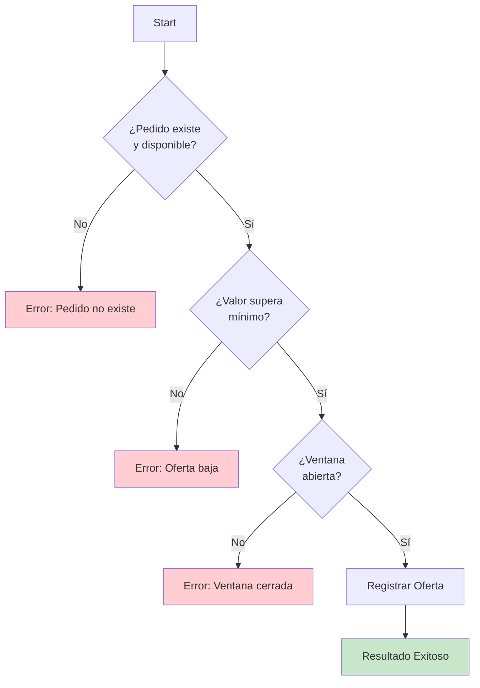

# 0003 Domiciliarios Contraofertar Pedido

## INFORMACIÓN GENERAL

| Campo | Valor |
|-------|-------|
| **Nombre** | 0003 Domiciliarios Contraofertar Pedido |
| **ID** | HzK6mbnjJfsRlNyW |
| **Estado** | ⚪ Inactivo (Sub-workflow) |
| **Total de Nodos** | 11 |
| **Trigger** | Execute Workflow Trigger |
| **Error Workflow** | cGFHe0wsizcDFbHD |

---

## PROPÓSITO

Sub-workflow que **registra una contraoferta** de un domiciliario cuando propone un valor mayor al valor original del pedido.

### Responsabilidades
1. Validar que el pedido existe y está disponible
2. Validar que el valor de contraoferta supera el valor mínimo
3. Verificar que la ventana de ofertas está abierta
4. Registrar la contraoferta en la tabla `ofertas_recibidas`
5. Retornar resultado de la operación

---

## PATRÓN DE VALIDACIÓN EN CASCADA



---

## INPUT ESPERADO

```typescript
{
  pedido_id: string,
  valor_contraoferta: number,
  numero_domiciliario: string,
  nombre_domiciliario: string,
  calificacion_domiciliario: number
}
```

**Ejemplo**:
```json
{
  "pedido_id": "129",
  "valor_contraoferta": 12000,
  "numero_domiciliario": "573006064535",
  "nombre_domiciliario": "Juan Pérez",
  "calificacion_domiciliario": 4.5
}
```

---

## VALIDACIONES

### Validación 1: Pedido Existe y Está Disponible
```sql
SELECT * FROM pedidos
WHERE pedido_id = :pedido_id
  AND estado = 'VentanaAbierta';
```

**Errores**:
- Pedido no existe
- Pedido ya confirmado
- Pedido cancelado

**Mensaje**:
```
⚠️ El pedido 129 no existe o no está disponible.
Verifica el No. del pedido.
```

---

### Validación 2: Valor Supera Mínimo
```javascript
valor_contraoferta > valor_oferta_original
```

**Ejemplo**:
- Valor original: $8000
- Contraoferta: $7500 → ❌ Rechazada
- Contraoferta: $12000 → ✅ Aceptada

**Mensaje de error**:
```
❌ Tu contraoferta debe ser mayor a $8000.
Ingresa un valor más alto.
```

**Nota**: También debe ser múltiplo de 50 (validado en flujo principal)

---

### Validación 3: Ventana Abierta
```sql
SELECT * FROM ventanas_ofertas
WHERE pedido_id = :pedido_id
  AND estado_ventana = 'abierta';
```

**Validación temporal**:
```javascript
NOW() < tiempo_fin
```

**Mensaje de error**:
```
⏰ La ventana del pedido 129 ya cerró.
Ya no acepta más propuestas.
```

---

## REGISTRO DE CONTRAOFERTA

**Operación**: INSERT en `ofertas_recibidas`

```sql
INSERT INTO ofertas_recibidas (
  ventana_id,
  numero_domiciliario,
  nombre_domiciliario,
  tipo_oferta,
  valor_oferta,
  calificacion_domiciliario,
  fecha_oferta
) VALUES (
  :ventana_id,
  :numero_domiciliario,
  :nombre_domiciliario,
  'contraoferta',
  :valor_contraoferta,
  :calificacion_domiciliario,
  NOW()
);
```

---

## OUTPUT

### Exitoso
```javascript
{
  resultado: "exitoso",
  mensaje_respuesta: "✅ Tu contraoferta de $12000 para el pedido 129 fue registrada\n\n⏰ Te notificaremos si eres seleccionado",
  guardar_en_memoria: false
}
```

### Pedido No Disponible
```javascript
{
  resultado: "no_existe_no_disponible",
  mensaje_respuesta: "⚠️ El pedido 129 no existe o no está disponible.\nVerifica el No. del pedido.",
  guardar_en_memoria: false
}
```

### Oferta Baja
```javascript
{
  resultado: "oferta_baja",
  mensaje_respuesta: "❌ Tu contraoferta debe ser mayor a $8000.\nIngresa un valor más alto.",
  guardar_en_memoria: true  // Permite reintentar
}
```

### Ventana Cerrada
```javascript
{
  resultado: "ventana_cerrada",
  mensaje_respuesta: "⏰ La ventana del pedido 129 ya cerró.\nYa no acepta más propuestas.",
  guardar_en_memoria: false
}
```

---

## CASOS DE USO

### Caso 1: Contraoferta Exitosa
```
Pedido 129:
- Valor original: $8000
- Estado: VentanaAbierta
- Ventana: abierta hasta 10:33:00

Domiciliario:
- Nombre: Juan Pérez
- Calificación: 4.5
- Propone: $12000

Proceso:
1. ✅ Pedido existe y disponible
2. ✅ $12000 > $8000
3. ✅ Ventana abierta (actual: 10:31:00)
4. INSERT en ofertas_recibidas
5. Return: "Contraoferta registrada"
```

---

### Caso 2: Contraoferta Insuficiente
```
Domiciliario propone: $7500

Validación:
1. ✅ Pedido existe
2. ❌ $7500 < $8000
3. Return: "Debe ser mayor a $8000"
4. guardar_en_memoria: true (permite reintentar con valor correcto)
```

---

### Caso 3: Ventana Ya Cerrada
```
Pedido 129:
- Ventana: cerrada desde 10:33:00
- Hora actual: 10:35:00

Validación:
1. ✅ Pedido existe
2. ✅ Valor correcto
3. ❌ Ventana cerrada
4. Return: "Ventana cerrada"
```

---

## TABLAS SUPABASE

### `pedidos`
```sql
SELECT pedido_id, estado, valor_oferta
FROM pedidos
WHERE pedido_id = :id
  AND estado = 'VentanaAbierta';
```

### `ventanas_ofertas`
```sql
SELECT ventana_id, estado_ventana, tiempo_fin
FROM ventanas_ofertas
WHERE pedido_id = :id
  AND estado_ventana = 'abierta';
```

### `ofertas_recibidas`
```sql
INSERT INTO ofertas_recibidas (...)
VALUES (...);
```

---

## DEPENDENCIAS

**Invocado por**: 0001 Domiciliarios Flujo Principal (MKNuC0q1F3Sh6K6Q)

**Siguiente en cadena**: 0004 Procesar Ventana Ofertas (evaluará esta contraoferta junto con otras)

---

## CONSIDERACIONES

### 1. Early Return Pattern
- Primera validación fallida → Retorna inmediatamente
- No ejecuta validaciones subsiguientes
- Eficiente y rápido

### 2. `guardar_en_memoria` Inteligente
```javascript
// Permite reintentar
guardar_en_memoria: true   // "Oferta baja"

// No permite reintentar (final)
guardar_en_memoria: false  // "Ventana cerrada"
```

### 3. Múltiples Contraofertas
Un domiciliario puede hacer múltiples contraofertas si:
- La ventana sigue abierta
- Su oferta anterior fue rechazada por ser baja

**Sistema registra todas** para comparación posterior.

---

## MEJORAS POTENCIALES

1. **Límite de Contraofertas**:
   ```sql
   COUNT ofertas WHERE numero_domiciliario = :numero
   IF count >= 3 THEN REJECT
   ```

2. **Validación de Múltiplo de 50**:
   ```javascript
   if (valor_contraoferta % 50 !== 0) {
     return "Valor debe ser múltiplo de $50";
   }
   ```

3. **Contraoferta Máxima**:
   ```javascript
   if (valor_contraoferta > valor_original * 2) {
     return "Contraoferta excesiva";
   }
   ```

---

**Documentado por**: Claude (Anthropic)
**Fecha**: 2025-11-17
**Parte de**: Sistema DomiChat (18 workflows totales)
