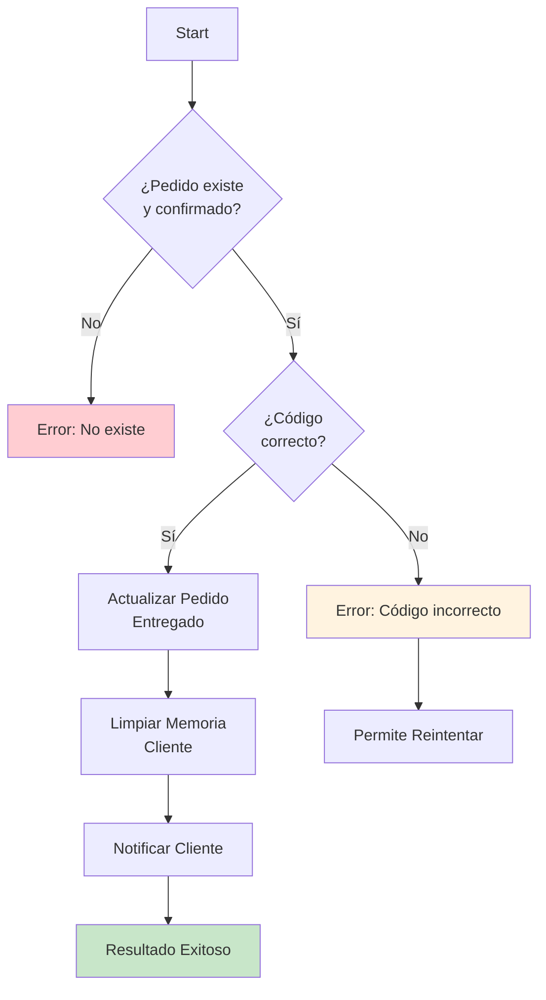

# 0004 Domiciliarios Validar Entrega Pedido

## INFORMACIÓN GENERAL

| Campo | Valor |
|-------|-------|
| **Nombre** | 0004 Domiciliarios Validar Entrega Pedido |
| **ID** | qERWYLB6k0hZ7k4s |
| **Estado** | ⚪ Inactivo (Sub-workflow) |
| **Total de Nodos** | 11 |
| **Trigger** | Execute Workflow Trigger |
| **Error Workflow** | tCJVhMSfqtz6Lsv2 |

---

## PROPÓSITO

Sub-workflow que **valida la entrega de un pedido** mediante código de verificación y marca el pedido como entregado.

### Responsabilidades
1. Validar que el pedido existe y está confirmado
2. Verificar que el domiciliario asignado coincide
3. Validar el código de verificación
4. Actualizar pedido a estado "Entregado"
5. Limpiar memoria Redis del cliente
6. Notificar al cliente que el pedido fue entregado

---

## FLUJO



---

## INPUT

```typescript
{
  pedido_id: string,
  codigo_verificacion: string,
  numero_domiciliario: string
}
```

**Ejemplo**:
```json
{
  "pedido_id": "129",
  "codigo_verificacion": "2121",
  "numero_domiciliario": "573006064535"
}
```

---

## VALIDACIONES

### Validación 1: Pedido Confirmado
```sql
SELECT * FROM pedidos
WHERE pedido_id = :pedido_id
  AND estado = 'Confirmado'
  AND domiciliario_asignado = :numero_domiciliario;
```

**Verifica**:
- Pedido existe
- Estado es "Confirmado" (no VentanaAbierta, ni Entregado, ni Cancelado)
- Domiciliario asignado coincide

**Error**:
```javascript
{
  resultado: "no_existe_no_disponible",
  mensaje_respuesta: "⚠️ El pedido 129 no existe o no está asignado a ti.",
  guardar_en_memoria: false
}
```

---

### Validación 2: Código de Verificación
```javascript
codigo_ingresado === pedido.codigo_verificacion
```

**Ejemplos**:
- Cliente dice: "2121"
- Domiciliario ingresa: "2121" → ✅
- Domiciliario ingresa: "2120" → ❌

**Error**:
```javascript
{
  resultado: "codigo_erroneo",
  mensaje_respuesta: "❌ Código incorrecto.\n\nEl código 2120 no coincide con el pedido 129.\n\nIngresa el código correcto.",
  guardar_en_memoria: true  // ⚠️ Permite reintentar
}
```

---

## ACTUALIZACIÓN DE PEDIDO

```sql
UPDATE pedidos
SET estado = 'Entregado',
    fecha_entrega = NOW()
WHERE pedido_id = :pedido_id;
```

**Campos actualizados**:
- `estado` → "Entregado"
- `fecha_entrega` → Timestamp actual (Bogotá)

---

## LIMPIEZA DE MEMORIA REDIS

**Operación**: DELETE all messages

**Session Key**:
```javascript
`${numero_usuario}_cliente`
```

**Ejemplo**: `573219876543_cliente`

**Por qué**:
- Pedido completado, conversación termina
- Libera memoria Redis
- Si cliente crea nuevo pedido, empieza conversación limpia

---

## NOTIFICACIÓN AL CLIENTE

**WhatsApp al cliente**:
```
✅ ¡Domicilio entregado con éxito!

🎉 Tu pedido llegó a destino
📦 Entrega completada satisfactoriamente
⭐ Esperamos que todo haya sido de tu agrado

😊 *¡Gracias por confiar en DomiChat!*
```

**Retry**: 2 intentos

---

## OUTPUT

### Exitoso
```javascript
{
  resultado: "exitoso",
  mensaje_respuesta: "✅ Pedido 129 marcado como entregado\n\n🎉 ¡Gracias por tu servicio!",
  guardar_en_memoria: false
}
```

### Código Incorrecto
```javascript
{
  resultado: "codigo_erroneo",
  mensaje_respuesta: "❌ Código incorrecto.\n\nEl código 2120 no coincide con el pedido 129.\n\nIngresa el código correcto.",
  guardar_en_memoria: true  // Permite reintentar
}
```

### Pedido No Disponible
```javascript
{
  resultado: "no_existe_no_disponible",
  mensaje_respuesta: "⚠️ El pedido 129 no existe o no está asignado a ti.",
  guardar_en_memoria: false
}
```

---

## CASOS DE USO

### Caso 1: Entrega Exitosa
```
Pedido 129:
- Estado: Confirmado
- Domiciliario asignado: 573006064535
- Código: 2121
- Cliente: 573219876543

Domiciliario llega y pide código:
Input: {
  pedido_id: "129",
  codigo_verificacion: "2121",
  numero_domiciliario: "573006064535"
}

Proceso:
1. ✅ Pedido existe, estado Confirmado, domiciliario correcto
2. ✅ Código 2121 coincide
3. UPDATE pedidos: estado='Entregado', fecha_entrega=NOW()
4. DELETE Redis session: 573219876543_cliente
5. WhatsApp al cliente: "Pedido entregado con éxito"
6. Return al domiciliario: "Marcado como entregado. ¡Gracias!"
```

---

### Caso 2: Código Incorrecto (Reintento)
```
Domiciliario ingresa código equivocado:
Input: {
  codigo_verificacion: "2120"  // Incorrecto
}

Proceso:
1. ✅ Pedido existe
2. ❌ Código 2120 ≠ 2121
3. Return: "Código incorrecto. Ingresa el código correcto."
4. guardar_en_memoria: true

Conversación:
Domiciliario: "entregar 129 2120"
Sistema: "❌ Código incorrecto. Ingresa el código correcto."
Domiciliario: "2121"  // Reintenta
Sistema: "✅ Pedido 129 marcado como entregado"
```

---

### Caso 3: Pedido No Asignado
```
Domiciliario A intenta entregar pedido de Domiciliario B:

Pedido 129:
- Domiciliario asignado: 573001111111

Intento:
- numero_domiciliario: 573002222222

Resultado:
❌ Pedido no asignado a ti
```

---

## TABLAS SUPABASE

### `pedidos`
```sql
-- Consulta
SELECT pedido_id, estado, domiciliario_asignado,
       codigo_verificacion, numero_usuario
FROM pedidos
WHERE pedido_id = :id
  AND estado = 'Confirmado'
  AND domiciliario_asignado = :numero;

-- Actualización
UPDATE pedidos
SET estado = 'Entregado',
    fecha_entrega = NOW()
WHERE pedido_id = :id;
```

---

## REDIS

### Session Keys
**Cliente**: `{numero_usuario}_cliente`
**Domiciliario**: `{numero_domiciliario}_delivery`

**Operación**: Delete all messages del cliente (no del domiciliario)

---

## CONFIGURACIÓN

### Error Workflow
**ID**: tCJVhMSfqtz6Lsv2 (Control y Notificación de Errores)

### Variables de Entorno
```bash
WHATSAPP_API_VERSION=v21.0
WHATSAPP_CLIENT_PHONE_NUMBER_ID=xxxxx
WHATSAPP_CLIENT_SENDER_ACCESS_TOKEN=xxxxx
```

---

## DEPENDENCIAS

**Invocado por**: 0001 Domiciliarios Flujo Principal

**Servicios**:
- Supabase: Tabla `pedidos`
- Redis: Memoria conversacional
- WhatsApp API: Notificación al cliente

---

## CONSIDERACIONES

### 1. Código de 4 Dígitos
- Generado al crear pedido
- Único por pedido
- Validación exacta (no aproximada)
- Seguridad básica contra entregas fraudulentas

### 2. `guardar_en_memoria` para Reintentos
```javascript
// Código incorrecto → Permite reintentar
guardar_en_memoria: true

// Pedido no existe → No permite reintentar
guardar_en_memoria: false
```

### 3. Limpieza de Memoria
- Solo se limpia memoria del **cliente**
- Memoria del **domiciliario** permanece (puede recibir más pedidos)

### 4. Notificación Dual
```
Domiciliario → "Pedido marcado como entregado"
Cliente → "Domicilio entregado con éxito"
```

---

## MEJORAS POTENCIALES

1. **Geolocalización**:
   ```javascript
   if (distancia > 100 metros) {
     return "Debes estar cerca del punto de entrega";
   }
   ```

2. **Rating Post-Entrega**:
   ```
   Cliente: "¿Cómo calificarías el servicio?"
   [⭐⭐⭐⭐⭐]
   ```

3. **Confirmación Fotográfica**:
   ```
   "Envía una foto del producto entregado"
   ```

4. **Límite de Intentos**:
   ```javascript
   if (intentos_codigo > 3) {
     notificar_soporte();
     bloquear_entrega();
   }
   ```

---

**Documentado por**: Claude (Anthropic)
**Fecha**: 2025-11-17
**Parte de**: Sistema DomiChat (18 workflows totales)
