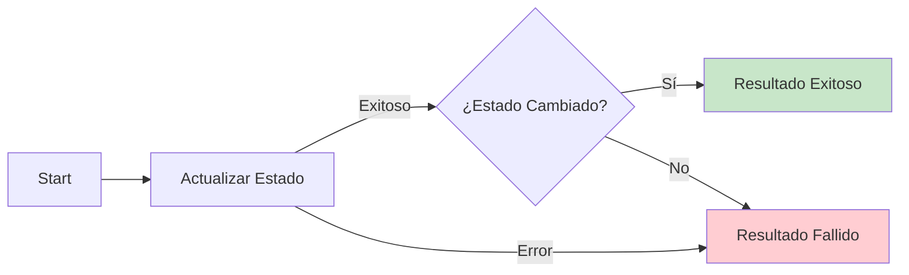

# 0005 Domiciliarios Cambiar Estado

## INFORMACIÓN GENERAL

| Campo | Valor |
|-------|-------|
| **Nombre** | 0005 Domiciliarios Cambiar Estado |
| **ID** | 3qKyLhg7cDGi1Ijs |
| **Estado** | ⚪ Inactivo (Sub-workflow) |
| **Fecha Creación** | 2025-09-14T03:21:16.119Z |
| **Última Actualización** | 2025-11-10T21:31:31.000Z |
| **Total de Nodos** | 5 |
| **Trigger** | Execute Workflow Trigger |

---

## PROPÓSITO DEL FLUJO

Sub-workflow responsable de **actualizar el estado de disponibilidad** de un domiciliario entre "Activo" e "Inactivo".

### Función Principal
- Cambia el estado del domiciliario en la base de datos
- Valida que el cambio fue exitoso
- Retorna mensaje apropiado según el resultado

### Invocado Por
- `0001 Domiciliarios Flujo Principal` (MKNuC0q1F3Sh6K6Q)

---

## FLUJO DE DATOS



---

## NODOS DETALLADOS

### 1. Start (Execute Workflow Trigger)
**Inputs esperados**:
```javascript
{
  numero_domiciliario: string,  // Número WhatsApp del domiciliario
  nuevo_estado: "Activo" | "Inactivo"
}
```

**Ejemplo**:
```json
{
  "numero_domiciliario": "573006064535",
  "nuevo_estado": "Activo"
}
```

---

### 2. Actualizar Estado (Supabase UPDATE)
**Operación**: UPDATE en tabla `domiciliarios`

**Filtros**:
- `numero_domiciliario` = `{{ numero_domiciliario }}`

**Campos actualizados**:
- `estado_domiciliario` = `{{ nuevo_estado }}`

**Configuración**:
- `alwaysOutputData`: true
- `retryOnFail`: false
- `onError`: continueErrorOutput

**Credenciales**: Supabase QA (4bpjJPK2fqZkspgx)

---

### 3. ¿Estado Cambiado? (IF)
**Condición**:
```javascript
$json.estado_domiciliario exists
```

**Lógica**:
- Si el campo `estado_domiciliario` existe en la respuesta → UPDATE exitoso
- Si no existe → UPDATE falló

---

### 4. Resultado Exitoso (Set)
**Output**:
```javascript
{
  resultado: "exitoso",
  mensaje_respuesta: `
    ✅ ¡Estado cambiado exitosamente!

    📊 *Nuevo estado:* ${estado_domiciliario}
    ${estado_domiciliario === 'Activo'
      ? '🚚 Ahora recibirás pedidos'
      : '🚚 No recibirás pedidos temporalmente'}

    📢 ¡Listo!
  `,
  guardar_en_memoria: false
}
```

---

### 5. Resultado Fallido (Set)
**Output**:
```javascript
{
  resultado: "error_cambio_estado",
  mensaje_respuesta: "❌ El cambio de estado falló.\n\nIntenta más tarde.",
  guardar_en_memoria: false
}
```

---

## CASOS DE USO

### Caso 1: Cambiar a Inactivo
**Escenario**: Domiciliario termina su jornada

```
Input:
{
  numero_domiciliario: "573006064535",
  nuevo_estado: "Inactivo"
}

Proceso:
1. UPDATE domiciliarios SET estado_domiciliario = 'Inactivo'
2. Valida que el campo fue actualizado
3. Retorna mensaje de éxito

Output:
{
  resultado: "exitoso",
  mensaje_respuesta: "✅ ¡Estado cambiado exitosamente!\n\n📊 *Nuevo estado:* Inactivo\n🚚 No recibirás pedidos temporalmente\n\n📢 ¡Listo!"
}
```

**Efecto**:
- Domiciliario no aparecerá en broadcasts de nuevos pedidos
- No recibirá notificaciones de pedidos disponibles

---

### Caso 2: Cambiar a Activo
**Escenario**: Domiciliario inicia su jornada

```
Input:
{
  numero_domiciliario: "573006064535",
  nuevo_estado: "Activo"
}

Output:
{
  resultado: "exitoso",
  mensaje_respuesta: "✅ ¡Estado cambiado exitosamente!\n\n📊 *Nuevo estado:* Activo\n🚚 Ahora recibirás pedidos\n\n📢 ¡Listo!"
}
```

**Efecto**:
- Domiciliario volverá a recibir notificaciones de pedidos
- Aparecerá en broadcasts según su ciudad

---

### Caso 3: Error en Actualización
**Escenario**: Fallo de conexión a Supabase

```
Input:
{
  numero_domiciliario: "573006064535",
  nuevo_estado: "Activo"
}

Proceso:
1. UPDATE falla (timeout, conexión, etc.)
2. onError: continueErrorOutput
3. Output vacío desde Supabase
4. Validación falla
5. Retorna error

Output:
{
  resultado: "error_cambio_estado",
  mensaje_respuesta: "❌ El cambio de estado falló.\n\nIntenta más tarde."
}
```

---

## TABLA SUPABASE

### `domiciliarios`
**Campos afectados**:
```sql
estado_domiciliario VARCHAR
  -- Valores: 'Activo' | 'Inactivo'
  -- Default: 'Activo'
```

**Query ejecutada**:
```sql
UPDATE domiciliarios
SET estado_domiciliario = :nuevo_estado
WHERE numero_domiciliario = :numero_domiciliario;
```

---

## CONTRATO DEL SUB-WORKFLOW

### Input
```typescript
interface InputCambiarEstado {
  numero_domiciliario: string;
  nuevo_estado: "Activo" | "Inactivo";
}
```

### Output
```typescript
interface OutputCambiarEstado {
  resultado: "exitoso" | "error_cambio_estado";
  mensaje_respuesta: string;
  guardar_en_memoria: false;
}
```

**Nota**: `guardar_en_memoria` siempre es `false` para este sub-workflow (no se guarda en Redis)

---

## CONFIGURACIÓN

### Settings
```json
{
  "executionOrder": "v1"
}
```

**No tiene Error Workflow configurado** (hereda del flujo principal)

---

## PIN DATA (Testing)

```json
{
  "Start": [{
    "json": {
      "numero_domiciliario": "573006064535",
      "nuevo_estado": "Activo"
    }
  }]
}
```

---

## CONSIDERACIONES TÉCNICAS

### 1. Simplicidad
- Flujo muy simple: solo 5 nodos
- Una sola operación de base de datos
- Sin validaciones complejas

### 2. Manejo de Errores
- `onError: continueErrorOutput` permite capturar fallos
- Validación explícita del resultado
- Mensaje genérico de error (no expone detalles técnicos)

### 3. Sin Guardar en Memoria
- `guardar_en_memoria: false` siempre
- Confirmaciones de cambio de estado no necesitan contexto conversacional
- Reduce carga en Redis

### 4. Atomicidad
- Single UPDATE operation
- No hay transacciones complejas
- Idempotente (ejecutar múltiples veces da el mismo resultado)

---

## DEPENDENCIAS

### Workflows
- **Invocado por**: 0001 Domiciliarios Flujo Principal (MKNuC0q1F3Sh6K6Q)
- **Invoca a**: Ninguno

### Servicios Externos
- **Supabase QA**: Tabla `domiciliarios`

---

## MEJORAS POTENCIALES

1. **Logging de Cambios**:
   ```sql
   INSERT INTO historial_estados (
     numero_domiciliario,
     estado_anterior,
     estado_nuevo,
     fecha_cambio
   ) VALUES (...);
   ```

2. **Validación de Estado Válido**:
   - Verificar que `nuevo_estado` sea "Activo" o "Inactivo"
   - Retornar error específico si es inválido

3. **Notificación Proactiva**:
   - Si cambio a "Inactivo" → notificar que no recibirá pedidos
   - Si cambio a "Activo" → mensaje de bienvenida

---

**Documentado por**: Claude (Anthropic)
**Fecha**: 2025-11-17
**Parte de**: Sistema DomiChat (18 workflows totales)
