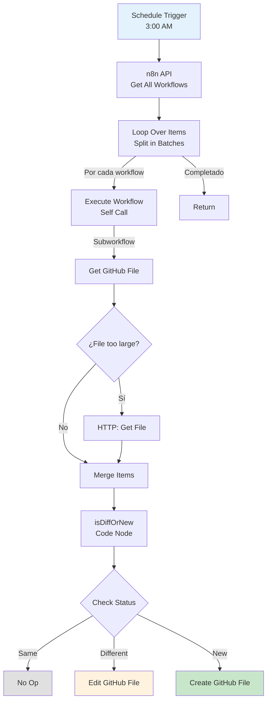

# 0001 Utilidades Backup n8n Workflows

## INFORMACIÓN GENERAL

| Campo | Valor |
|-------|-------|
| **Nombre** | 0001 Utilidades Backup n8n Workflows |
| **ID** | AJBw1wLT9MihOn9E |
| **Estado** | ✅ Activo |
| **Fecha Creación** | 2025-09-25T04:00:42.782Z |
| **Última Actualización** | 2025-09-25T16:03:40.000Z |
| **Total de Nodos** | 20+ |
| **Trigger** | Schedule (3:00 AM diario) + Manual |

---

## PROPÓSITO

Workflow de **backup automático** que exporta todos los workflows de n8n a GitHub diariamente.

### Responsabilidades
1. Obtener lista de todos los workflows de n8n
2. Comparar cada workflow con versión en GitHub
3. Detectar cambios (nuevo, modificado, sin cambios)
4. Actualizar/crear archivos en GitHub según sea necesario
5. Generar commit con mensaje descriptivo

---

## ARQUITECTURA

### Patrón: Main + Sub-Workflow Recursivo



---

## TRIGGER

### Schedule Trigger
**Cron**: Diario a las 3:00 AM (America/Bogota)

```json
{
  "rule": {
    "interval": [
      {
        "triggerAtHour": 3
      }
    ]
  }
}
```

**Por qué 3:00 AM**:
- Baja actividad del sistema
- Workflows no están ejecutándose
- Menor probabilidad de conflictos

---

## CONFIGURACIÓN GLOBAL

### Node: Globals (Set)

**Variables del repositorio**:
```javascript
{
  "repo.owner": "DomiChat",
  "repo.name": "domichat-n8n-workflows-backup",
  "repo.path": "{{ workflow_name.split('-')[1] }}/"
  // Ejemplo: "0001 Clientes Flujo Principal" → "clientes/"
}
```

**Lógica de Path**:
```javascript
name = "0002 Domiciliarios Aceptar Pedido"
parts = name.split('-')  // ["0002 Domiciliarios ", " Aceptar Pedido"]
folder = parts[1].trim()  // "Domiciliarios"
path = folder.toLowerCase() + "/"  // "domiciliarios/"
```

---

## FLUJO PRINCIPAL

### 1. n8n API - Get All Workflows

**Operación**: GET all workflows

**Output**:
```javascript
[
  {
    id: "vZz3KSWmbZa2xPyx",
    name: "0001 Clientes Flujo Principal",
    active: true,
    nodes: [...],
    connections: {...},
    ...
  },
  // ... más workflows
]
```

---

### 2. Loop Over Items (Split In Batches)

**Función**: Itera sobre cada workflow uno por uno

**Razón de usar sub-workflow**:
> "The workflow calls itself using a subworkflow, to help reduce memory usage."

Evita cargar todos los workflows en memoria simultáneamente.

---

## SUB-WORKFLOW (RECURSIVO)

### 3. Get file data (GitHub API)

**Operación**: GET file from GitHub

**Path construido**:
```javascript
path = "clientes/0001-clientes-flujo-principal.json"
```

**Output posible**:
- Archivo existe → content (base64), sha, size
- Archivo no existe → error (404)
- Archivo muy grande → content vacío

---

### 4. If file too large (IF Node)

**Condición**:
```javascript
content === "" && error === null
```

**Acción si es muy grande**:
- **TRUE**: Usar HTTP Request para descargar
- **FALSE**: Usar content de GitHub API directamente

---

### 5. Get File (HTTP Request)

**Solo si archivo muy grande**

**URL**:
```javascript
download_url from GitHub API
```

**Descarga archivo completo** sin límite de tamaño

---

### 6. isDiffOrNew (Code Node)

**Función**: Compara workflow actual vs versión en GitHub

**Algoritmo**:
```javascript
// 1. Order JSON keys alfabéticamente
const orderJsonKeys = (jsonObj) => {
  const ordered = {};
  Object.keys(jsonObj).sort().forEach(key => {
    ordered[key] = jsonObj[key];
  });
  return ordered;
}

// 2. Decode base64 content from GitHub
const githubWorkflow = JSON.parse(
  Buffer.from(content, 'base64').toString()
);

// 3. Get current workflow from n8n
const n8nWorkflow = $input.all()[1].json;

// 4. Order both
const orderedGitHub = orderJsonKeys(githubWorkflow);
const orderedN8N = orderJsonKeys(n8nWorkflow);

// 5. Compare
if (JSON.stringify(orderedGitHub) === JSON.stringify(orderedN8N)) {
  status = "same";
} else {
  status = "different";
}
```

**Output**:
```javascript
{
  github_status: "same" | "different" | "new",
  n8n_data_stringy: JSON.stringify(workflow, null, 2),  // Pretty formatted
  content_decoded: githubWorkflow  // Solo si existe
}
```

---

### 7. Check Status (Switch)

**Rutas**:
- `github_status === "same"` → No Op (no hacer nada)
- `github_status === "different"` → Edit existing file
- `github_status === "new"` → Create new file

---

### 8. Same file - Do nothing (NoOp)

**Función**: Termina sin acción

**Razón**: Archivo ya está actualizado en GitHub

---

### 9. Edit existing file (GitHub API)

**Operación**: UPDATE file in GitHub

**Parámetros**:
```javascript
{
  owner: "DomiChat",
  repository: "domichat-n8n-workflows-backup",
  filePath: "clientes/0001-clientes-flujo-principal.json",
  fileContent: n8n_data_stringy,  // JSON pretty formatted
  commitMessage: "0001-clientes-flujo-principal (different)"
}
```

**Resultado**: Commit en GitHub con cambios

---

### 10. Create new file (GitHub API)

**Operación**: CREATE file in GitHub

**Parámetros**: Mismos que Edit

**Resultado**: Nuevo archivo en repositorio

---

## CASOS DE USO

### Caso 1: Workflow Modificado
```
1. Schedule trigger a las 3:00 AM
2. Get workflow "0001 Clientes Flujo Principal"
3. Get file from GitHub
4. Compare:
   - GitHub version: updatedAt 2025-11-16
   - n8n version: updatedAt 2025-11-17
5. Status: "different"
6. Edit existing file in GitHub
7. Commit: "0001-clientes-flujo-principal (different)"
```

---

### Caso 2: Nuevo Workflow
```
1. Desarrollador crea "0008 Clientes Nueva Feature"
2. Backup ejecuta a las 3:00 AM
3. Get file from GitHub → 404 (no existe)
4. Status: "new"
5. Create new file
6. Commit: "0008-clientes-nueva-feature (new)"
```

---

### Caso 3: Sin Cambios
```
1. Workflow no modificado desde último backup
2. Compare: JSON identical
3. Status: "same"
4. NoOp → No commit
```

---

## ESTRUCTURA DEL REPOSITORIO GITHUB

```
domichat-n8n-workflows-backup/
├── clientes/
│   ├── 0001-clientes-flujo-principal.json
│   ├── 0002-clientes-crear-pedido.json
│   └── ...
├── domiciliarios/
│   ├── 0001-domiciliarios-flujo-principal.json
│   └── ...
├── utilidades/
│   ├── 0001-utilidades-backup-n8n-workflows.json
│   └── ...
└── docs/
    └── ...
```

---

## NOMBRES DE ARCHIVOS

### Transformación

```javascript
// Workflow name
"0001 Clientes Flujo Principal"

// Replace spaces with hyphens
.replace(/\s+/g, '-')
// → "0001-Clientes-Flujo-Principal"

// Lowercase
.toLowerCase()
// → "0001-clientes-flujo-principal"

// Add .json
+ ".json"
// → "0001-clientes-flujo-principal.json"
```

---

## CREDENCIALES

### GitHub OAuth2
**ID**: HkKSejQrQphXO7RH
**Name**: GitHub account

**Permisos requeridos**:
- `repo` (read/write access to code)

### n8n API
**ID**: 9XAgYrtgGFjHHgP6
**Name**: n8n account

**URL**: Self-hosted instance

---

## CONSIDERACIONES TÉCNICAS

### 1. Memory Optimization

**Problema**: Cargar 18 workflows simultáneamente consume mucha memoria

**Solución**: Sub-workflow recursivo
```
Main loop:
  For each workflow:
    Call self with single workflow
    Process
    Return
    Next workflow
```

### 2. Ordering JSON Keys

**Por qué**: Asegurar comparación consistente

**Ejemplo sin ordering**:
```json
// Version 1
{"a": 1, "b": 2}

// Version 2 (same data, different order)
{"b": 2, "a": 1}

// Sin ordering: Different ❌
// Con ordering: Same ✅
```

### 3. Pretty Formatting

```javascript
JSON.stringify(workflow, null, 2)
```

**Ventajas**:
- Legible en GitHub
- Fácil de hacer diff
- Better for version control

---

## MEJORAS POTENCIALES

1. **Notificación de Backup**:
   ```javascript
   Telegram: "Backup completado: 3 modificados, 1 nuevo, 14 sin cambios"
   ```

2. **Backup Incremental**:
   - Solo procesar workflows modificados hoy
   - Check `updatedAt` field

3. **Branch por Ambiente**:
   ```
   main: Producción
   qa: QA environment
   dev: Development
   ```

4. **Retention Policy**:
   - Mantener solo últimos 30 días de commits
   - Tag para releases importantes

5. **Restore Capability**:
   - Workflow para restaurar desde GitHub
   - Útil para disaster recovery

---

## DEPENDENCIAS

**APIs**:
- n8n Internal API
- GitHub REST API v3

**No invocado por otros workflows**

---

**Documentado por**: Claude (Anthropic)
**Fecha**: 2025-11-17
**Parte de**: Sistema DomiChat (18 workflows totales)
**⭐ CRÍTICO: Único backup automático del sistema**
