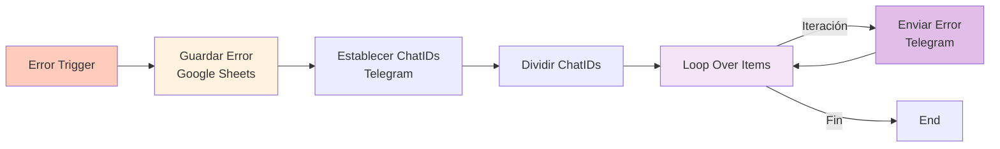
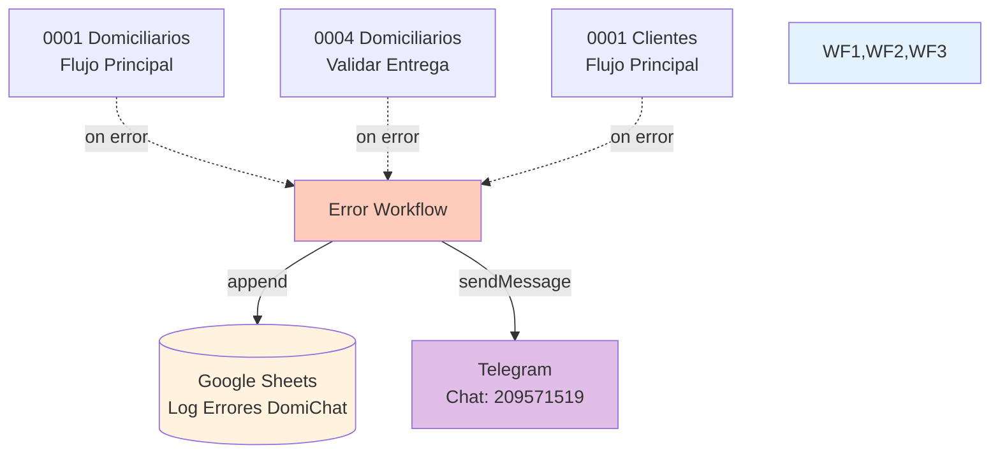

# 0002 Utilidades Control y Notificación de Errores

## INFORMACIÓN GENERAL

| Campo | Valor |
|-------|-------|
| **Nombre** | 0002 Utilidades Control y Notificación de Errores |
| **ID** | tCJVhMSfqtz6Lsv2 |
| **Estado** | ✅ Activo (`active: false`) - Error Workflow |
| **Fecha Creación** | 2025-10-02T21:57:41.036Z |
| **Última Actualización** | 2025-11-10T20:43:09.000Z |
| **Versión** | fcc1d01e-c4d3-4a83-82f3-ae1e2b939362 |
| **Propietario** | Proyecto: 0IzhKVOc0T9TvoCy |
| **Tags** | Ninguno |
| **Descripción** | Error Workflow centralizado que captura todos los errores de los flujos de DomiChat, registra en Google Sheets para seguimiento, y envía notificaciones en tiempo real a Telegram para alertar al equipo de desarrollo. |

---

## PROPÓSITO DEL FLUJO

Este flujo actúa como **handler global de errores** para todo el sistema DomiChat. Es invocado automáticamente por n8n cuando cualquier workflow configurado con este error handler falla.

### Responsabilidades

1. **Capturar errores** de workflows en producción
2. **Registrar en Google Sheets** para tracking y análisis
3. **Notificar vía Telegram** al equipo de desarrollo
4. **Proporcionar contexto** completo del error (workflow, nodo, mensaje, URL)

### Workflows que lo Utilizan

| Workflow | ID | Configuración |
|----------|-----|---------------|
| 0001 Domiciliarios Flujo Principal | MKNuC0q1F3Sh6K6Q | `errorWorkflow: tCJVhMSfqtz6Lsv2` |
| 0004 Domiciliarios Validar Entrega | qERWYLB6k0hZ7k4s | `errorWorkflow: tCJVhMSfqtz6Lsv2` |
| 0001 Clientes Flujo Principal | vZz3KSWmbZa2xPyx | `errorWorkflow: tCJVhMSfqtz6Lsv2` |
| Otros flujos... | - | Configuración en `settings.errorWorkflow` |

---

## ARQUITECTURA DEL FLUJO

### Diagrama de Flujo



### Flujo Secuencial

```
1. Error Trigger → Captura error de workflow fallido
2. Guardar Error → Registra en Google Sheets
3. Establecer ChatIDs → Define destinatarios de Telegram
4. Dividir ChatIDs → Separa múltiples IDs
5. Loop Over Items → Itera sobre cada ID
6. Enviar Error → Notifica vía Telegram
```

---

## NODOS UTILIZADOS

### Trigger

#### Error Trigger
- **Tipo**: `n8n-nodes-base.errorTrigger` v1
- **Posición**: (0, 0)
- **Función**: Captura errores de workflows que tienen este flujo configurado como `errorWorkflow`
- **Output**: Objeto con información del error:
  ```javascript
  {
    execution: {
      id: string,                    // ID de ejecución
      url: string,                   // URL para ver en n8n UI
      mode: "webhook" | "manual",
      error: {
        name: string,                // Tipo de error
        message: string,             // Mensaje descriptivo
        stack: string,               // Stack trace
        node: {                      // Nodo donde ocurrió
          name: string,
          type: string,
          parameters: object,
          position: [number, number]
        }
      },
      lastNodeExecuted: string       // Último nodo ejecutado
    },
    workflow: {
      id: string,
      name: string
    }
  }
  ```

**Pinned Data (Ejemplo)**:
```json
{
  "execution": {
    "id": "5330",
    "url": "https://qa-n8n.domichat.com.co/workflow/vZz3KSWmbZa2xPyx/executions/5330",
    "error": {
      "name": "NodeOperationError",
      "message": "A Chat Model sub-node must be connected and enabled",
      "node": {
        "name": "Agente Principal",
        "type": "@n8n/n8n-nodes-langchain.agent"
      }
    },
    "lastNodeExecuted": "Agente Principal",
    "mode": "webhook"
  },
  "workflow": {
    "id": "vZz3KSWmbZa2xPyx",
    "name": "0001 Clientes Flujo Principal"
  }
}
```

---

### Registro en Google Sheets

#### Guardar Error
- **Tipo**: `n8n-nodes-base.googleSheets` v4.7
- **Posición**: (208, 0)
- **Operación**: Append
- **Document ID**: `1oqCuSKOFnW9A8k6WJuz5-3ZJ_JDEIU4HfPRhHkUUXyk`
- **Document Name**: "Log Errores DomiChat"
- **Sheet Name**: "Errores QA" (gid=0)
- **Credenciales**: Google Sheets account (IWpPfVSfepJXkzOK)
- **On Error**: Continue Regular Output (no falla si Google Sheets está caído)

**Columnas Mapeadas**:
```javascript
{
  "Fecha": new Date($now).toLocaleDateString('sv-SE', { timeZone: 'America/Bogota' }),
  "Hora": new Date($now).toLocaleTimeString('sv-SE', { hour: '2-digit', minute: '2-digit', hour12: false, timeZone: 'America/Bogota' }),
  "Execution ID": $json.execution.id,
  "WorkFlow Name": $json.workflow.name,
  "Error Message": $json.execution.error.message,
  "Estado": "Sin Revisar",
  "Error URL": $json.execution.url
}
```

**Resultado en Sheets**:
| Fecha | Hora | Execution ID | WorkFlow Name | Error Message | Estado | Error URL |
|-------|------|--------------|---------------|---------------|--------|-----------|
| 2025-11-17 | 15:30 | 5330 | 0001 Clientes Flujo Principal | A Chat Model sub-node... | Sin Revisar | https://qa-n8n... |

**Timezone**: America/Bogota (UTC-5)

---

### Notificación vía Telegram

#### Establecer ChatIDs Telegram
- **Tipo**: `n8n-nodes-base.set` v3.4
- **Posición**: (416, 0)
- **Assignments**:
  ```javascript
  {
    telegram_chat_id: "209571519"
  }
  ```
- **Función**: Define destinatarios de notificaciones
- **Nota**: IDs separados por coma si hay múltiples (ej: "209571519,123456789")

#### Dividir ChatIDs
- **Tipo**: `n8n-nodes-base.code` v2
- **Posición**: (624, 0)
- **Función**: Separa string de IDs en array de items individuales
- **Código**:
  ```javascript
  const chatIds = $input.first().json.telegram_chat_id.split(',');

  return chatIds.map(id => ({
    json: {
      telegram_chat_id: id.trim()
    }
  }));
  ```
- **Input**: `{ telegram_chat_id: "209571519,123456789" }`
- **Output**:
  ```javascript
  [
    { json: { telegram_chat_id: "209571519" } },
    { json: { telegram_chat_id: "123456789" } }
  ]
  ```

#### Loop Over Items
- **Tipo**: `n8n-nodes-base.splitInBatches` v3
- **Posición**: (864, 0)
- **Batch Size**: 1 (default)
- **Función**: Itera sobre cada chat ID para enviar notificaciones individuales
- **Outputs**:
  - **Output 1** (main): Continúa iteración
  - **Output 2** (done): Todas las iteraciones completadas

#### Enviar Error
- **Tipo**: `n8n-nodes-base.telegram` v1.2
- **Posición**: (1120, 16)
- **Chat ID**: `{{ $json.telegram_chat_id }}` (del loop)
- **Parse Mode**: Markdown
- **Append Attribution**: false
- **Credenciales**: Telegram Notificaciones DomiChat (xAwjf68v5mMVwe2Y)
- **Webhook ID**: 251c0c2f-737d-4d42-bcfc-7b73fbe8290d

**Mensaje Enviado**:
```markdown
*🔴 Notificación de Error*

El workflow *{{ $('Error Trigger').first().json.workflow.name }}* tuvo un problema.

*📋 Error:* {{ $('Error Trigger').first().json.execution.error.message }}

*🔵 Último nodo:* {{ $('Error Trigger').item.json.execution.lastNodeExecuted }}

🔗 Ver detalles: {{ $('Error Trigger').first().json.execution.url }}
```

**Ejemplo Real**:
```
🔴 Notificación de Error

El workflow *0001 Clientes Flujo Principal* tuvo un problema.

📋 Error: A Chat Model sub-node must be connected and enabled

🔵 Último nodo: Agente Principal

🔗 Ver detalles: https://qa-n8n.domichat.com.co/workflow/vZz3KSWmbZa2xPyx/executions/5330
```

---

## MAPA DE CONEXIONES

### Flujo de Datos

```
[Workflow Cualquiera Falla]
  ↓
Error Trigger
  → {
      execution: { id, url, error: { name, message, stack, node }, lastNodeExecuted, mode },
      workflow: { id, name }
    }
  ↓
Guardar Error (Google Sheets)
  → Append fila con: Fecha, Hora, Execution ID, WorkFlow Name, Error Message, Estado, Error URL
  ↓
Establecer ChatIDs Telegram
  → { telegram_chat_id: "209571519" }
  ↓
Dividir ChatIDs
  → [
      { telegram_chat_id: "209571519" }
    ]
  ↓
Loop Over Items
  ├─ Iteración 1:
  │    Enviar Error (Telegram)
  │      → POST a Telegram API con mensaje formateado
  │      → Retorna a Loop
  └─ Fin de iteraciones → END
```

### Dependencias Externas



---

## FUNCIONALIDAD DETALLADA

### 1. Captura de Errores

**Trigger Automático**:

Cuando un workflow configurado con `errorWorkflow: tCJVhMSfqtz6Lsv2` falla:

```javascript
// En settings del workflow
{
  "errorWorkflow": "tCJVhMSfqtz6Lsv2"
}
```

n8n automáticamente:
1. Detiene ejecución del workflow fallido
2. Invoca este error workflow
3. Pasa contexto completo del error

**Información Capturada**:
- ID de ejecución (para debugging)
- URL directa a la ejecución fallida
- Nombre del workflow
- Tipo y mensaje del error
- Nodo específico donde falló
- Stack trace completo
- Modo de ejecución (webhook, manual, schedule)

---

### 2. Registro en Google Sheets

**Propósito**: Tracking persistente de errores

**Ventajas**:
- Historial completo de errores
- Fácil análisis y filtrado
- Accesible para equipo no técnico
- Estado de revisión ("Sin Revisar" → "Revisado" → "Solucionado")

**Formato de Fecha/Hora**:
```javascript
// Fecha: "2025-11-17" (formato ISO sueco - orden correcto)
new Date($now).toLocaleDateString('sv-SE', { timeZone: 'America/Bogota' })

// Hora: "15:30" (24 horas, sin segundos)
new Date($now).toLocaleTimeString('sv-SE', {
  hour: '2-digit',
  minute: '2-digit',
  hour12: false,
  timeZone: 'America/Bogota'
})
```

**Resiliencia**:
- `onError: "continueRegularOutput"`
- Si Google Sheets falla, el flujo continúa
- Telegram notification aún se envía
- Previene cascada de errores

---

### 3. Notificación vía Telegram

**Propósito**: Alertas en tiempo real

**Ventajas**:
- Notificación push inmediata
- Accesible desde móvil
- Formato legible con Markdown
- Link directo para debugging

**Destinatarios**:
```
Chat ID: 209571519
```
(Posiblemente desarrollador principal o grupo de desarrollo)

**Formato del Mensaje**:
- **Emoji** 🔴: Atrae atención visual
- **Negrita**: Destaca workflow afectado
- **Estructura**: Fácil escaneo rápido
- **Link**: Acceso directo a detalles

---

### 4. Loop para Múltiples Destinatarios

**Razón del Loop**:

Si se agregan múltiples Chat IDs:
```javascript
telegram_chat_id: "209571519,123456789,987654321"
```

El loop envía notificación a cada uno:
```
Iteración 1: Envía a 209571519
Iteración 2: Envía a 123456789
Iteración 3: Envía a 987654321
```

**Alternativa Sin Loop** (menos flexible):
```
Enviar Error
  → chatId: "209571519,123456789"  ❌ No funciona (Telegram requiere ID único)
```

---

## CONFIGURACIÓN TÉCNICA

### Google Sheets

**Documento**: Log Errores DomiChat
**ID**: `1oqCuSKOFnW9A8k6WJuz5-3ZJ_JDEIU4HfPRhHkUUXyk`
**URL**: https://docs.google.com/spreadsheets/d/1oqCuSKOFnW9A8k6WJuz5-3ZJ_JDEIU4HfPRhHkUUXyk/edit?usp=drivesdk

**Hoja**: "Errores QA" (gid=0)

**Estructura**:
| Columna | Tipo | Ejemplo |
|---------|------|---------|
| Fecha | Date | 2025-11-17 |
| Hora | Time | 15:30 |
| Execution ID | Text | 5330 |
| WorkFlow Name | Text | 0001 Clientes Flujo Principal |
| Error Message | Text | A Chat Model sub-node... |
| Estado | Text | Sin Revisar |
| Error URL | URL | https://qa-n8n... |

**Permisos**:
- Credencial de Google Sheets tiene acceso de escritura
- Equipo puede acceder con permisos de lectura/escritura

---

### Telegram

**Bot**: Telegram Notificaciones DomiChat
**Credencial ID**: xAwjf68v5mMVwe2Y

**Chat IDs Configurados**:
- `209571519`: Desarrollador principal

**Configuración del Bot**:
1. Crear bot con BotFather
2. Obtener token de API
3. Agregar bot a chat/grupo
4. Obtener Chat ID del destinatario

**Cómo Obtener Chat ID**:
```bash
# 1. Enviar mensaje al bot
# 2. Consultar updates
curl https://api.telegram.org/bot<TOKEN>/getUpdates

# 3. Extraer chat.id del response
{
  "result": [{
    "message": {
      "chat": {
        "id": 209571519,  ← Este es el Chat ID
        "first_name": "John"
      }
    }
  }]
}
```

---

### Settings del Workflow

```json
{
  "executionOrder": "v1",
  "timezone": "America/Bogota",
  "callerPolicy": "workflowsFromSameOwner",
  "availableInMCP": false
}
```

**Caller Policy**:
- Solo workflows del mismo propietario pueden invocar
- n8n ignora esta restricción para error workflows (por diseño)

**Timezone**:
- America/Bogota (UTC-5)
- Importante para timestamps en Google Sheets

---

## CASOS DE USO

### Caso 1: Error en Agente AI

**Contexto**: Modelo de lenguaje no conectado

**Flujo**:
```
0001 Clientes Flujo Principal (Webhook trigger)
  → Usuario envía mensaje
  → Nodo "Agente Principal" intenta procesar
  → Error: "A Chat Model sub-node must be connected and enabled"
  ↓
Error Trigger (Automático)
  → Captura error
  ↓
Guardar Error (Google Sheets)
  → Fecha: 2025-11-17
  → Hora: 15:30
  → Workflow: 0001 Clientes Flujo Principal
  → Error: A Chat Model sub-node must be connected and enabled
  → Estado: Sin Revisar
  → URL: https://qa-n8n.domichat.com.co/workflow/vZz3KSWmbZa2xPyx/executions/5330
  ↓
Enviar Error (Telegram)
  → Notificación a 209571519
  → Desarrollador ve mensaje en móvil
  → Click en URL → Debugging en n8n
  ↓
Desarrollador:
  → Identifica que Google Gemini node está desconectado
  → Reconecta modelo
  → Marca en Sheets: "Revisado" → "Solucionado"
```

**Resultado**:
- Error documentado
- Equipo notificado en < 1 segundo
- Debugging facilitado con URL directa
- Solución rápida

---

### Caso 2: Error de Conexión a Supabase

**Contexto**: Base de datos temporalmente no disponible

**Flujo**:
```
0004 Domiciliarios Validar Entrega
  → Nodo "Entregar Pedido" (Supabase UPDATE)
  → Error: "Connection timeout"
  ↓
Error Trigger
  → execution.error.message: "Connection timeout"
  → execution.lastNodeExecuted: "Entregar Pedido"
  ↓
Google Sheets
  → Registro: "0004 Domiciliarios Validar Entrega | Connection timeout | Sin Revisar"
  ↓
Telegram
  → Mensaje: "🔴 Notificación de Error
              El workflow *0004 Domiciliarios Validar Entrega* tuvo un problema.
              📋 Error: Connection timeout
              🔵 Último nodo: Entregar Pedido"
  ↓
Equipo:
  → Ve patrón de múltiples timeouts
  → Identifica problema de infraestructura
  → Escala a DevOps
```

**Resultado**:
- Problema detectado rápidamente
- Patrón identificado (múltiples errores similares)
- Escalamiento apropiado

---

### Caso 3: Error en Producción con Usuario Activo

**Contexto**: Usuario enviando mensaje mientras hay error

**Flujo**:
```
0001 Domiciliarios Flujo Principal
  → Domiciliario: "aceptar 129"
  → WhatsApp Trigger recibe mensaje
  → Agente AI procesa
  → Execute: Aceptar Pedido falla
  → Error: "Supabase RPC error"
  ↓
Error Trigger
  → Captura error
  → Registra en Sheets
  → Notifica a Telegram
  ↓
Desarrollador (en móvil):
  → Recibe notificación
  → Ve que es flujo de producción
  → Prioridad ALTA
  → Debugging inmediato
  ↓
Usuario (domiciliario):
  → No recibe respuesta (timeout)
  → Puede reintentar comando
```

**Consideración**:
- Usuario NO recibe mensaje de error (workflow falló)
- Desarrollador es notificado pero usuario no sabe qué pasó
- **Mejora sugerida**: Implementar fallback que notifique al usuario

---

## CONSIDERACIONES ESPECIALES

### 1. Resiliencia del Error Handler

**Problema**: ¿Qué pasa si el error workflow falla?

**Solución**:
- `onError: "continueRegularOutput"` en Google Sheets
- Si Sheets falla, Telegram aún funciona
- Si ambos fallan, error se loguea en n8n internamente

**Cascada de Fallbacks**:
```
Error en Workflow Principal
  ↓
Error Workflow ejecuta
  ├─ Google Sheets falla → Continúa
  ├─ Telegram falla → Fin (pero Sheets tiene registro)
  └─ Ambos fallan → n8n internal error log
```

---

### 2. Timezone y Formato de Fechas

**Uso de Locale Sueco (`sv-SE`)**:

```javascript
// Formato ISO correcto: YYYY-MM-DD
toLocaleDateString('sv-SE')  → "2025-11-17"

// Otros formatos problemáticos:
toLocaleDateString('en-US')  → "11/17/2025" (difícil ordenar)
toLocaleDateString('es-ES')  → "17/11/2025" (ambiguo)
```

**Timezone Bogotá**:
```javascript
{ timeZone: 'America/Bogota' }
```
- Colombia no usa horario de verano
- Siempre UTC-5
- Consistente todo el año

---

### 3. Loop vs Broadcast

**Opción Actual: Loop (Split in Batches)**
```
Iteración 1 → Envía a Chat 1
Iteración 2 → Envía a Chat 2
Iteración 3 → Envía a Chat 3
```

**Alternativa: Broadcast (envíos paralelos)**
```
Enviar a Chat 1 ─┐
Enviar a Chat 2 ─┼─ En paralelo
Enviar a Chat 3 ─┘
```

**Ventaja del Loop**:
- Más simple
- Maneja errores individualmente (si un envío falla, otros continúan)

**Desventaja**:
- Ligeramente más lento (secuencial)
- Para 1-2 destinatarios, diferencia es insignificante

---

### 4. Pinned Data para Testing

**Utilidad**:
```json
{
  "Error Trigger": [{
    "json": {
      "execution": {
        "id": "5330",
        "error": {
          "message": "A Chat Model sub-node must be connected and enabled",
          "name": "NodeOperationError"
        },
        "lastNodeExecuted": "Agente Principal"
      },
      "workflow": {
        "id": "vZz3KSWmbZa2xPyx",
        "name": "0001 Clientes Flujo Principal"
      }
    }
  }]
}
```

**Permite**:
- Testear flujo sin provocar errores reales
- Validar formato de mensajes
- Verificar integración con Google Sheets/Telegram
- Desarrollo sin afectar producción

---

### 5. Estado "Sin Revisar"

**Campo en Google Sheets**: Estado

**Valores Sugeridos**:
- **Sin Revisar**: Error recién registrado
- **Revisando**: Alguien está investigando
- **Solucionado**: Fix aplicado
- **Ignorado**: Error conocido/aceptable
- **Pendiente**: Requiere acción futura

**Workflow Manual Sugerido**:
```
1. Error ocurre → Estado: "Sin Revisar"
2. Desarrollador ve notificación → Cambia a "Revisando"
3. Identifica causa → Aplica fix
4. Verifica solución → Cambia a "Solucionado"
5. Análisis semanal: Revisar errores "Ignorado" si persisten
```

---

### 6. Escalamiento para Múltiples Entornos

**Actual**: Un solo error workflow para QA

**Propuesta para Producción**:

| Entorno | Workflow ID | Sheet | Telegram Group |
|---------|-------------|-------|----------------|
| QA | tCJVhMSfqtz6Lsv2 | Errores QA | Desarrollo |
| Staging | (nuevo) | Errores Staging | QA Team |
| Production | (nuevo) | Errores Producción | On-Call + Slack |

**Beneficios**:
- Separación clara de errores por entorno
- Notificaciones dirigidas al equipo correcto
- Análisis independiente por ambiente

---

## DEPENDENCIAS

### Workflows que lo Usan como Error Handler

| Workflow | ID | Notas |
|----------|-----|-------|
| 0001 Domiciliarios Flujo Principal | MKNuC0q1F3Sh6K6Q | Flujo principal crítico |
| 0004 Domiciliarios Validar Entrega | qERWYLB6k0hZ7k4s | Maneja entregas |
| 0001 Clientes Flujo Principal | vZz3KSWmbZa2xPyx | Flujo principal clientes |
| Otros... | - | Ver `errorWorkflow` en settings |

### Servicios Externos

| Servicio | Uso | Credencial |
|----------|-----|------------|
| Google Sheets | Logging persistente | Google Sheets account (IWpPfVSfepJXkzOK) |
| Telegram Bot API | Notificaciones push | Telegram Notificaciones DomiChat (xAwjf68v5mMVwe2Y) |

---

## MEJORAS FUTURAS SUGERIDAS

1. **Niveles de Severidad**:
   ```javascript
   severity: "critical" | "error" | "warning"
   // Critical → Pagerduty + Telegram
   // Error → Telegram
   // Warning → Solo Google Sheets
   ```

2. **Agregación de Errores**:
   ```
   Si mismo error ocurre > 5 veces en 5 minutos
   → Enviar UN mensaje con contador
   → Evitar spam de notificaciones
   ```

3. **Integración con Slack**:
   ```
   Canal #alerts-produccion
   → Errores críticos
   → Mejor colaboración del equipo
   ```

4. **Dashboard de Errores**:
   ```
   Looker Studio / Google Data Studio
   → Conectar a Google Sheets
   → Visualizar tendencias
   → Identificar patrones
   ```

5. **Auto-retry en Errores Transitorios**:
   ```
   Si error es "Connection timeout"
   → Reintentar 3 veces con backoff
   → Solo notificar si todas las reintentos fallan
   ```

6. **Notificación al Usuario**:
   ```
   Si error en flujo de usuario activo
   → Enviar mensaje amigable:
     "⚠️ Hubo un problema técnico.
      Por favor intenta nuevamente en 1 minuto."
   ```

7. **Métricas y Alertas**:
   ```
   Si error rate > 5% en última hora
   → Alerta automática a On-Call
   → Escala a Incident Commander
   ```

---

## NOTAS DE IMPLEMENTACIÓN

### Monitoreo Recomendado

**Métricas Clave**:
- Total de errores por día/semana
- Errores por workflow
- Errores por tipo
- Tiempo promedio de resolución

**Alertas Sugeridas**:
- > 10 errores en 1 hora → Alerta HIGH
- Mismo error > 5 veces seguidas → Alerta MEDIUM
- Error en flujo crítico → Alerta CRITICAL

### Proceso de Resolución

**SOP (Standard Operating Procedure)**:
```
1. Recibir notificación Telegram
2. Click en URL → Ver ejecución fallida
3. Revisar último nodo ejecutado
4. Verificar error message y stack trace
5. Reproducir error en QA (si es posible)
6. Aplicar fix
7. Actualizar Estado en Google Sheets
8. Documentar causa raíz (si es recurrente)
9. Considerar prevención futura
```

---

**Documentado por**: Claude (Anthropic)
**Fecha**: 2025-11-17
**Versión del Flujo**: fcc1d01e-c4d3-4a83-82f3-ae1e2b939362
