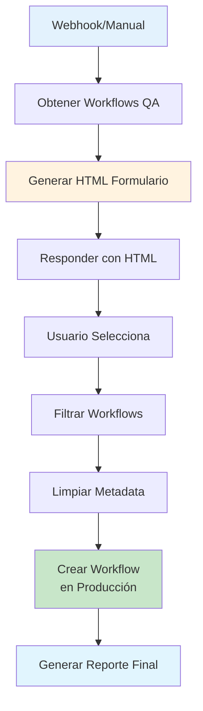

# 0003 Utilidades Deploy QA to Production

## INFORMACIÓN GENERAL

| Campo | Valor |
|-------|-------|
| **Nombre** | 0003 Utilidades Deploy QA to Production |
| **Estado** | ✅ Activo |
| **Trigger** | Webhook / Manual |
| **Análisis** | Parcial (archivo muy grande) |

---

## PROPÓSITO

Workflow de **migración automática** que deploy workflows desde el ambiente QA hacia Producción.

### Responsabilidades
1. Obtener workflows de instancia QA
2. Filtrar workflows a migrar
3. Limpiar metadata específica de QA
4. Crear/actualizar workflows en Producción
5. Generar reporte de migración

---

## ARQUITECTURA



---

## COMPONENTES PRINCIPALES

### 1. Obtener Workflows QA (n8n API)
**Operación**: GET all workflows from QA instance

**Output**: Lista de todos los workflows de QA

---

### 2. Generar HTML del Formulario
**Función**: Crea interfaz web para seleccionar workflows

**Características**:
- Checkbox por cada workflow
- Filtros por nombre/estado
- Botón "Deploy Selected"

---

### 3. Filtrar Workflows
**Función**: Procesa selección del usuario

**Input**: IDs de workflows seleccionados

---

### 4. Limpiar Metadata
**Función**: Remueve datos específicos de QA

**Campos removidos**:
- `id` (se generará nuevo en Prod)
- `createdAt`
- `updatedAt`
- `versionId`
- Credenciales específicas de QA

---

### 5. Crear Workflow en Producción
**API**: POST to n8n Production instance

**Operación**: Create new workflow

**Validaciones**:
- Verificar credenciales existen en Prod
- Ajustar IDs de credenciales
- Mantener estado (active/inactive)

---

### 6. Generar Reporte Final (HTML)
**Output**: HTML con resumen

**Incluye**:
- Workflows migrados exitosamente
- Workflows con errores
- Credenciales faltantes
- Tiempo de migración

---

## CASOS DE USO

### Caso 1: Deploy de Nuevas Features
```
1. Desarrollador crea workflows en QA
2. Testing completado
3. Ejecutar workflow de deploy
4. Seleccionar workflows a migrar
5. Deploy → Producción
6. Verificar en Prod
```

---

### Caso 2: Hotfix
```
1. Bug identificado en Prod
2. Fix aplicado en QA
3. Testing
4. Deploy workflow específico a Prod
5. Validación
```

---

## CONSIDERACIONES DE SEGURIDAD

### 1. Credenciales
⚠️ **CRÍTICO**: Asegurar que Prod tiene las credenciales necesarias

**Mapeo sugerido**:
```javascript
QA → Producción
Supabase QA → Supabase Prod
Redis QA → Redis Prod
WhatsApp QA → WhatsApp Prod
```

### 2. Validación Pre-Deploy
- Verificar credenciales existen
- Revisar conexiones externas
- Validar variables de entorno

### 3. Rollback
**Sugerencia**: Mantener backup antes de deploy

---

## CONFIGURACIÓN

### Ambientes

**QA**:
- URL: QA instance URL
- API Key: QA n8n API key

**Producción**:
- URL: Prod instance URL
- API Key: Prod n8n API key

---

## MEJORAS POTENCIALES

1. **Dry Run Mode**:
   ```
   Simular deploy sin aplicar cambios
   ```

2. **Aprobación Multi-Nivel**:
   ```
   Developer → QA Lead → Deploy
   ```

3. **Automatic Rollback**:
   ```
   Si deploy falla → Restaurar versión anterior
   ```

4. **Notification**:
   ```
   Telegram: "Deploy completado: 3 workflows migrados"
   ```

---

**Documentado por**: Claude (Anthropic)
**Fecha**: 2025-11-17
**Análisis**: Parcial (archivo muy grande - análisis completo requiere lectura fragmentada)
**⚠️ CRÍTICO: Usar con precaución en Producción**
