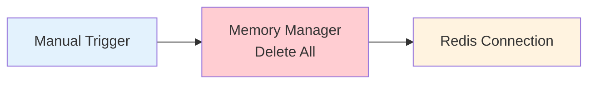

# 0004 Utilidades Borrar Memoria de Agente

## INFORMACIÓN GENERAL

| Campo | Valor |
|-------|-------|
| **Nombre** | 0004 Utilidades Borrar Memoria de Agente |
| **ID** | CY132083QPsn1AYm |
| **Estado** | ⚪ Inactivo (Utilidad de debugging) |
| **Total de Nodos** | 3 |
| **Trigger** | Manual Trigger |

---

## PROPÓSITO

Utilidad de **debugging y mantenimiento** para limpiar la memoria conversacional de un agente AI almacenada en Redis.

### Uso
- Desarrollo y testing
- Limpiar sesiones problemáticas
- Reset de conversaciones

⚠️ **Solo para uso en desarrollo/QA**

---

## FLUJO



---

## NODOS

### 1. Manual Trigger (When clicking 'Execute workflow')
**Función**: Ejecución manual desde UI de n8n

---

### 2. Chat Memory Manager (Memory Manager)
**Modo**: delete all

**Función**: Elimina todos los mensajes de una sesión Redis específica

**Operación Redis equivalente**:
```redis
DEL session_key
```

---

### 3. Redis Chat Memory
**Session Key**: `573006064535_cliente` (hardcoded)

**Configuración**:
- TTL: 86400000 ms (24 horas)
- Context Window: 6 mensajes
- Credenciales: Redis QA

**Nota**: Key está hardcodeada en el workflow, probablemente para testing de un usuario específico

---

## CASOS DE USO

### Caso 1: Reset de Conversación Problemática
```
Escenario:
- Cliente 573006064535 tiene conversación corrupta
- AI agent responde de forma incorrecta
- Contexto en Redis está desactualizado

Solución:
1. Ejecutar workflow manualmente
2. Delete all messages de session "573006064535_cliente"
3. Cliente empieza conversación limpia
```

---

### Caso 2: Testing de Prompts
```
Desarrollo:
1. Probar prompt nuevo
2. Conversación genera contexto indeseado
3. Ejecutar Borrar Memoria
4. Probar prompt nuevamente con estado limpio
```

---

## CONFIGURACIÓN

### Session Key Hardcoded
```javascript
sessionKey: "573006064535_cliente"
```

⚠️ **Limitación**: Solo borra memoria de ese usuario específico

**Mejora sugerida**:
```javascript
// Input dinámico
sessionKey: $('Manual Trigger').json.session_key
```

---

## REDIS

### Estructura de Session Key
**Formato**: `{numero_telefono}_{tipo}`

**Ejemplos**:
- Cliente: `573219876543_cliente`
- Domiciliario: `573006064535_delivery`

### Datos Eliminados
```json
{
  "messages": [
    { "role": "user", "content": "..." },
    { "role": "ai", "content": "..." },
    // ... hasta 6 mensajes
  ]
}
```

---

## DEPENDENCIAS

**Servicios**:
- Redis QA

**No invocado por otros workflows** (solo manual)

---

## CONSIDERACIONES

### 1. Solo Desarrollo
Este workflow **no debe usarse en producción** porque:
- Session key hardcoded
- No hay confirmación
- No hay logging de quién lo ejecutó
- Pérdida de contexto irreversible

### 2. Alternativa Automática
La memoria se limpia automáticamente por:
- TTL de 24 horas (expiración natural)
- Workflow de validación de entrega (limpia memoria del cliente)

### 3. Herramienta de Debugging
Útil para:
- Investigar problemas de contexto
- Testing de nuevos prompts
- Desarrollo de features

---

## MEJORAS POTENCIALES

1. **Session Key Dinámica**:
   ```javascript
   {
     "workflowInputs": {
       "values": [
         { "name": "session_key", "type": "string" }
       ]
     }
   }
   ```

2. **Confirmación**:
   ```
   "¿Seguro que quieres borrar la memoria de 573006064535?"
   [Confirmar] [Cancelar]
   ```

3. **Logging**:
   ```sql
   INSERT INTO memoria_borrada (
     session_key,
     fecha,
     usuario_ejecutor
   ) VALUES (...);
   ```

4. **Backup Antes de Borrar**:
   ```javascript
   1. Leer memoria actual
   2. Guardar en tabla backup_memoria
   3. Borrar de Redis
   ```

---

**Documentado por**: Claude (Anthropic)
**Fecha**: 2025-11-17
**Parte de**: Sistema DomiChat (18 workflows totales)
**⚠️ Solo para desarrollo/QA**
