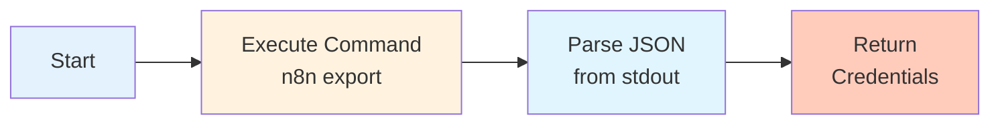

# 0005 Utilidades Extraer Credenciales

## INFORMACIÓN GENERAL

| Campo | Valor |
|-------|-------|
| **Nombre** | 0005 Utilidades Extraer Credenciales |
| **ID** | txbu5tXSsbm0OFqL |
| **Estado** | ⚪ Inactivo (Utilidad de mantenimiento) |
| **Total de Nodos** | 4 |
| **Trigger** | Webhook / Manual |

---

## PROPÓSITO

Utilidad de **mantenimiento y migración** que exporta todas las credenciales almacenadas en n8n en formato desencriptado.

### Uso
- Backup de credenciales
- Migración entre ambientes
- Auditoría de configuración

⚠️ **CRÍTICO: Solo para uso en desarrollo - Alto riesgo de seguridad**

---

## FLUJO



---

## NODOS

### 1. Start (Trigger)
**Tipo**: Webhook o Manual

**Función**: Inicia el proceso de exportación

---

### 2. Execute Command (Bash)
**Comando**:
```bash
npx n8n export:credentials --all --decrypted
```

**Flags**:
- `--all`: Exporta todas las credenciales
- `--decrypted`: Exporta en texto plano (sin encriptar)

**Output (stdout)**:
```json
{
  "credentials": [
    {
      "id": "4bpjJPK2fqZkspgx",
      "name": "Supabase QA",
      "type": "supabaseApi",
      "data": {
        "host": "https://xxxxx.supabase.co",
        "serviceRole": "eyJhbGciOiJIUzI1NiIsInR..."
      }
    },
    {
      "id": "v1sP8v4ffq4fES1C",
      "name": "Redis QA",
      "type": "redis",
      "data": {
        "host": "redis-xxxxx.upstash.io",
        "port": 6379,
        "password": "xxxxx"
      }
    },
    // ... más credenciales
  ]
}
```

---

### 3. Parse JSON (Code/Set)
**Función**: Parsea el JSON del stdout del comando

**Transformación**:
```javascript
const output = $json.stdout;
const credentials = JSON.parse(output);

return {
  json: {
    total_credentials: credentials.length,
    credentials: credentials
  }
};
```

---

### 4. Return (Set)
**Output estructurado**:
```javascript
{
  total_credentials: 6,
  credentials: [
    {
      id: "4bpjJPK2fqZkspgx",
      name: "Supabase QA",
      type: "supabaseApi",
      data: { ... }
    },
    // ... más credenciales
  ]
}
```

---

## CREDENCIALES EXPORTADAS

### Tipos de Credenciales en DomiChat

1. **WhatsApp Business API**
   - WhatsApp Clientes - Trigger
   - WhatsApp Domiciliarios - Trigger
   - Access Tokens

2. **Supabase QA**
   - Host
   - Service Role Key
   - Anon Key

3. **Redis QA**
   - Host
   - Port
   - Password

4. **Google AI Studio QA**
   - API Key

5. **Telegram Notificaciones DomiChat**
   - Bot Token
   - Chat ID

6. **Google Sheets**
   - OAuth Credentials
   - Access Token

---

## CASOS DE USO

### Caso 1: Migración QA → Producción
```
1. Exportar credenciales de QA
2. Revisar cuáles son necesarias en Prod
3. Importar credenciales en instancia de Producción
4. Actualizar valores sensibles (tokens, passwords)
```

---

### Caso 2: Backup de Seguridad
```
1. Ejecutar workflow mensualmente
2. Guardar JSON en repositorio privado seguro
3. Usar para recovery en caso de pérdida
```

⚠️ **Nota**: Guardar en repositorio con encriptación adicional

---

### Caso 3: Auditoría de Configuración
```
1. Exportar credenciales
2. Verificar:
   - ¿Todas las credenciales están actualizadas?
   - ¿Hay credenciales sin usar?
   - ¿Los nombres son descriptivos?
```

---

## RIESGOS DE SEGURIDAD

### 🔴 CRÍTICO

1. **Credenciales en Texto Plano**
   ```json
   {
     "password": "mi_password_secreto",
     "apiKey": "sk_live_xxxxxxxxxxxxx"
   }
   ```

2. **Exposición en Logs**
   - n8n guarda ejecuciones con outputs
   - Credenciales quedan visibles en UI

3. **Acceso No Autorizado**
   - Webhook puede ser llamado externamente
   - Sin autenticación adicional

---

## MEJORES PRÁCTICAS

### ✅ Recomendaciones

1. **Solo Desarrollo**
   ```
   ❌ No usar en Producción
   ✅ Solo en ambiente QA controlado
   ```

2. **Acceso Restringido**
   ```javascript
   // Validar IP
   if (request.ip !== "IP_PERMITIDA") {
     return "Acceso denegado";
   }
   ```

3. **Encriptar Output**
   ```javascript
   const crypto = require('crypto');
   const encrypted = encrypt(credentials, SECRET_KEY);
   return { encrypted };
   ```

4. **Eliminar Ejecuciones**
   ```
   Después de usar → Borrar ejecución en n8n
   ```

---

## COMANDO n8n ALTERNATIVO

### Exportar Solo por Tipo
```bash
# Solo WhatsApp
npx n8n export:credentials --type=whatsAppApi

# Solo Supabase
npx n8n export:credentials --type=supabaseApi
```

### Exportar por ID
```bash
npx n8n export:credentials --id=4bpjJPK2fqZkspgx
```

### Exportar Encriptado
```bash
# ⚠️ Requiere encryption key
npx n8n export:credentials --all --encrypted
```

---

## CONFIGURACIÓN

### Environment Variables
```bash
N8N_ENCRYPTION_KEY=xxxxx  # Requerido para --encrypted
```

### Settings
```json
{
  "executionOrder": "v1"
}
```

**Sin error workflow** (ejecuta sin captura de errores)

---

## DEPENDENCIAS

**Requisitos**:
- n8n CLI instalado
- Acceso a base de datos de n8n
- Permisos de lectura en credenciales

**No invocado por otros workflows**

---

## ALTERNATIVAS MÁS SEGURAS

### 1. Exportar Solo Nombres
```bash
npx n8n export:credentials --all --decrypted=false
```
Output:
```json
{
  "credentials": [
    { "id": "xxx", "name": "Supabase QA", "type": "supabaseApi" }
    // Sin campo "data"
  ]
}
```

### 2. Usar Variables de Entorno
```
En lugar de exportar credenciales:
- Migrar a variables de entorno
- Usar secretos de Docker/Kubernetes
- Gestión con Vault o AWS Secrets Manager
```

### 3. Manual Copy
```
Para migración específica:
1. n8n UI → Settings → Credentials
2. Copy/Paste manual de credencial específica
3. No exponer todas a la vez
```

---

## MEJORAS POTENCIALES

1. **Autenticación**:
   ```javascript
   if ($input.headers.authorization !== "Bearer SECRET_TOKEN") {
     throw new Error("No autorizado");
   }
   ```

2. **Filtro de Credenciales**:
   ```javascript
   // Solo exportar credenciales de QA
   credentials.filter(c => c.name.includes("QA"))
   ```

3. **Ofuscación Parcial**:
   ```javascript
   password: "***" + password.slice(-4)  // "***word"
   ```

4. **Auditoría**:
   ```sql
   INSERT INTO audit_log (
     action: "EXPORT_CREDENTIALS",
     user: current_user,
     timestamp: NOW()
   )
   ```

---

## CONCLUSIÓN

Este workflow es una **herramienta poderosa pero peligrosa**.

**Usar solo cuando**:
- Migración entre ambientes
- Backup urgente
- Debugging de problemas de credenciales

**NUNCA usar para**:
- Operaciones rutinarias
- Ambientes de Producción
- Compartir con terceros

---

**Documentado por**: Claude (Anthropic)
**Fecha**: 2025-11-17
**Parte de**: Sistema DomiChat (18 workflows totales)
**🔴 ADVERTENCIA: Alto riesgo de seguridad - Solo desarrollo**
